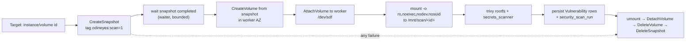

# Agentless EBS Snapshot Vulnerability Scanning (Wiz-style)

Design + tomorrow's implementation plan. Turns the mock
`cloud/agentless_scanner.py` into a real snapshot → mount → `trivy rootfs` →
persist → teardown pipeline that finds on-disk CVEs and secrets in EC2 volumes
**without touching the running workload**.

## TL;DR — this is wiring, not greenfield

The heavy machinery already exists and is reused verbatim:

| Need | Already have | Change |
|------|--------------|--------|
| Run a vuln scanner safely | `cloud/trivy_scanner.py` (SHA256 pin, argv guard, timeout, pure parser) | add `scan_rootfs(mount_path)` — clone of `scan_image` using `trivy rootfs` |
| Vuln row shape | `cloud/cve_scanner.Vulnerability` (has `scanner_source`, `target`, `package_path`, `epss`, `kev`) | none — set `scanner_source="trivy-ebs"` |
| Persist + open/resolve lifecycle | `service.scan_container_vulnerabilities()` + `VulnerabilityRepository` + `SecurityScanRepository.record()` | add `scan_disk_vulnerabilities()` (same body, `scan_kind="ebs_snapshot"`) |
| Scan-evidence trail | `security_scan_runs` table + `SecurityScanRepository.record()` | none — new `scan_kind` value |
| Snapshot inventory / public-share flag | `aws_raw_collector._enrich_ebs_snapshot`, `aws.ec2.volume` / `aws.ec2.snapshot` assets | none |
| Secrets on disk | `scanner/secrets_scanner.py` | call it against the mount |
| CVE enrichment | `scanner/{nvd,osv,kev,epss}_client.py` | reuse via existing enrich path |
| UI: per-asset Vuln tab + fleet Vulnerabilities page | `AssetDetails.tsx`, `Vulnerabilities.tsx` | none — they key on `resource_id` already |

**Net new code:** the orchestrator state machine + IAM perms + one service
method + one API route + one "Scan disk" button. Everything downstream is done.

## The one architectural decision (defaulted, override tomorrow)

Where does the mount + scan physically run? Three options:

1. **Attach-to-worker, same account (RECOMMENDED, default).** Create a volume
   from the snapshot in the scanner host's AZ, `AttachVolume` to the Linux EC2
   host the backend already runs on (`deploy/aws/`), mount read-only, `trivy
   rootfs`. Needs a Linux worker with EBS attach rights — which the EC2
   deployment already is. Matches current "scan your own account with ambient
   creds" mode (commit `ac62490`).
2. **Cross-account (true Wiz).** Share/copy the snapshot into a dedicated
   scanner account, then option 1 there. Adds a copy+share phase (below,
   Phase 6). Do this only when scanning accounts other than the deploy account.
3. **EBS direct block read, no compute** (`ebs:ListSnapshotBlocks` +
   `GetSnapshotBlock`, reconstruct FS in userspace). No attach/mount/root, runs
   from Fargate — but needs a filesystem parser and trivy can't read it without
   a loopback. Heaviest code. **Skip** unless a hard "no attach" constraint appears.

> Assumption for the plan: **option 1, single account, backend EC2 host is the
> worker.** If the scanner runs on Windows/locally (dev), the AWS steps are
> stubbed and only the pure logic is unit-tested (see Testing). Real mounts run
> on the Linux EC2 deployment.

## Pipeline state machine

Every state past `CreateSnapshot` registers its cleanup action **before** doing
the work, so teardown runs on any exception. Teardown is idempotent and also
runs as a standalone tag-swept reaper (below). This is the whole reason the mock
is dangerous to ship as-is: a real snapshot/volume left behind = silent AWS bill
+ data copy sprawl.

## Phased implementation (tomorrow)

Ordered so each phase is independently testable and the risky AWS parts come
after the pure, mockable parts.

### Phase 1 — `trivy rootfs` support (pure, no AWS)  ~30 min
`trivy_scanner.py`: add `scan_rootfs(self, path: str) -> RootfsScanResult`
mirroring `scan_image` but `["trivy", "rootfs", "--quiet", "--format", "json",
"--scanners", "vuln", "--", path]`. Reuse `verify_binary()`, the timeout, and
`_parse` **unchanged** (rootfs JSON is the same `Results[].Vulnerabilities[]`
shape). Set `scanner_source="trivy-ebs"` in the mapped rows. Guard `path` the
same way (`startswith("-")` reject). Extend the existing `__main__` self-check
with a rootfs fixture doc.

### Phase 2 — orchestrator state machine (mockable AWS)  ~2–3 h
Rewrite `AgentlessSnapshotScanner`:
- Inject the ec2 client + a `Mounter` seam (`mount(vol_device)->path`,
  `umount(path)`) so the AWS + OS side effects are swappable for a fake in tests.
- Real `create_snapshot` with tag `odineyes:scan-temp=<scan-id>`, `waiter`
  (`snapshot_completed`, capped wait), `create_volume` in worker AZ from the
  snapshot, `attach_volume`, poll `in-use`, mount **read-only + noexec + nodev +
  nosuid**, scan, then guaranteed teardown via a `contextlib.ExitStack` /
  `try/finally` registered per resource.
- `execute_scan()` returns a `DiskScanResult` (scanned bool, vulnerabilities,
  component_count, target=volume id, skipped_reason) — same shape family as
  `ImageScanResult` so persistence is copy-paste.
- Hard caps: max wait per state, max concurrent scans, `max_volume_gb` skip.

### Phase 3 — persistence (copy the container path)  ~45 min
`service.py`: add `scan_disk_vulnerabilities(provider, account, region, targets)`
= near-identical to `scan_container_vulnerabilities` (lines ~484–559) with
`scanner="trivy"`, `scan_kind="ebs_snapshot"`, `resource_id=<volume or instance
id>`. Reuse `VulnerabilityRepository` open/resolved reconcile and
`SecurityScanRepository.record()`. NVD audit cross-check comes along for free.

### Phase 4 — IAM  ~30 min
`core/iam_policy_generator.py`: add to the scanner policy —
`ec2:CreateSnapshot`, `DescribeSnapshots`, `CreateVolume`, `DescribeVolumes`,
`AttachVolume`, `DetachVolume`, `DeleteVolume`, `DeleteSnapshot`,
`CreateTags` — **scoped by `aws:ResourceTag/odineyes:scan-temp` on the
mutate/delete actions** (create actions gated by a `RequestTag` condition) so the
scanner can only touch resources it created. If cross-account (option 2): add
`ModifySnapshotAttribute` + `CopySnapshot` + KMS `ReEncrypt*`/`CreateGrant` on
the scanner CMK. Add the matching count assertion in the policy-pack test.

### Phase 5 — wiring (orchestrator + API + UI trigger)  ~1 h
- Orchestrator: opt-in flag (`enable_ebs_scan`), pick targets (running EC2 with
  attached volumes), budget-cap the count.
- API: `POST /inventory/scan/disk` (mirror the trivy sbom route at
  `inventory_routes.py:817`), body `{region, targets?}`.
- UI: "Scan disk" action on the asset Vuln tab; results already render.

### Phase 6 — cross-account + reaper (only if needed)  ~2 h
- Snapshot copy with re-encrypt to scanner CMK, share, copy into scanner account.
- **Orphan reaper**: scheduled sweep that deletes any `odineyes:scan-temp` volume
  or snapshot older than N minutes — the safety net for a crashed worker. This is
  non-optional for production even in single-account mode.

## Security & cost controls (do not simplify away)

- **Read-only mount** (`ro,noexec,nodev,nosuid`) — a hostile guest filesystem
  must never execute or expose devices on the worker.
- **Never mount by label/UUID from the guest**; mount the specific attached
  device path only. Untrusted `/etc/fstab` inside the image is ignored.
- **Tag-scoped IAM** — scanner can only delete what it tagged; blast radius is
  its own temp resources.
- **Guaranteed teardown** + **orphan reaper** — no lingering snapshots/volumes.
- **Bounded waiters + concurrency + size caps** — one 16 TB volume can't hang or
  bankrupt the scan.
- **Trivy integrity** already enforced (`verify_binary`); reused unchanged.
- **KMS**: encrypted-source volumes need the scanner principal on the source CMK
  key policy (single-account) or re-encrypt to the scanner CMK (cross-account).
  Detect `Encrypted=true` and skip-with-reason if the key isn't usable — never
  fail silently.

## Testing (Windows dev can't mount — test the seams)

Same philosophy as `trivy_scanner`'s fixture tests: **all AWS + mount behind an
injectable fake**, pure logic unit-tested.

1. `scan_rootfs` parser — extend the `trivy_scanner __main__` self-check /
   `test_trivy_sbom.py` with a rootfs fixture (no binary, no AWS).
2. Orchestrator state machine — `test_agentless_scanner.py` with a fake ec2
   client + fake `Mounter`, assert: happy path scans + tears down; **failure at
   each state still deletes every created resource** (the critical invariant);
   size-cap skip; encrypted-unusable-key skip.
3. Persistence — reuse the container-vuln test pattern: fake `DiskScanResult` →
   assert `Vulnerability` rows + one `security_scan_run` with
   `scan_kind="ebs_snapshot"`.

Run: `.venv/Scripts/python.exe -m pytest src/odineyes/tests/ -q` (PYTHONIOENCODING=utf-8).

## Files touched

| File | Change |
|------|--------|
| `cloud/trivy_scanner.py` | + `scan_rootfs()`, `RootfsScanResult`, rootfs self-check |
| `cloud/agentless_scanner.py` | rewrite mock → real state machine + teardown + `Mounter` seam |
| `inventory/service.py` | + `scan_disk_vulnerabilities()` |
| `core/iam_policy_generator.py` | + EBS/snapshot/KMS perms (tag-scoped) |
| `api/inventory_routes.py` | + `POST /inventory/scan/disk` |
| `inventory/orchestrator.py` | opt-in target selection + budget cap |
| `frontend/.../AssetDetails.tsx` | "Scan disk" trigger (render path already exists) |
| `tests/test_agentless_scanner.py` (new), `test_trivy_sbom.py`, policy-pack test | coverage |

## Out of scope (say so, don't fake)

- Windows/NTFS EC2 disks — trivy rootfs covers Linux pkg managers; NTFS needs a
  different mount + scanner. Skip-with-reason, don't claim clean.
- LVM/encrypted-in-guest (LUKS) filesystems — detect and skip-with-reason.
- Malware/YARA scanning — separate pass; the mount seam makes it a later add-on.

---
*Ceiling for the default (option 1): single scanner-host worker serializes
attaches (~one volume slot family at a time). Fine for a demo and small fleets;
move to a pool of ephemeral Fargate/EC2 workers when the scan queue is the long
pole.*
