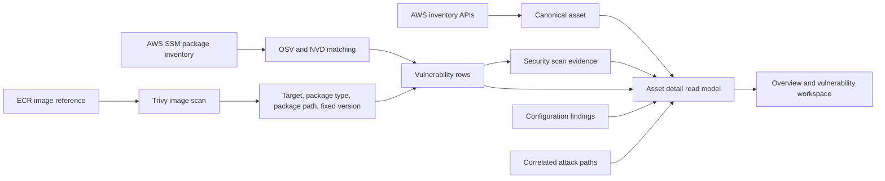

# Asset Investigation and Trivy Vulnerability View

## Outcome

Odineyes now has an asset-centric investigation workflow. Selecting a resource
from Cloud Inventory opens a full detail page at:

```text
/inventory/{asset_id}
```

The page correlates the canonical inventory record with configuration findings,
attack paths, workload scan coverage, vulnerabilities, remediation evidence,
raw cloud data, and the asset change timeline.

## User workflow

1. Open **Cloud Inventory**.
2. Select a resource.
3. Review **Overview** for exposure, privilege, encryption, risk, findings, and
   vulnerability coverage.
4. Open **Findings** for posture-rule evidence and remediation.
5. Open **Vulnerability** for package-level remediation and per-CVE evidence.
6. Open **Configuration** to compare normalized properties with the raw cloud API
   response.
7. Open **Activity** to inspect discovery and drift events.

## Data flow



## New persisted evidence

The `vulnerabilities` table now retains:

- `scanner_source`: `trivy` or `ssm-osv`
- `package_type`: Trivy result type or SSM package ecosystem
- `target`: the Trivy result target
- `package_path`: the package/file path when Trivy reports one

The new append-only `security_scan_runs` table records:

- target resource ID and optional canonical asset link
- scanner and scan kind
- completed, skipped, or failed status
- package/component count
- vulnerability count
- skip/failure reason
- scanner-specific evidence
- scan timestamp

This makes the following states distinguishable:

- completed scan with no vulnerabilities
- completed scan with vulnerabilities
- skipped scan
- failed scan
- legacy evidence from before coverage tracking
- not scanned
- scanner not applicable to this asset type

## Trivy presentation

The resource Vulnerability tab and fleet-wide Vulnerabilities page now provide:

- remediation grouped by package/component
- installed and fixed versions
- critical, high, medium, and low counts per component
- package path or Trivy target
- scanner source
- unresolved CVE table
- CVSS, EPSS, and CISA KEV context
- CycloneDX SBOM download for a Trivy-scanned image target

## Scope boundary

Current Trivy support scans **container images referenced from ECR**. Current EC2
host package scanning uses **SSM package inventory plus OSV/NVD**.

This does not yet reproduce Wiz-style agentless EBS snapshot scanning of every
running EC2 filesystem. Implementing that safely requires a dedicated customer
permission mode, encrypted snapshot copy/orchestration, isolated analysis
workers, lifecycle cleanup, and explicit cost controls. The UI therefore does
not label an unscanned EC2 disk as clean.

## Main implementation files

- `frontend/src/pages/AssetDetails.tsx`
- `frontend/src/pages/Inventory.tsx`
- `frontend/src/pages/Vulnerabilities.tsx`
- `frontend/src/types.ts`
- `frontend/src/index.css`
- `src/odineyes/cloud/trivy_scanner.py`
- `src/odineyes/db/models.py`
- `src/odineyes/db/base.py`
- `src/odineyes/inventory/repository.py`
- `src/odineyes/inventory/service.py`
- `src/odineyes/inventory/queries.py`

## Validation

- Frontend TypeScript type check: passed
- Frontend production build: passed
- Backend regression suite: 539 passed, 1 skipped
- New tests cover Trivy target/path preservation and asset-detail correlation
