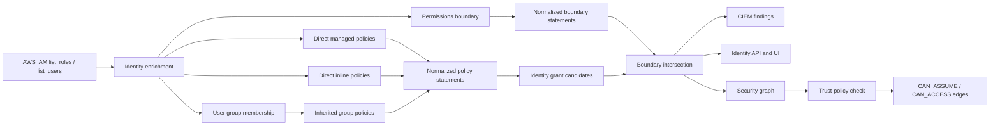
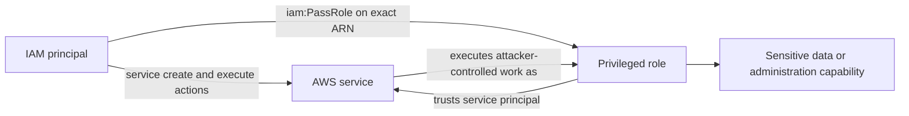

# Odineyes CIEM implementation

## Outcome

Odineyes now models IAM permissions as evidence-backed capability candidates
instead of reducing an identity to `admin: true/false`.

The implemented slice covers:

- IAM role managed and inline policies;
- IAM user managed and inline policies;
- IAM group membership and group-inherited managed and inline policies;
- permissions-boundary documents;
- normalized Allow, Deny, Action, Resource, NotAction, NotResource, and
  condition metadata;
- provenance for every policy source;
- boundary-aware administrator and privilege-escalation candidates;
- boundary-aware `CAN_ASSUME` and `CAN_ACCESS` graph edges;
- direct-policy, unrestricted-admin-grant, and privilege-escalation findings;
- explicit disclosure of authorization layers that are not evaluated yet.

This is deeper CIEM, but it is intentionally not labelled a complete AWS
authorization simulator.

## The real-world problem

AWS permission is not stored in one place. A user's apparent access can come
from a directly attached policy, an inline policy, one or more IAM groups, a
resource policy, or a role that the user can assume. A permissions boundary,
session policy, service control policy, resource control policy, or explicit
Deny can reduce that access.

The practical failure modes are:

1. A CSPM reads only direct user policies and reports a group-admin user as
   least-privileged.
2. A CSPM sees `Action: "*"` and reports effective administrator access even
   though a boundary prevents it.
3. A CSPM sees `sts:AssumeRole` but creates an attack path without checking the
   target role's trust policy.
4. A CSPM treats a conditional grant as universally usable.
5. A UI says "Administrator" without explaining whether this means policy
   grant, boundary-permitted access, or fully evaluated effective access.

Odineyes now avoids those five errors for the IAM layers it observes.

## AWS authorization model used

For an IAM principal, a useful simplified model is:

```text
candidate identity access
  = direct identity grants
  union inherited IAM group grants

boundary-permitted access
  = candidate identity access
  intersect permissions boundary

effective access
  = boundary-permitted access
  intersect organization controls
  intersect session controls
  combined with applicable resource policies
  minus every applicable explicit Deny
```

The current implementation reaches `boundary-permitted access`. It does not
claim the final `effective access` result.

## Collection and processing flow



## Collected AWS APIs

The user CIEM enrichment uses:

- `iam:ListAttachedUserPolicies`
- `iam:ListUserPolicies`
- `iam:GetUserPolicy`
- `iam:ListGroupsForUser`
- `iam:ListAttachedGroupPolicies`
- `iam:ListGroupPolicies`
- `iam:GetGroupPolicy`
- `iam:GetPolicy`
- `iam:GetPolicyVersion`
- `iam:ListAccessKeys`
- `iam:GetAccessKeyLastUsed`
- `iam:GetLoginProfile`
- `iam:ListMFADevices`

Role enrichment uses the equivalent role policy APIs plus `iam:GetRole`.

All IAM list operations are paginated. Managed policy documents are cached
only for the duration of one scan and are fetched again on the next scan so a
changed default policy version is not hidden.

The generated least-privilege onboarding policy has been expanded to include
the group APIs. Existing onboarding stacks that use the AWS-managed
`SecurityAudit` and `ViewOnlyAccess` mode continue to use those managed
policies. Existing least-privilege stacks must be updated before group evidence
can be complete.

## Normalized identity schema

CIEM evidence remains in the existing SQLite `Asset.properties` JSON field, so
this change does not require a destructive database migration.

Important fields:

```json
{
  "has_admin_grant": true,
  "has_admin": false,
  "boundary_restricts_admin": true,
  "admin_reason": "managed policy AdministratorAccess (*:*) via group platform",
  "privesc_actions": ["iam:PassRole", "sts:AssumeRole"],
  "effective_privesc_actions": ["sts:AssumeRole"],
  "policy_source_count": 3,
  "direct_policy_count": 1,
  "inherited_policy_count": 2,
  "allow_statement_count": 8,
  "explicit_deny_count": 1,
  "conditional_statement_count": 2,
  "wildcard_action_statement_count": 2,
  "wildcard_resource_statement_count": 4,
  "group_names": ["platform"],
  "permissions_boundary_arn": "arn:aws:iam::123456789012:policy/DeveloperBoundary",
  "permissions_boundary_state": "observed",
  "authorization_scope": "identity_policies_and_boundary",
  "effective_access_complete": false,
  "unevaluated_policy_layers": [
    "resource_policies",
    "session_policies",
    "service_control_policies",
    "resource_control_policies"
  ]
}
```

`has_admin_grant` answers whether an identity policy grants `Action: "*"` and
`Resource: "*"`. `has_admin` is the narrower boundary-permitted candidate.
Neither field claims that every AWS request will succeed.

Every normalized statement also records:

- source type and name;
- managed policy ARN when present;
- direct versus inherited;
- IAM group name;
- effect;
- actions and resources;
- NotAction and NotResource;
- whether conditions exist;
- condition context-key names.

Condition values are not needed for the current evidence summary and are not
copied into the normalized grant record.

## SQLite relationships

The normalizer now emits:

- `BELONGS_TO`: identity to cloud account;
- `MEMBER_OF`: IAM user to IAM group ARN;
- `BOUNDED_BY`: role or user to permissions-boundary policy ARN.

The full policy evidence is stored in `Asset.properties`. This avoids adding
hundreds of policy-statement rows before the product has a query workload that
requires a relational policy table. A future PostgreSQL migration can promote
principals, policies, statements, and grants to dedicated tables without
changing the collection contract.

## Graph semantics

Odineyes creates a role-to-role or user-to-role `CAN_ASSUME` edge only when:

1. an unconditional explicit identity-policy Allow matches
   `sts:AssumeRole` and the target role ARN;
2. the permissions boundary is absent or has an unconditional matching Allow;
3. no matching boundary Deny is observed;
4. the target role trust policy accepts the exact principal, its account root,
   or a matching wildcard principal.

Conditional grants, NotAction, NotResource, and unreadable boundaries do not
produce a traversal edge.

The same boundary gate is applied to S3 `CAN_ACCESS` edges.

Graph edges carry `authorization_scope` and
`effective_access_complete: false`. The UI and issue engine can therefore
distinguish a supported capability path from a fully simulated AWS decision.

## Detection rules

The built-in catalog now contains 43 policies. The CIEM additions are:

### `IDENTITY_UNRESTRICTED_ADMIN_GRANT`

Detects an unconditional identity-policy Allow with wildcard Action and
Resource. Severity is reduced when an observed boundary currently restricts
the admin capability, but the underlying dangerous grant remains visible.

### `IDENTITY_PRIVILEGE_ESCALATION_GRANT`

Detects boundary-permitted actions such as policy version modification,
policy attachment, inline policy modification, access-key creation,
`iam:PassRole`, trust-policy modification, or role assumption.

### `IAM_USER_DIRECT_POLICY_ATTACHMENT`

Detects direct user policy sources. Direct grants are harder to review,
standardize, and revoke than federated role access or centrally managed group
access.

Existing long-lived-key and dormant-privilege rules now use the
boundary-permitted privilege set rather than every raw policy action.

## False-positive controls

The following choices are deliberate:

- A conditional Allow is evidence but not an unconditional capability edge.
- NotAction and NotResource are preserved but not converted into an edge.
- An unreadable configured boundary fails closed for graph traversal.
- `PowerUserAccess` is not hard-coded as administrator access.
- `IAMFullAccess` is not hard-coded as universal administrator access.
- Admin is identified from the actual policy document.
- Group-derived privilege is attributed to the group policy source.
- Direct grants and inherited grants remain distinguishable.
- Missing SCP, RCP, session, or resource-policy data is shown as an evaluation
  gap instead of silently treated as Allow.

## Remaining gaps and priority

### P0 - implemented

- direct and group-inherited identity policies;
- permissions-boundary evidence;
- conservative statement normalization;
- boundary-aware graph edges;
- explainable CIEM API and UI;
- three additional CIEM policies;
- least-privilege onboarding action update.

### P1 - next

1. Collect AWS Organizations SCPs and RCPs from the management or delegated
   administrator account.
2. Collect resource policies for S3, KMS, Secrets Manager, SQS, SNS, Lambda,
   ECR, and API Gateway.
3. Add Access Analyzer findings as independent reachability evidence.
4. Model role session policies and permission-bearing session tags where scan
   evidence exists.
5. Replace the current capability labels with a four-state verdict:
   `granted`, `bounded`, `denied`, or `unknown`.

### P2 - rightsizing

1. Collect service/action last-accessed details asynchronously.
2. Compare granted actions to observed CloudTrail usage.
3. Generate removable-action recommendations with a confidence score and a
   lookback window.
4. Add owner approval and suppression expiry before remediation.

### P3 - advanced attack paths

1. Add service-mediated escalation, including `iam:PassRole` combined with
   Lambda, EC2, ECS, Glue, SageMaker, and CloudFormation creation/update paths.
2. Add resource-policy and KMS key-policy traversal.
3. Add cross-account organization paths.
4. Calculate the smallest remediation set that breaks every path to a critical
   target.

## Acceptance criteria for the next CIEM phase

- No effective-access claim is emitted when required policy layers are unknown.
- Every privilege finding names its source policy and inheritance path.
- Every attack edge includes evidence, evaluation scope, and confidence.
- SCP/RCP collection failure is shown as degraded coverage.
- Rightsizing recommendations include a configurable observation period.
- Existing verified Odineyes onboarding trust is excluded from external-risk
  findings while remaining visible as a verified relationship.

## Second-order relationship engine

Odineyes now includes a native second-order relationship engine informed by
IAMhounddog's publicly documented graph concepts. IAMhounddog itself is not
vendored, imported, or executed:

- its repository does not currently contain a detected redistribution license;
- it performs a second AWS inventory pass instead of using Odineyes' assumed
  customer session and normalized inventory;
- its output is a BloodHound OpenGraph file rather than the Odineyes asset,
  finding, evidence, and lifecycle contract;
- Odineyes already evaluates explicit Deny and permissions boundaries more
  conservatively.

The native engine emits these evidence-backed relationships:

- `CAN_MODIFY_AND_INVOKE`: an identity can update and invoke an existing Lambda
  function, and the function has an observed execution-role binding;
- `CAN_IMPERSONATE_VIA_SERVICE`: an identity can create and execute an
  attacker-controlled service workload, can `iam:PassRole` the exact target
  role, and that role trusts the corresponding AWS service.

The create-and-execute patterns currently cover:

- Lambda;
- CloudFormation;
- CodeBuild;
- ECS;
- Step Functions.

The engine requires unconditional Allows for every action. It intersects those
Allows with the observed permissions boundary, checks explicit Deny through the
common IAM evaluator, verifies `iam:PassRole` against the exact target ARN, and
checks the target role's service trust. Missing policy evidence, unreadable
boundaries, conditional statements, or incompatible trust produce no edge.



These edges feed the existing security graph and produce a
`SECOND_ORDER_ROLE_ESCALATION` issue when the target role is administrator-level
or contains observed privilege-escalation actions. The issue retains source
actions, service, policy evaluation scope, evidence, and a reduced confidence
when SCP, RCP, session-policy, or resource-policy layers remain unevaluated.
