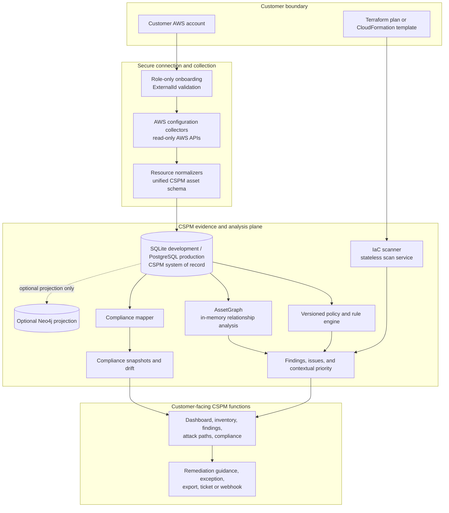
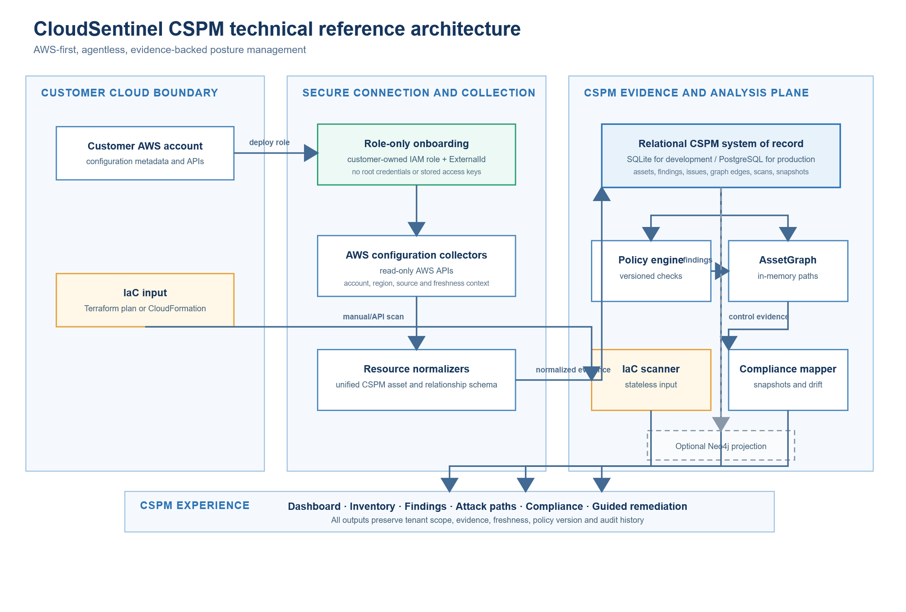
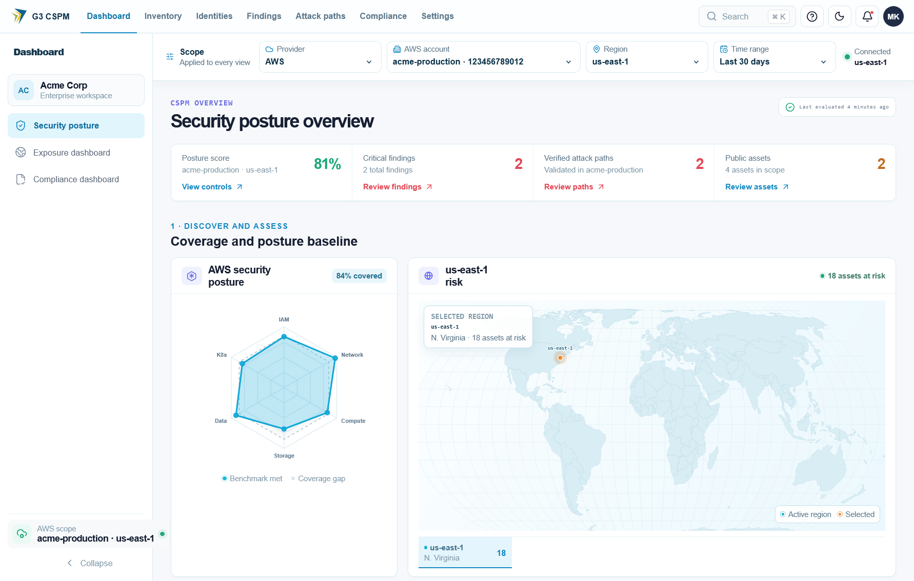
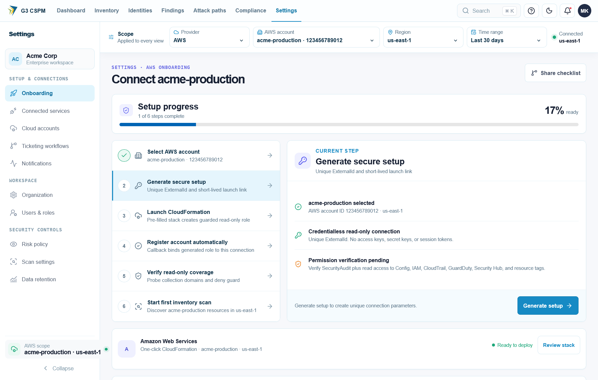
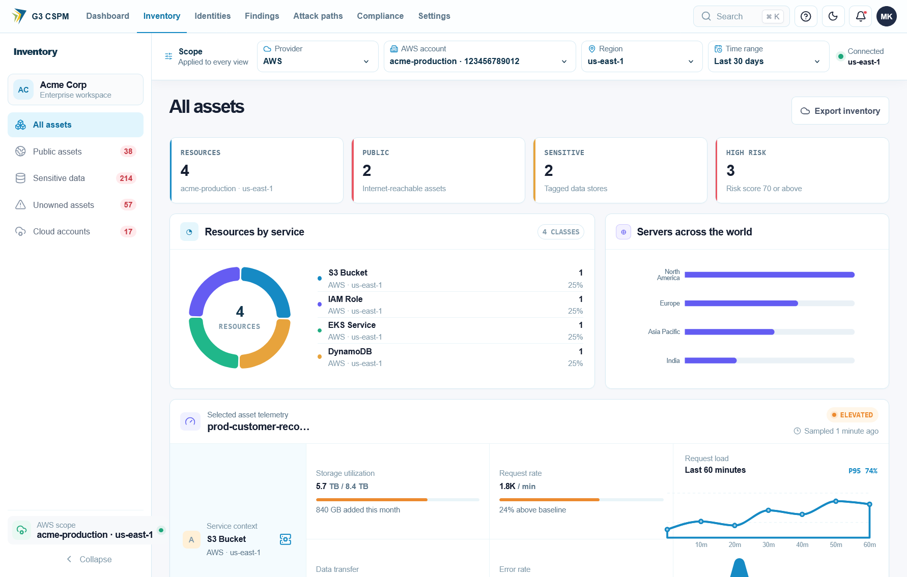
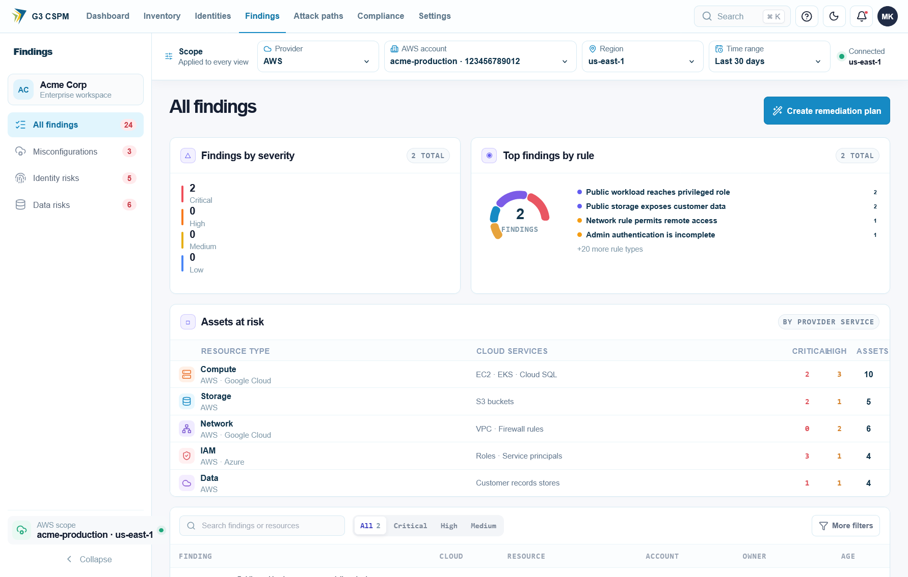
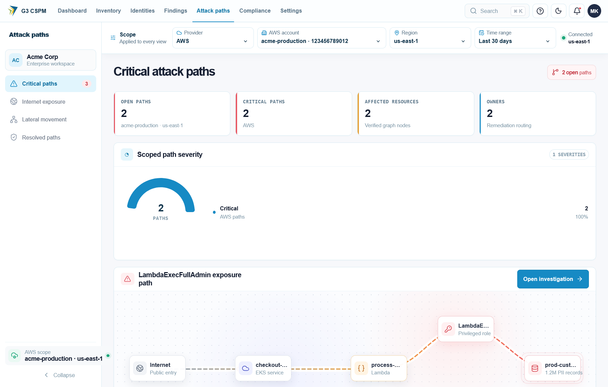
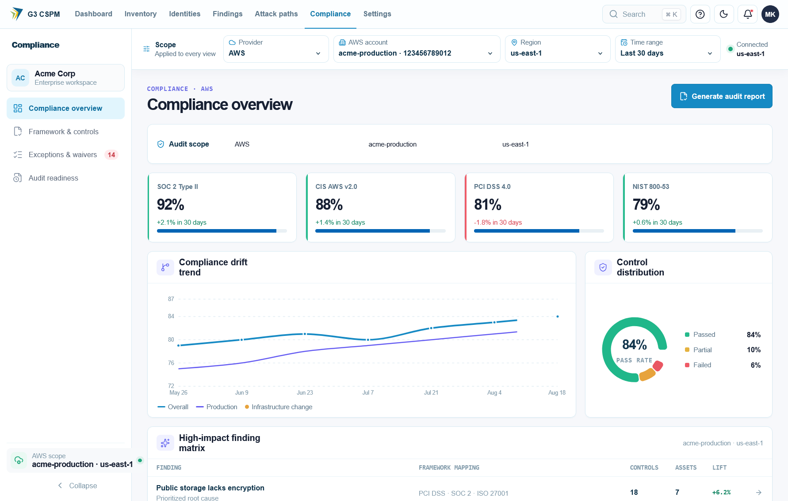

# CloudSentinel CSPM Functional Business Requirements Document

| Document control | Value |
|---|---|
| Product | CloudSentinel CSPM |
| UI reference project | cloudsentinel-saas |
| Document type | Functional Business Requirements Document |
| Version | 2.2 |
| Date | 27 August 2026 |
| Status | Functional draft for product and engineering approval |
| Scope | Cloud Security Posture Management only |
| Initial cloud | AWS |
| Planned clouds | Microsoft Azure and Google Cloud |
| Primary owners | Product, Cloud Security, Engineering, GRC |

## 1. Executive summary

CloudSentinel CSPM is a functional cloud-control-plane security product. It connects customer cloud accounts, discovers resources, evaluates configuration, correlates risky relationships, prioritizes findings, supports remediation decisions, scans Infrastructure as Code, and reports technical compliance posture.

Cloud providers already supply strong security controls and native posture products. Customers still struggle with fragmented account coverage, inconsistent policies, unclear ownership, excessive findings, weak evidence, configuration drift, and different remediation processes across clouds. CloudSentinel will address these operating problems through one evidence-backed CSPM workflow.

CloudSentinel will not compete by offering another list of configuration failures. It will compete through:

1. Transparent coverage across accounts, regions, and supported clouds.
2. Evidence-backed findings with observed configuration, source, freshness, and confidence.
3. Contextual risk prioritization using exposure, privilege, resource relationships, environment, and business criticality.
4. Prevention through Infrastructure as Code scanning and policy gates.
5. Governed remediation with ownership, approval, verification, exceptions, and audit history.
6. Unified compliance evidence without claiming that technical checks prove certification.

This document defines how each CSPM function must behave from user input through processing, output, error handling, authorization, and acceptance. Release 1 remains AWS-first. Azure and GCP remain preview until their inventory, policy, onboarding, evidence, and acceptance requirements meet the same product standard.

## 2. Purpose

This BRD defines functional business requirements for CloudSentinel as a CSPM product. It covers actors, product screens, inputs, processing rules, outputs, validations, permissions, workflows, acceptance conditions, non-functional requirements, delivery gates, and success measures.

It also records the logical CSPM reference architecture and current repository-backed technical baseline needed to make the functional requirements testable. It is not a substitute for detailed API schemas, database schemas, threat models, test plans, or implementation tasks; those documents must trace back to approved requirements in this BRD.

## 3. CSPM product definition

CloudSentinel CSPM is a cloud control-plane security product. It uses cloud configuration metadata, policies, relationships, tags, logs of configuration changes, and Infrastructure as Code to answer five questions:

1. What cloud resources exist?
2. Which resources violate required security policy?
3. Which violations create material risk in their current context?
4. Who owns the risk and what safe change will reduce it?
5. Has the risk been fixed, and has it returned?

### 3.1 CSPM capability boundary

| Included in CSPM | Excluded from this BRD |
|---|---|
| Cloud account and organization onboarding | Endpoint detection and response |
| Cloud asset inventory and relationships | Host and container CVE scanning |
| Configuration and policy assessment | Runtime eBPF detection |
| Internet exposure and control-plane reachability | Malware detection and sandboxing |
| Baseline identity configuration posture | Full Cloud Infrastructure Entitlement Management |
| Posture-based attack paths | Sensitive-content discovery and DSPM |
| Compliance control mapping and evidence | Data loss prevention |
| Configuration drift and posture history | SIEM, SOAR, or incident response replacement |
| IaC scanning and deployment prevention | Offensive exploitation or penetration testing |
| Finding workflow, exceptions, remediation, and verification | Application source-code SAST or DAST |
| Reporting, APIs, and operational integrations | Cloud workload protection platform features |

Baseline identity posture includes configuration checks such as missing MFA, dangerous public trust, wildcard administrative access, stale privileged credentials, and unsafe workload roles. Advanced effective-permission analysis, rightsizing, identity behavior analytics, and entitlement lifecycle management belong to CIEM and remain outside this BRD.

Posture attack paths may correlate cloud configuration, network exposure, identity trust, and resource access relationships. They must not depend on runtime, vulnerability, or sensitive-content products to produce a valid CSPM result.

## 4. Product vision and principles

### 4.1 Vision

> CloudSentinel gives every cloud risk an owner, evidence, business context, safe remediation path, and verified closure.

### 4.2 Product principles

- **Evidence before assertion:** Every finding shows observed values, data source, collection time, policy logic, and affected scope.
- **Coverage before score:** Missing permissions, unsupported services, failed regions, and stale scans reduce reported coverage. They never appear as passing controls.
- **Context before severity:** Priority reflects exposure, privilege, relationships, business criticality, environment, confidence, and compensating controls.
- **Read-only by default:** Cloud onboarding and assessment use least-privilege read access.
- **Human-controlled change:** Remediation requires approval unless a tenant administrator explicitly enables a bounded automation policy.
- **Code-first durability:** When IaC manages a resource, remediation should update source configuration before or with the live-resource change.
- **No compliance theater:** A technical control result supports assurance but does not prove legal or regulatory compliance.
- **Provider complement:** Native AWS, Azure, and GCP findings may be ingested and enriched. CloudSentinel need not duplicate every provider control.
- **Explainable decisions:** Users can understand why an issue exists, why it has its priority, and what evidence closes it.
- **Tenant isolation:** Customer data, policy, evidence, findings, and integrations remain isolated by tenant.

## 5. Business problem

Target customers face these problems:

- Cloud resources are distributed across many accounts, subscriptions, projects, and regions.
- Asset inventories become stale and often omit newly created or short-lived resources.
- Native cloud posture tools use different policy models, severity schemes, workflows, and reports.
- Security teams receive many isolated findings without enough context to identify material risk.
- A failed collection or missing permission can look like a secure environment.
- Remediation guidance often changes a live resource without correcting the IaC source, causing recurrence.
- Finding ownership is unclear across central security, platform, and application teams.
- Exceptions are stored in tickets or spreadsheets without expiry and revalidation.
- GRC teams manually collect screenshots and cannot easily prove continuous control operation.
- Leaders cannot measure whether posture programs reduce risk or only close alerts.

## 6. Business objectives

| ID | Objective | Initial target |
|---|---|---|
| BO-01 | Establish trusted cloud visibility | Discover at least 95% of supported, permitted assets within freshness SLA |
| BO-02 | Expose collection gaps | Show 100% of known permission, region, API, and freshness gaps |
| BO-03 | Reduce posture noise | Consolidate raw findings into at least 60% fewer actionable issues during pilots |
| BO-04 | Improve prioritization | Rank all Critical and High issues using exposure, privilege, business context, and confidence |
| BO-05 | Accelerate ownership | Assign or route at least 90% of Critical and High issues to an owner or queue |
| BO-06 | Reduce remediation time | Reduce median time to remediate Critical and High issues by 50% from pilot baseline |
| BO-07 | Prevent insecure deployment | Evaluate integrated IaC changes before deployment and block approved policy violations |
| BO-08 | Prevent recurrence | Revalidate 100% of closed Critical issues after relevant change or scheduled reassessment |
| BO-09 | Reduce audit effort | Generate at least 70% of supported technical evidence automatically |
| BO-10 | Support multicloud governance | Apply one normalized policy and workflow model across GA-supported clouds |

Targets must be baselined with design partners before becoming contractual service commitments.

## 7. Target customers

### 7.1 Ideal customer profile

- Uses 20 or more cloud accounts, subscriptions, or projects.
- Has an AWS-led environment or an active multicloud program.
- Operates decentralized engineering teams under centralized security or GRC governance.
- Has regulated, audit-sensitive, internet-facing, or business-critical workloads.
- Experiences alert overload, ownership gaps, recurring misconfiguration, or high audit effort.
- Uses Infrastructure as Code and ticketing or source-control workflows.

### 7.2 Buyer and user personas

| Persona | Business need | Required CSPM experience |
|---|---|---|
| CISO or security leader | Understand material cloud risk and trend | Executive risk view, coverage, recurring risks, SLA, and risk acceptance |
| Cloud security engineer | Find, prioritize, and resolve posture risk | Evidence, relationships, queries, policy, suppression, and verification |
| Cloud or platform engineer | Fix configuration safely | Exact resource, observed state, required state, IaC guidance, impact, and rollback |
| Application owner | Understand and own issues affecting a service | Business context, due date, remediation steps, and status |
| GRC analyst or auditor | Evaluate continuous technical controls | Framework mapping, evidence provenance, scope, exceptions, and history |
| Product administrator | Configure tenant, users, clouds, policies, and integrations | RBAC, SSO, onboarding health, policy assignment, and audit logs |
| MSP operator | Manage multiple customer tenants | Strong isolation, delegated administration, customer-level reporting, and fleet health |

## 8. Business assumptions

- Customers authorize read-only cloud access for discovery and assessment.
- Customers remain responsible for approving and implementing changes in their environments.
- Cloud provider APIs, quotas, regional availability, and eventual consistency affect collection time.
- Supported control coverage varies by cloud, service, region, and permission scope.
- Technical control checks contribute evidence but do not certify compliance.
- AWS reaches GA before Azure and GCP.
- Production remediation automation requires separate security review and customer opt-in.
- Customer tags, account hierarchy, CMDB data, or repository metadata provide business ownership context when available.

## 9. CSPM capability model

| Capability | Business outcome |
|---|---|
| 1. Secure cloud onboarding | Fast connection without storing long-lived cloud credentials |
| 2. Asset inventory and normalization | Complete, searchable view of supported cloud resources |
| 3. Configuration policy assessment | Continuous detection of insecure cloud configurations |
| 4. Exposure and relationship analysis | Distinguish theoretical configuration weakness from reachable risk |
| 5. Contextual risk prioritization | Focus teams on issues with greatest likely business impact |
| 6. Compliance posture and evidence | Continuous technical-control visibility with defensible evidence |
| 7. Drift and posture history | Identify new, recurring, and long-standing configuration risk |
| 8. Shift-left IaC security | Prevent approved policy violations before deployment |
| 9. Governed remediation | Move each issue from discovery to verified closure |
| 10. Reporting and integrations | Embed CSPM results into customer operating workflows |
| 11. Policy administration | Manage built-in, custom, versioned, and scoped policies |
| 12. Platform administration | Operate a secure multitenant enterprise service |

## 10. Functional product specification

### 10.1 Product snapshot notice

Screenshots in this document were captured from the dedicated `cloudsentinel-saas` user interface project and its embedded CSPM demonstration dataset on 26 August 2026. The screens represent the intended product experience; they do not prove that every displayed action is connected to a production backend. Resource names, account identifiers, findings, counts, dates, and scores are illustrative test data. They are not customer security results or production service-level evidence.

Only CSPM screens and CSPM functions are specified by this document. Navigation entries for runtime, vulnerability, DSPM, or other CNAPP modules visible in the current interface remain outside this BRD.

### 10.2 Functional navigation map

| Product area | UI page or module | Primary actor | Core function | CSPM status |
|---|---|---|---|---|
| Dashboard | Dashboard - Security posture | Security leader, analyst | Summarize posture, material risk, workflow, coverage, and next actions | In scope |
| Cloud accounts | Settings - Onboarding and Cloud accounts | Administrator | Connect, verify, scan, and offboard cloud accounts | In scope |
| Inventory | Inventory - All assets and scoped views | Analyst, engineer | Search assets and inspect exposure, ownership, configuration, and posture | In scope |
| Asset detail | Inventory - Selected asset detail | Analyst, engineer | Investigate one asset, evidence, relationships, configuration, and activity history | In scope |
| Findings | Findings - All findings and Misconfigurations | Analyst, engineer | Triage, filter, export, re-evaluate, and remediate configuration findings | In scope |
| Attack paths | Attack paths - Critical, internet, lateral, and resolved | Analyst | Review correlated posture paths, confidence, hops, and remediation priority | In scope |
| IaC security | Planned shift-left CSPM module | Developer, platform engineer | Scan Terraform plan JSON or CloudFormation before deployment | In scope; UI not represented in current prototype |
| Compliance | Compliance - Overview, controls, exceptions, and evidence | GRC, auditor, security leader | Review framework controls, score technical posture, and capture snapshots | In scope |
| Policy settings | Settings - Risk policy and Scan settings | Administrator, policy owner | Configure policy, framework, thresholds, and product behavior | In scope where related to CSPM |

### 10.3 Actor and permission matrix

| Function | Administrator | Security analyst | Cloud engineer | GRC or auditor | Read-only executive |
|---|---:|---:|---:|---:|---:|
| View dashboard and coverage | Yes | Yes | Yes | Yes | Yes |
| Connect or offboard account | Yes | No | Optional delegated | No | No |
| Trigger inventory scan | Yes | Yes | Optional delegated | No | No |
| Search inventory and asset detail | Yes | Yes | Yes | Yes | Yes |
| Re-evaluate findings | Yes | Yes | Optional delegated | No | No |
| Assign or change finding state | Yes | Yes | Assigned scope | No | No |
| Request exception | Yes | Yes | Assigned scope | No | No |
| Approve exception | Yes, when authorized | Optional separate role | No | Optional separate role | No |
| Scan IaC | Yes | Yes | Yes | No | No |
| Change policy configuration | Yes | Policy owner only | No | Framework mapping only | No |
| Capture compliance snapshot | Yes | Yes | No | Yes | No |
| Export findings or evidence | Yes | Yes | Assigned scope | Yes | Summary only |
| Approve cloud mutation | Separate privileged permission | No | Separate privileged permission | No | No |

No role may approve its own exception or high-impact remediation when tenant separation-of-duty policy requires a second approver.

### 10.4 End-to-end functional flow

| Stage | User input | System processing | User-visible output | Failure behavior |
|---|---|---|---|---|
| 1. Connect | Provider, account scope, region, deployment option | Generate onboarding package, verify trust and temporary access | Connection status and permission coverage | Show exact failed trust, permission, or provider operation |
| 2. Discover | Manual scan or configured schedule | Collect supported resource metadata and normalize assets | Inventory, counts, relationships, freshness | Preserve previous valid state and mark failed scope degraded |
| 3. Evaluate | Enabled policy packs and parameters | Apply versioned checks to fresh evidence | Pass, fail, unknown, error, not-applicable | Never convert missing evidence into pass |
| 4. Correlate | Asset, identity, network, and access relationships | Build supported posture paths and group related findings | Material-risk issues and attack paths | Mark incomplete paths unknown with missing evidence |
| 5. Prioritize | Business criticality, environment, exposure, privilege, confidence | Calculate contextual priority | Ranked findings and issues with explanation | Retain provider severity if context calculation fails |
| 6. Act | Assignment, remediation choice, exception, or ticket | Enforce permission, approval, scope, and audit rules | Guidance, action status, ticket, or approved exception | Reject unauthorized or unsafe mutation without changing cloud state |
| 7. Verify | Rescan or relevant configuration event | Collect fresh evidence and re-evaluate affected policies and paths | Verified resolved, reopened, still open, or unknown | Never close from manual status alone |
| 8. Report | Scope, framework, date, filters, format | Aggregate current or historical evidence | Dashboard, CSV, JSON, compliance report | Show freshness and coverage limitations in every report |

### 10.4.1 CSPM technical reference architecture

The CSPM architecture is AWS-first and agentless. A customer deploys a customer-owned, read-only AWS IAM role with a tenant-specific ExternalId. The platform assumes that role only for the registered account, collects supported configuration metadata, normalizes it, and persists evidence in the relational data store. That relational store is the system of record: it holds assets, policy results, issues, graph edges, compliance snapshots, scan state, and audit-relevant timestamps.

The platform builds an in-memory `AssetGraph` from persisted graph edges to analyse supported posture paths. A Neo4j projection may be enabled for ad-hoc query and exploration, but it is not a serving dependency and does not replace the relational source of truth. The architecture below intentionally excludes runtime telemetry, host or container vulnerability scanning, sensitive-content discovery, and full effective-permission CIEM.

Architecture processing rules:

- The platform shall operate CSPM collection through the registered cross-account role. It shall not use customer root credentials, stored access keys, or credentials from a different AWS account.
- Each collected record shall carry tenant, account, region, source, collection time, scan run, and evidence-freshness context before it is eligible for policy evaluation.
- The relational store shall remain the authoritative record for CSPM state. Optional graph exports must be reconstructable from the relational records and must not become required to return posture results.
- The graph engine shall label a relationship as observed or inferred, retain evidence references for every reported path hop, and lower confidence when required evidence is absent.
- The system shall treat failed collection, unsupported service, missing permission, stale evidence, and evaluation error as explicit coverage states. None may be represented as a passed control.
- IaC scans shall be isolated from customer account collection: template or plan input is evaluated statelessly, sensitive values are redacted, and source content is not retained unless a separately approved retention policy applies.
- Azure and GCP adapters may be developed behind the same normalized model, but their current shallow collector coverage is preview only and is not equivalent to AWS CSPM GA.

### 10.4.2 CSPM technical functions and evidence flow

| Technical function | Current logical component | Input | Processing and evidence | CSPM output | Scope status |
|---|---|---|---|---|---|
| Secure onboarding | Onboarding template and account-registration service | AWS account selection, role ARN, ExternalId | Generates CloudFormation or Terraform package; validates trust and assumes only the registered role | Connection health, account record, permission coverage, last-verified time | AWS functional baseline |
| Discovery and normalization | AWS collector and resource normalizers | Read-only AWS configuration APIs | Collects supported resource metadata; converts provider records to a unified asset model; persists source and freshness metadata | Searchable assets, relationships, coverage and scan status | AWS functional baseline |
| Policy evaluation | Versioned CSPM rule engine | Normalized assets, relationships, policy parameters | Evaluates configuration and combination rules against versioned evidence | Pass, fail, unknown, error, not-applicable, and finding rationale | AWS functional baseline |
| Relationship correlation | `AssetGraph` built from persisted graph edges | Asset, identity, network, and access relationships | Enumerates supported paths in memory with bounded traversal; preserves path-hop evidence and confidence | Correlated issues, attack paths, blast-radius context | AWS functional baseline for supported patterns |
| Contextual prioritization | Issues and priority logic | Findings, exposure, privilege, environment, ownership, confidence | Groups related findings and calculates explainable priority | Ranked issue with risk factors and remediation order | Functional baseline; calibration required |
| Compliance evidence | Compliance mapper and snapshot records | Active findings, framework mapping, scope and date | Maps technical controls, stores immutable snapshot metadata, and compares snapshots for drift | Framework score, control state, evidence list, drift trend | Functional baseline; GRC validation required |
| IaC assessment | Terraform and CloudFormation scan service | Terraform plan JSON or CloudFormation JSON/YAML | Parses supported input, evaluates supported policies, redacts secrets, and returns normalized results | IaC findings, severity, resource identifier, rationale, remediation | Manual or API invocation; automated PR gating is roadmap |
| Presentation and action | CSPM API and UI | Authorized tenant scope, user filters, reporting request | Enforces scope, presents evidence and freshness, records workflow actions | Dashboard, inventory, findings, attack paths, reports, exceptions, exports | Functional baseline |

### 10.4.3 Current CSPM technical limits and roadmap boundary

| Capability | Current CSPM position | Product treatment in this BRD |
|---|---|---|
| AWS configuration collection | Deepest current implementation, with multiple resource operations, normalizers, and rule types | Release 1 implementation baseline; production readiness still requires coverage, performance, and security validation |
| Azure and GCP collection | Shallow storage-focused collectors | Preview only; not marketed as multicloud CSPM coverage or used for GA score parity |
| Event-driven reassessment | Listener module exists but is not wired into the active scan workflow | Roadmap; scheduled and manual reassessment remain the supported functional path |
| Optional Neo4j projection | Write-through or export option where configured | Optional exploration capability only; SQL remains the system of record |
| IaC CI or pull-request gating | Scanner accepts direct input or manual CI invocation | Roadmap; do not claim GitHub App, PR comments, automated blocking, or source-line mapping |
| Runtime, vulnerability, DSPM, and full CIEM | Separate CNAPP capabilities | Excluded from CSPM scoring, functionality, screenshots, and acceptance gates |

### 10.5 Dashboard function

The dashboard is the CSPM decision workspace. It must summarize current posture without requiring users to interpret every raw finding.

| Element | Input or source | Functional behavior | Output or action |
|---|---|---|---|
| Account scope | Global scope selector | Re-query every dashboard widget within authorized account scope | All accounts or selected account posture |
| Security brief | Open contextual findings | Select highest-priority unresolved decision signal | Critical count and triage action |
| Operating workflow | Account, inventory, issues, verification state | Determine furthest completed CSPM lifecycle stage | Connect, Discover, Prioritize, Act, Verify status |
| Assets | Active inventory | Count active assets in selected scope | Click-through to filtered inventory |
| Public assets | Exposure evaluation | Count assets with verified public exposure | Click-through to public inventory |
| Active threats | Active configuration findings | Count active posture findings, excluding suppressed hygiene | Click-through to findings |
| Critical | Open highest-severity issues | Count unresolved Critical items | Start triage action |
| Source coverage | Collection coverage | Show healthy, degraded, absent, stale, and unsupported sources | Coverage details and corrective action |
| Next actions | Role and current posture | Rank permitted actions for active persona | Triage, inspect path, scan, or report |

Dashboard acceptance rules:

- Every count must use same selected account scope.
- Loading, empty, stale, degraded, and error states must be visually distinct.
- Zero findings with degraded collection must not be displayed as secure.
- Clicking a metric must preserve scope and filter context on destination screen.
- Dashboard must state data freshness when latest supporting evidence exceeds configured SLA.

### 10.6 Cloud account onboarding function

Cloud account onboarding establishes read-only CSPM access. AWS Release 1 supports CloudFormation or Terraform deployment, temporary role assumption, tenant-specific ExternalId validation, account registration, permission verification, manual scan, and offboarding.

| Step | User action | Validation | Stored output |
|---|---|---|---|
| Select provider | Choose AWS and desired account model | Provider enabled for tenant | Draft onboarding session |
| Generate package | Choose CloudFormation or Terraform | Template version approved and hosting available | Session ID, expiry, template version, ExternalId hash or reference |
| Deploy customer role | Customer reviews and deploys package | Role trust includes approved platform principal and correct ExternalId | Role ARN and account identifier |
| Register callback or manual role | Customer stack reports role ARN or administrator registers it | Account ID matches role ARN; session active; duplicate handling defined | Cloud connection record |
| Verify access | Administrator selects Verify | AssumeRole succeeds and required read APIs are tested | Health, permission results, last verified time |
| Initial scan | Administrator starts scan | Connection healthy; no conflicting scan | Scan job and progress |
| Offboard | Administrator requests disconnect | Confirmation, authorization, retention policy | Inactive connection and revocation instructions |

Onboarding must not state that nothing is deployed in the customer environment when the selected method creates an IAM role, policies, callback resources, event rules, or telemetry components. UI text must accurately describe every resource created by each onboarding mode.

### 10.7 Inventory function

Inventory is the searchable system of record for supported cloud resources and CSPM relationships.

| User control | Functional requirement |
|---|---|
| Category tabs | Filter by All, Network, Data, Compute, Identity, Security, Management, or Other |
| Search | Match authorized resource name, ARN or native ID, normalized ID, and type |
| Service filter | Limit results to selected provider service |
| Region filter | Limit results to selected region or global scope |
| Exposure filter | Limit results to public, private, unknown, or not-applicable exposure |
| Risk filter | Limit results by contextual risk severity |
| Sort | Support risk, name, type, last seen, and exposure where available |
| Resource row | Show name, native identifier, service, normalized type, region, exposure, and owner |
| Resource selection | Open summary panel without losing list filters |
| Full asset action | Open asset detail page with selected asset ID |

Inventory processing rules:

- Asset identity must remain stable across scans.
- Failed collection cannot deactivate an asset.
- Public exposure must distinguish verified reachability from a permissive but blocked rule.
- Unknown owner, region, or exposure must display as unknown, not blank or secure.
- Asset detail must expose configuration evidence, related findings, relationships, and freshness.
- Current and historical asset state must remain distinguishable.

### 10.8 Findings function

Findings converts policy evaluations into actionable CSPM work.

| Function | Required behavior |
|---|---|
| Summary cards | Count active findings by signal class, severity, context, suppression, and resolution |
| Signal tabs | Separate active threats, network hygiene, and all signals |
| Status tabs | Filter open, suppressed, and resolved findings |
| Category tabs | Filter network, compute, data, identity, security, or other posture category |
| Search | Match verdict, policy ID, resource, native ID, service, or type |
| Filters | Filter severity, rule, service, account, region, owner, and contextual priority |
| Freshness warning | Show last confirmed time when active result exceeds freshness SLA |
| Finding detail | Show title, policy ID and version, resource, observed state, required state, evidence, context, remediation, compliance mapping, timestamps, and status history |
| Re-evaluate | Run policy evaluation against latest stored evidence or trigger configured refresh workflow |
| Export | Export only authorized filtered results with freshness and coverage metadata |

Finding state logic:

| State | Entry condition | Exit condition |
|---|---|---|
| Open | Current evidence fails enabled policy | Assignment, exception, false-positive decision, or verified pass |
| Assigned | Authorized user or routing rule sets owner | Work starts, reassignment, exception, or verified resolution |
| In progress | Owner accepts remediation work | Pending verification, exception, or reassignment |
| Pending verification | Fix reported or approved action completed | Fresh evaluation passes, fails, errors, or becomes unknown |
| Resolved | Fresh evidence passes or risky path is broken | Condition recurs or policy logic changes with valid evidence |
| Suppressed | Governed suppression rule applies | Rule expires, scope changes, or suppression is revoked |
| Accepted risk | Approved exception is active | Exception expires, is revoked, or underlying condition resolves |
| False positive | Authorized reviewer proves evaluation invalid | New evidence or policy version requires revalidation |
| Reopened | Previously resolved condition fails again | Normal remediation lifecycle |

### 10.9 Attack-path function

Attack paths correlate configuration and relationship evidence to show how exposure may lead to privileged access or cloud-resource impact.

| Function | Required behavior |
|---|---|
| Analyze | Rebuild supported paths from current authorized asset graph |
| Confidence banner | State whether path evidence is complete, partial, stale, or missing |
| Evidence counters | Show inventory, identity, data-resource metadata, relationships, and entry-point coverage used by analysis |
| List view | Show risk score, title, confidence, ordered hops, observed date, and severity |
| Graph view | Visualize same path without changing underlying path result |
| Status filter | Filter open and resolved paths |
| Severity filter | Filter Critical, High, Medium, and Low paths |
| Path detail | Show hop evidence, assumptions, missing permissions, related findings, compliance mappings, and break-point remediation |

Path acceptance rules:

- Every hop must reference stored evidence or be labeled inferred.
- Incomplete IAM, network, or resource-policy evidence must reduce confidence.
- System must never declare a scope clean when required relationship evidence is missing.
- Resolved path requires fresh evidence showing at least one required hop is broken.
- Risk score must remain explainable and versioned.
- Duplicate paths with same entry, decisive relationships, and target should consolidate without losing evidence.

### 10.10 Infrastructure as Code function

IaC security prevents approved CSPM violations before cloud deployment.

| Input | Processing | Output |
|---|---|---|
| Terraform plan JSON | Parse planned resources, normalize supported properties, run single-resource and combination checks | Format, resource count, findings, severity, resource address, rationale, remediation |
| CloudFormation JSON or YAML | Parse resource definitions and intrinsic-function-safe values, then run supported checks | Template format, resource count, findings, logical ID, rationale, remediation |
| Repository or pipeline directory through approved engine | Run configured scanner using tenant policy and baseline | Pipeline status, SARIF or normalized results, audit artifact |

IaC validation and error rules:

- Empty input disables or rejects scan with clear message.
- Invalid JSON or YAML returns location-aware parse error without logging full source.
- Unsupported format returns explicit supported-format list.
- Scanner absence or engine failure returns error, not zero findings.
- Findings identify policy, severity, resource, source location where available, and corrective action.
- Pipeline policy supports pass, warn, or block.
- Existing baseline can be separated from newly introduced violations.
- Secrets and sensitive values must be redacted from UI, logs, API, and exports.

### 10.11 Compliance function

Compliance translates current CSPM findings into technical-control evidence. It does not certify the customer.

| Function | Required behavior |
|---|---|
| Framework cards | Show framework name and version, technical score, passed controls, and total covered controls |
| Framework selection | Display controls for selected framework without changing selected account scope |
| Control filter | Filter failing or all controls; future states include pass, unknown, error, not-applicable, and uncovered |
| Control row | Show control ID, title, section, state, related policies, evidence count, freshness, and exception status |
| Snapshot now | Persist point-in-time framework result with scope, policy versions, evidence timestamps, and coverage |
| History | Display score and control-state changes across snapshots |
| Drift | Show newly failed, newly passed, recurring, changed, and unevaluable controls |
| Export | Produce human-readable and machine-readable evidence package |

Compliance score rules:

- Unknown, error, and uncovered controls must not count as pass.
- Framework and control version must appear in UI and export.
- Score must disclose denominator and coverage limitations.
- Snapshot must be immutable after creation.
- Exception changes control disposition but does not erase technical failure evidence.
- Reports must state that technical checks do not prove certification or legal compliance.

### 10.12 Policy and configuration administration

The CSPM portion of Settings must support:

- Built-in policy-pack enablement.
- Framework selection and version visibility.
- Policy parameter values.
- Tenant severity overrides.
- Scope assignment by provider, account, region, environment, tag, and resource type.
- Draft, test, approval, publication, deprecation, and retirement states for custom policy.
- Preview of policy change against current or historical assets.
- Scan cadence and freshness SLA.
- Exception maximum duration and approval rules.
- Finding-routing defaults.
- Export, webhook, ticketing, and source-control integration health.
- Audit history for every configuration change.

### 10.13 Functional status and empty-state rules

| Status | Meaning | Required UI treatment |
|---|---|---|
| Loading | Request still active | Progress indicator without false zero |
| Healthy | Fresh supported evidence available | Normal result plus freshness time |
| Empty | Valid authoritative collection returned no matching data | Explain scope and next action |
| Unknown | Evidence insufficient for decision | Show missing evidence and corrective action |
| Degraded | Some required sources failed or are stale | Warning and affected scope |
| Error | Operation failed | Error reason, correlation ID, retry path, and retained previous valid state |
| Unsupported | Product does not cover resource, service, region, or format | Explicit unsupported label |
| Not applicable | Policy or function does not apply to selected scope | Explain applicability rule |

### 10.14 Functional interface requirements

| Interface | Direction | CSPM purpose | Required controls |
|---|---|---|---|
| AWS APIs | Inbound metadata | Asset, configuration, trust, logging, and relationship collection | Temporary credentials, retry, throttling, permission evidence |
| Azure APIs | Inbound metadata | Future Azure inventory and configuration collection | Tenant-scoped identity, permission health, service coverage |
| GCP APIs | Inbound metadata | Future GCP inventory and configuration collection | Federation or approved identity, project scope, permission health |
| Source-control and CI | Bidirectional metadata | IaC scan, annotation, owner mapping, and status gate | App authentication, scoped repositories, signed callbacks |
| Ticketing | Bidirectional | Create and synchronize remediation work | Idempotency, owner mapping, conflict rules |
| Webhooks | Outbound | Finding, issue, coverage, and exception events | Signing, retry, idempotency, dead-letter handling |
| REST API | Bidirectional | Inventory, findings, issues, compliance, administration, and export | Versioning, RBAC, tenant scope, pagination, rate limit, audit |
| CSV and JSON export | Outbound | Authorized reporting and evidence portability | Scope, redaction, freshness, provenance |

## 11. Functional business requirements

Priority uses MoSCoW: Must, Should, Could, or Won't for the defined release.

### 11.1 Secure cloud onboarding and coverage

| ID | Requirement | Priority | Acceptance condition |
|---|---|---|---|
| FR-ONB-001 | Platform shall onboard AWS accounts through a customer-deployed role using a tenant-specific ExternalId | Must | Trust validation rejects missing, incorrect, reused, or expired onboarding context |
| FR-ONB-002 | Platform shall provide reviewable CloudFormation and Terraform onboarding options | Must | Customer can inspect all created permissions and resources before deployment |
| FR-ONB-003 | Platform shall not require storage of long-lived AWS access keys | Must | Production onboarding and scans use temporary role credentials |
| FR-ONB-004 | Platform shall support AWS Organizations onboarding and delegated rollout | Should | Administrator can connect selected organization accounts with inherited policy |
| FR-ONB-005 | Platform shall support explicit account and region inclusion or exclusion | Must | Scan scope matches saved configuration and appears in coverage report |
| FR-ONB-006 | Platform shall validate required permissions before declaring onboarding complete | Must | Validation reports passed, missing, denied, and untested permissions |
| FR-ONB-007 | Platform shall record account connection health and last successful authentication | Must | Account view shows status, failure reason, and last verified time |
| FR-ONB-008 | Platform shall support secure Azure subscription onboarding before Azure GA | Must for Azure GA | Connection uses tenant-approved application or managed identity and scoped permissions |
| FR-ONB-009 | Platform shall support secure GCP project and organization onboarding before GCP GA | Must for GCP GA | Connection uses approved federation or service identity without embedded static keys |
| FR-ONB-010 | Platform shall support safe offboarding | Must | Access can be revoked and tenant data follows configured retention policy |

### 11.2 Asset inventory and normalization

| ID | Requirement | Priority | Acceptance condition |
|---|---|---|---|
| FR-AST-001 | Platform shall discover supported resources across all enabled accounts and regions | Must | Coverage tests compare supported API inventory with persisted inventory |
| FR-AST-002 | Platform shall preserve cloud-native identifiers and provider metadata | Must | Each asset includes provider, account, region, native ID, type, and collection time |
| FR-AST-003 | Platform shall normalize equivalent resource concepts across clouds | Must for multicloud GA | Users can query common fields without losing provider-specific evidence |
| FR-AST-004 | Platform shall capture tags, labels, environment, owner, and business criticality when available | Must | Asset detail shows source and timestamp for each context field |
| FR-AST-005 | Platform shall model relationships needed for CSPM analysis | Must | Supported links include attachment, trust, access, network, logging, and encryption relationships |
| FR-AST-006 | Platform shall mark assets inactive only after authoritative collection confirms absence | Must | Partial or failed collection never deletes or resolves valid inventory |
| FR-AST-007 | Platform shall retain first-seen, last-seen, and last-scanned timestamps | Must | Asset history supports age and drift analysis |
| FR-AST-008 | Platform shall support search and filtering by provider, account, region, type, tag, owner, environment, and status | Must | Filters return correct results through UI and API |
| FR-AST-009 | Platform shall show unsupported services and uncollected scopes | Must | Coverage view distinguishes unsupported, denied, failed, stale, and empty |
| FR-AST-010 | Platform shall export inventory through documented APIs and structured files | Should | JSON and CSV exports preserve stable IDs and timestamps |

### 11.3 Configuration policy assessment

| ID | Requirement | Priority | Acceptance condition |
|---|---|---|---|
| FR-POL-001 | Platform shall continuously evaluate assets against enabled posture policies | Must | Scan or relevant change produces deterministic pass, fail, error, or not-applicable result |
| FR-POL-002 | Each policy shall define provider, supported resource type, rationale, severity, evaluation logic, evidence fields, and remediation guidance | Must | Published policies fail validation when required metadata is missing |
| FR-POL-003 | Each finding shall contain observed state and required state | Must | Analyst can reproduce result from stored evidence and policy version |
| FR-POL-004 | Platform shall support built-in security baselines | Must | AWS GA includes approved AWS best-practice and CIS-aligned control set |
| FR-POL-005 | Platform shall support customer-defined policy | Should | Authorized user can create, test, version, scope, publish, and retire a policy |
| FR-POL-006 | Platform shall support policy assignment by tenant, cloud, account, region, business unit, environment, resource type, and tag | Must | Assignment test proves only intended resources are evaluated |
| FR-POL-007 | Platform shall support policy parameters | Should | Customer can set values such as permitted ports, retention days, or approved regions |
| FR-POL-008 | Platform shall support policy severity override without changing vendor policy logic | Should | Override retains original severity and records approver and reason |
| FR-POL-009 | Platform shall identify duplicate or equivalent findings from native cloud services | Should | Duplicates group under one issue while preserving all sources |
| FR-POL-010 | Platform shall never treat evaluation error or missing evidence as pass | Must | Error and unknown states appear separately in UI, API, score, and export |
| FR-POL-011 | Platform shall support policy suppression only through governed rule or exception | Must | Suppression includes scope, owner, reason, approval, and expiry |
| FR-POL-012 | Platform shall retain policy version used for every result | Must | Historical result remains reproducible after policy update |

### 11.4 Exposure and relationship analysis

| ID | Requirement | Priority | Acceptance condition |
|---|---|---|---|
| FR-EXP-001 | Platform shall evaluate whether a resource has a complete internet path, a blocked path, or insufficient evidence | Must | Result includes evaluated hops and reason for each status |
| FR-EXP-002 | Platform shall correlate public addressing, gateways, routes, subnets, network controls, resource endpoints, and attachments where supported | Must | Test environments produce expected reachable and unreachable outcomes |
| FR-EXP-003 | Platform shall distinguish an open network rule from a verified reachable workload | Must | Unattached or blocked rules do not receive same priority as proven exposure |
| FR-EXP-004 | Platform shall model identity trust and resource-access relationships needed for posture paths | Must | Path shows principal, trust condition, permission evidence, and target resource |
| FR-EXP-005 | Platform shall detect posture combinations with greater risk than isolated controls | Must | Supported combinations produce one issue linked to underlying findings |
| FR-EXP-006 | Platform shall explain every path in plain language | Must | User can see entry point, hops, target, assumptions, blockers, and remediation options |
| FR-EXP-007 | Platform shall attach confidence to inferred or incomplete relationships | Must | Inferred path cannot be displayed as verified without supporting evidence |
| FR-EXP-008 | Platform shall recalculate affected paths after relevant configuration change | Must | Changed edge or asset triggers reassessment within freshness SLA |

### 11.5 Risk prioritization

| ID | Requirement | Priority | Acceptance condition |
|---|---|---|---|
| FR-RSK-001 | Platform shall calculate risk using configuration severity, exposure, privilege, business criticality, environment, relationship context, age, and confidence | Must | Risk explanation shows contribution of each available factor |
| FR-RSK-002 | Platform shall separate vendor severity from contextual priority | Must | Finding retains original severity and displays computed priority independently |
| FR-RSK-003 | Platform shall group related symptoms into an actionable issue | Must | One material issue links all contributing findings and assets without hiding evidence |
| FR-RSK-004 | Platform shall support customer-defined critical assets and environments | Must | Crown-jewel or production context changes priority according to approved model |
| FR-RSK-005 | Platform shall reduce priority when a verified compensating control breaks the path | Should | Reduced priority records control evidence and expiry or freshness |
| FR-RSK-006 | Platform shall recalculate priority when context changes | Must | Owner, exposure, policy, tag, path, or exception change updates risk deterministically |
| FR-RSK-007 | Platform shall provide stable issue identity across rescans | Must | Persistent issue history survives routine evidence refreshes |
| FR-RSK-008 | Platform shall expose risk-model version | Must | Historical reports identify model version used for each score |

### 11.6 Compliance posture and evidence

| ID | Requirement | Priority | Acceptance condition |
|---|---|---|---|
| FR-CMP-001 | Platform shall map technical policies to supported framework controls | Must | Mapping identifies framework, version, control, and mapping rationale |
| FR-CMP-002 | AWS GA shall support approved mappings for CIS AWS Foundations and selected NIST, PCI DSS, SOC 2, and ISO 27001 controls | Must | Framework catalog passes product and GRC review |
| FR-CMP-003 | Platform shall distinguish technical-control coverage from full compliance | Must | Reports include scope and limitation statement |
| FR-CMP-004 | Platform shall calculate pass, fail, unknown, error, not-applicable, and uncovered status | Must | Unknown or uncovered controls do not increase compliance score |
| FR-CMP-005 | Platform shall preserve evidence provenance | Must | Evidence includes asset, observed value, collector, account, region, time, policy version, and evaluation result |
| FR-CMP-006 | Platform shall create point-in-time compliance snapshots | Must | User can reproduce framework posture for selected date and scope |
| FR-CMP-007 | Platform shall show compliance drift | Must | Report shows newly failed, remediated, recurring, and unchanged controls |
| FR-CMP-008 | Platform shall include approved exceptions and their expiry in reports | Must | Auditor can trace approver, reason, scope, start, expiry, and current status |
| FR-CMP-009 | Platform shall export audit evidence in machine-readable and human-readable formats | Should | Export includes control summary and evidence detail without screenshots |
| FR-CMP-010 | Platform shall not market a framework score as certification | Must | Product copy and exports use approved assurance language |

### 11.7 Drift, freshness, and continuous monitoring

| ID | Requirement | Priority | Acceptance condition |
|---|---|---|---|
| FR-DRF-001 | Platform shall support scheduled posture assessment | Must | Tenant can configure supported cadence within service limits |
| FR-DRF-002 | Platform shall support change-triggered reassessment for material AWS configuration events | Should for AWS GA | Supported event updates affected assets and policies without full scan |
| FR-DRF-003 | Platform shall record first observed, last observed, resolved, reopened, and recurrence count | Must | Finding timeline survives repeated scans and temporary disappearance |
| FR-DRF-004 | Platform shall detect changes between observed configurations | Must | User can view changed fields and collection times |
| FR-DRF-005 | Platform shall display freshness SLA by account, region, service, and evidence source | Must | Stale status appears before user interprets posture results |
| FR-DRF-006 | Platform shall alert on failed or degraded collection | Must | Operational alert contains scope, cause, last success, and affected coverage |
| FR-DRF-007 | Platform shall protect prior valid state during partial collection failure | Must | Failed scope neither resolves findings nor marks missing assets inactive |
| FR-DRF-008 | Platform shall support historical posture trend | Should | User can compare risk, findings, coverage, and compliance over selected periods |

### 11.8 Infrastructure as Code security

| ID | Requirement | Priority | Acceptance condition |
|---|---|---|---|
| FR-IAC-001 | Platform shall scan Terraform plan JSON and CloudFormation JSON or YAML | Must | Supported insecure fixtures produce expected findings and line or resource references |
| FR-IAC-002 | Platform shall support broader IaC formats through an approved scanning engine | Should | Format coverage and engine version appear in scan result |
| FR-IAC-003 | Platform shall evaluate both individual resource checks and supported multi-resource combinations | Must | Test plan detects isolated and relationship-based template risk |
| FR-IAC-004 | Platform shall integrate with pull-request or pipeline workflows | Must | Scan result can pass, warn, or fail according to tenant policy |
| FR-IAC-005 | Platform shall annotate the changed resource and explain required correction | Should | Developer receives file, resource, policy, severity, rationale, and remediation |
| FR-IAC-006 | Platform shall support baseline handling for pre-existing findings | Should | Policy can block newly introduced violations without forcing immediate legacy cleanup |
| FR-IAC-007 | Platform shall link deployed resources to IaC source when reliable metadata exists | Could | Runtime finding shows repository, file, resource block, revision, and owner |
| FR-IAC-008 | Platform shall propose code-first remediation when IaC owns the resource | Should | Proposed change is reviewable and does not bypass source-control approval |
| FR-IAC-009 | Platform shall prevent secrets or sensitive template content from leaking into findings | Must | Redaction tests cover logs, UI, API, and exports |
| FR-IAC-010 | Platform shall expose scanner version, policy version, and scan time | Must | Pipeline artifact supports later audit and reproduction |

### 11.9 Finding workflow, remediation, and verification

| ID | Requirement | Priority | Acceptance condition |
|---|---|---|---|
| FR-REM-001 | Platform shall support states for open, triaged, assigned, in progress, pending verification, resolved, accepted risk, false positive, and reopened | Must | State transition rules and audit events pass workflow tests |
| FR-REM-002 | Platform shall assign issues to user, team, or integration queue | Must | Assignment records actor, time, owner, due date, and source |
| FR-REM-003 | Platform shall provide console, CLI, and IaC guidance where supported | Must | Guidance identifies prerequisites, impact, least-change fix, and verification |
| FR-REM-004 | Platform shall identify whether remediation changes live infrastructure, source code, or both | Must | User sees change target before approval |
| FR-REM-005 | Platform shall support ticket creation and bidirectional status synchronization | Should | Duplicate ticket prevention and conflict behavior pass integration tests |
| FR-REM-006 | Platform shall require approval before executing a cloud mutation | Must | Unauthorized or unapproved action is rejected and audited |
| FR-REM-007 | Platform shall preview affected resources and expected configuration change | Must for automated remediation | Approval view contains exact scope and policy context |
| FR-REM-008 | Platform shall use least-privilege, time-bounded credentials for approved remediation | Must for automated remediation | Credential scope cannot exceed approved action |
| FR-REM-009 | Platform shall provide rollback guidance when a safe rollback exists | Should | High-impact actions cannot be labeled one-click without reviewed rollback |
| FR-REM-010 | Platform shall close a finding only after fresh evidence confirms compliance | Must | Manual status change alone cannot create verified closure |
| FR-REM-011 | Platform shall reopen a resolved issue when the condition recurs | Must | Recurrence increments counter and retains prior remediation history |
| FR-REM-012 | Platform shall support bulk action only for homogeneous, previewed, bounded changes | Should | Bulk job shows per-resource result and stops safely on authorization failure |

### 11.10 Exceptions and governance

| ID | Requirement | Priority | Acceptance condition |
|---|---|---|---|
| FR-EXC-001 | Platform shall support time-bound risk exceptions | Must | Exception requires owner, reason, scope, start, expiry, and approver |
| FR-EXC-002 | Platform shall prevent indefinite exception by default | Must | Default policy requires expiry within tenant-defined maximum |
| FR-EXC-003 | Platform shall support compensating-control evidence | Should | Exception links evidence source, owner, freshness, and review date |
| FR-EXC-004 | Platform shall notify owners before exception expiry | Must | Notification timing is configurable and auditable |
| FR-EXC-005 | Platform shall automatically re-evaluate expired exceptions | Must | Expired issue returns to active workflow if condition remains |
| FR-EXC-006 | Platform shall distinguish accepted risk from false positive | Must | Reports and metrics treat states separately |
| FR-EXC-007 | Platform shall audit policy, severity, suppression, exception, and remediation changes | Must | Event includes actor, previous value, new value, scope, result, and time |

### 11.11 Reporting, dashboards, and integrations

| ID | Requirement | Priority | Acceptance condition |
|---|---|---|---|
| FR-RPT-001 | Platform shall provide executive posture view | Must | View includes material risk, coverage, trend, SLA, recurrence, and accepted risk |
| FR-RPT-002 | Platform shall provide operational finding and issue views | Must | Users can filter by cloud, account, region, owner, environment, policy, severity, risk, and status |
| FR-RPT-003 | Platform shall provide asset and coverage views | Must | Empty result always includes coverage and freshness context |
| FR-RPT-004 | Platform shall provide framework posture and evidence reports | Must | Reports trace summary values to individual evidence records |
| FR-RPT-005 | Platform shall support CSV and JSON exports | Must | Export respects tenant, role, scope, and redaction rules |
| FR-RPT-006 | Platform shall provide documented REST APIs | Must | API contract includes pagination, filters, errors, versioning, and rate limits |
| FR-RPT-007 | Platform shall provide signed, retryable webhooks | Should | Delivery supports authentication, idempotency, backoff, and dead-letter handling |
| FR-RPT-008 | Platform shall integrate with common ticketing, chat, SIEM, and source-control systems | Should | Each GA integration has health status and auditable configuration |
| FR-RPT-009 | Platform shall support scheduled reports | Should | Report records scope, generation time, data freshness, and recipient authorization |
| FR-RPT-010 | Platform shall prevent cross-tenant or unauthorized report access | Must | Negative authorization tests cover UI, API, links, and exports |

### 11.12 Policy administration

| ID | Requirement | Priority | Acceptance condition |
|---|---|---|---|
| FR-ADM-001 | Platform shall maintain a versioned policy catalog | Must | User can inspect current and historical policy metadata |
| FR-ADM-002 | Platform shall support draft, test, approved, active, deprecated, and retired policy states | Should | Only approved active versions affect production posture |
| FR-ADM-003 | Platform shall test policy changes against selected current or historical assets before publication | Should | Preview shows new, resolved, changed-severity, and error results |
| FR-ADM-004 | Platform shall record policy owner and review date | Must | Overdue review appears in administrative health view |
| FR-ADM-005 | Platform shall support policy packs by cloud, framework, and customer baseline | Must | Pack enablement shows included policies and parameters |
| FR-ADM-006 | Platform shall prevent silent breaking changes to policy semantics | Must | Material logic change creates new version and change log |

### 11.13 Tenant and platform administration

| ID | Requirement | Priority | Acceptance condition |
|---|---|---|---|
| FR-TEN-001 | Platform shall isolate every tenant's assets, evidence, findings, policy, integrations, and audit records | Must | Automated cross-tenant tests return no unauthorized data |
| FR-TEN-002 | Platform shall support SAML 2.0 or OIDC SSO | Must | Tenant can configure and validate one supported protocol |
| FR-TEN-003 | Platform shall support least-privilege RBAC | Must | Privileged APIs enforce explicit permissions |
| FR-TEN-004 | Platform shall support administrator, analyst, engineer, auditor, and read-only roles | Must | Role matrix passes positive and negative tests |
| FR-TEN-005 | Platform shall support scoped access by tenant, business unit, account, and environment | Should | Restricted user cannot query or export outside assigned scope |
| FR-TEN-006 | Platform shall provide immutable security audit events | Must | Audit search includes actor, action, target, result, time, and correlation ID |
| FR-TEN-007 | Platform shall expose operational health for collectors, queues, APIs, storage, integrations, and scheduled jobs | Must | Support can identify affected tenants and scope without reading customer content |

## 12. Primary business workflows

### 12.1 Onboard to trusted coverage

1. Administrator chooses cloud, organization, accounts, regions, and policy pack.
2. Platform generates a reviewable least-privilege deployment package.
3. Customer deploys the package in its cloud environment.
4. Platform verifies identity, trust, permissions, account ownership, and supported APIs.
5. Initial collection runs.
6. Coverage report shows discovered assets, unsupported scope, denied APIs, failures, and freshness.
7. Administrator accepts scope or corrects gaps before posture score becomes authoritative.

### 12.2 Discover to verified closure

1. Collector observes resource configuration and relationships.
2. Policy engine evaluates evidence using a versioned policy.
3. Platform creates or updates a stable finding.
4. Correlation engine groups related findings into an issue where applicable.
5. Risk engine adds exposure, privilege, business context, age, and confidence.
6. Routing assigns owner and SLA.
7. Engineer reviews live and IaC remediation options.
8. Approved change is implemented through customer workflow.
9. Platform collects fresh evidence.
10. Issue closes only after successful verification.
11. Later recurrence reopens the same issue history.

### 12.3 IaC prevention

1. Developer opens a pull request or pipeline run.
2. Platform scans supported IaC and records engine and policy versions.
3. Findings are limited to changed code or clearly identified existing baseline.
4. Developer receives resource-level rationale and correction guidance.
5. Policy determines pass, warning, or block.
6. Scan result is stored as audit evidence.
7. Where code-to-cloud mapping exists, deployed posture links back to source revision.

### 12.4 Exception lifecycle

1. Owner requests exception with business reason and scope.
2. Approver reviews risk, compensating control, and expiry.
3. Approved exception changes workflow status but retains underlying evidence.
4. Platform monitors compensating-control freshness.
5. Notifications occur before expiry.
6. At expiry, platform reassesses current configuration.
7. Remaining violation re-enters active remediation.

## 13. Information requirements

### 13.1 Core business entities

| Entity | Required meaning |
|---|---|
| Tenant | Isolated customer security and administration boundary |
| Cloud connection | Authorized relationship with provider organization, account, subscription, or project |
| Collection scope | Cloud, account, region, service, API, and permission boundary evaluated |
| Asset | Normalized cloud resource with provider-native identity |
| Relationship | Evidence-backed link between assets or identities |
| Policy | Versioned rule defining required posture |
| Evidence | Observed value and provenance used in evaluation |
| Finding | One policy result for one resource or relationship |
| Issue | Actionable risk that may group multiple findings and assets |
| Attack path | Ordered posture relationships connecting entry condition to impact |
| Exception | Approved, scoped, time-bound risk decision |
| Remediation action | Proposed or executed change with approval and result |
| Compliance mapping | Relationship between technical policy and framework control |
| Snapshot | Point-in-time posture or framework state |
| Audit event | Immutable record of security-relevant product action |

### 13.2 Mandatory provenance

Every evidence-backed result shall retain:

- Tenant and cloud connection.
- Provider, account or subscription or project, region, service, and resource ID.
- Collector and collector version.
- Collection operation and collection time.
- Observed value and normalized value.
- Policy ID and policy version.
- Evaluation result and evaluation time.
- Confidence and missing evidence.
- First observed, last observed, and resolution history.
- Source finding when imported from a native provider service.
- Risk-model version when contextual score is applied.

### 13.3 Data retention

| Data class | Initial requirement |
|---|---|
| Current inventory | Retain while connection is active plus tenant-configured offboarding period |
| Finding and issue history | Minimum 13 months; configurable for enterprise plans |
| Compliance snapshots | Minimum 13 months |
| Audit events | Minimum 13 months; longer where contractually required |
| Raw provider responses | Minimize; retain only required evidence fields where possible |
| IaC scan artifacts | Retain metadata and findings; source content retention is opt-in and minimized |

Final retention values require legal, privacy, security, and customer review.

## 14. Non-functional requirements

| ID | Category | Requirement | Initial target |
|---|---|---|---|
| NFR-001 | Availability | Production service availability | 99.9% monthly, excluding published maintenance |
| NFR-002 | Freshness | Scheduled AWS posture freshness | 95% of enabled scopes assessed within configured SLA |
| NFR-003 | Event latency | Supported AWS change reassessment | 95% within 10 minutes of accepted event |
| NFR-004 | Scale | Account capacity | At least 1,000 accounts per enterprise tenant without architecture change |
| NFR-005 | Scale | Asset capacity | At least 10 million active assets per tenant with paginated access |
| NFR-006 | Performance | Common dashboard API | p95 under 2 seconds for indexed tenant-scoped queries |
| NFR-007 | Performance | Search and filtered list | p95 under 3 seconds at supported scale |
| NFR-008 | Security | Encryption | TLS in transit and managed encryption at rest |
| NFR-009 | Security | Tenant isolation | Enforced at authentication, authorization, query, export, job, cache, and storage layers |
| NFR-010 | Security | Secrets | No cloud secret values collected or stored for CSPM operation |
| NFR-011 | Security | Cloud access | Temporary, least-privilege credentials with auditable use |
| NFR-012 | Reliability | Idempotency | Repeated collection or webhook delivery does not duplicate logical assets or issues |
| NFR-013 | Reliability | Partial failure | One failed account, region, service, or integration does not invalidate healthy scopes |
| NFR-014 | Explainability | Result reproduction | Stored evidence and versions reproduce policy result |
| NFR-015 | Privacy | Data minimization | Collect only configuration data required for approved CSPM capability |
| NFR-016 | Portability | Export | Customer can export assets, findings, evidence, exceptions, and audit history |
| NFR-017 | Accessibility | Web interface | Target WCAG 2.1 AA for supported user workflows |
| NFR-018 | Observability | Platform health | Metrics, logs, traces, job status, and correlation IDs support tenant-scoped diagnosis |
| NFR-019 | Recovery | Recovery point objective | 15 minutes for production metadata |
| NFR-020 | Recovery | Recovery time objective | 4 hours for production service |

NFR targets become contractual only after capacity, resilience, and security validation.

## 15. Security and privacy requirements

- CSPM collection shall remain read-only unless separately approved remediation is invoked.
- Product shall never read secret values to perform CSPM configuration assessment.
- Cloud trust relationships shall use tenant-specific anti-confusion controls such as AWS ExternalId.
- Onboarding templates and permissions shall be versioned and reviewable.
- Privileged product operations shall require strong authentication and authorization.
- Administrative, export, policy, exception, and remediation actions shall be audited.
- Tenant data shall not be used to train shared models without explicit contractual consent.
- Logs and error messages shall redact credentials, tokens, source content, and sensitive identifiers according to policy.
- Data residency, deletion, backup, and subprocessors shall be documented for enterprise customers.
- Independent security testing shall cover tenant isolation, onboarding trust, authorization, webhook security, and remediation boundaries before GA.

## 16. Current repository baseline

This section records implementation evidence observed in repository on 26 August 2026. It is not a GA claim and does not replace testing.

| CSPM area | Repository evidence | Product interpretation |
|---|---|---|
| AWS collection | `src/odineyes/inventory/aws_raw_collector.py` and 37 AWS normalizers in `src/odineyes/inventory/normalizers.py:117` onward | Broad AWS prototype foundation exists |
| Azure collection | Storage-account-only collector in `src/odineyes/inventory/azure_collector.py:25` | Experimental, not Azure CSPM GA |
| GCP collection | Bucket-only collector in `src/odineyes/inventory/gcp_collector.py:27` | Experimental, not GCP CSPM GA |
| Policy checks | 70 `rule_*` functions in `src/odineyes/inventory/rules.py:536` onward | Useful AWS policy base; requires catalog QA and coverage measurement |
| Relationship findings | Combination rules begin in `src/odineyes/inventory/rules.py:1619` | Evidence-aware grouping exists for selected cases |
| Posture attack paths | Eight issue types defined in `src/odineyes/inventory/issues.py:71` | Selected AWS path patterns exist; full coverage remains roadmap |
| IaC scanning | 13 single-resource and 3 combination checks in `src/odineyes/iac/scanner.py:250` onward | Terraform-plan and CloudFormation prototype exists |
| Broad IaC engine | Checkov wrapper in `src/odineyes/iac/checkov_runner.py:35` | Broad policy option exists when dependency is installed |
| Compliance | Mapping and reporting endpoints in `src/odineyes/inventory/rules.py:43` and `src/odineyes/api/inventory_routes.py:1222` | Evidence mapping exists; GRC validation still required |
| Onboarding | Template generation and account verification in `src/odineyes/api/inventory_routes.py:258` and `src/odineyes/api/inventory_routes.py:1459` | AWS onboarding workflow exists and needs production security gates |
| Remediation | CLI guidance in `src/odineyes/inventory/rules.py:431` | Guided remediation exists; governed execution is not assumed |
| Coverage transparency | Coverage endpoint in `src/odineyes/api/inventory_routes.py:482` | Coverage foundation exists but must become CSPM-specific across service scopes |

### 16.1 Current-state restrictions

- Only AWS may be positioned as near-term production CSPM.
- Azure and GCP storage collectors do not constitute multicloud CSPM coverage.
- Repository function counts measure implementation surface, not control quality or completeness.
- Runtime, vulnerability, DSPM, CIEM, and other CNAPP modules are outside this CSPM BRD.
- Existing remediation commands are guidance. They must not be represented as universally safe automatic fixes.
- Production claims require test evidence, security review, performance validation, and documented service coverage.

## 17. Release scope

### 17.1 Release 1: AWS CSPM GA

Must include:

- Secure single-account and multi-account onboarding.
- Supported-service AWS inventory with transparent regional and permission coverage.
- Versioned policy catalog with evidence-backed findings.
- Exposure and selected posture attack-path analysis.
- Contextual risk and stable issue lifecycle.
- CIS AWS Foundations and approved cross-framework mappings.
- Scheduled scans, drift history, collection-health alerts, and supported event-triggered reassessment.
- Terraform plan and CloudFormation scanning with CI policy gate.
- Assignment, SLA, exceptions, guided remediation, verification, and recurrence.
- Enterprise authentication, RBAC, tenant isolation, audit logs, API, and exports.

### 17.2 Release 2: AWS workflow depth

- Organization-scale policy assignment.
- Custom policy authoring and historical preview.
- Native AWS Security Hub finding normalization and deduplication.
- Code-to-cloud ownership mapping.
- Pull-request annotations and code-first fix proposals.
- Ticketing and webhook integrations.
- Bounded, approval-based remediation for a reviewed control subset.
- Advanced posture trend and executive program metrics.

### 17.3 Release 3: Azure CSPM GA

- Production Azure onboarding and tenant validation.
- Required Azure asset and relationship coverage.
- Azure-native posture policy catalog and evidence model.
- Azure exposure, drift, compliance, and remediation workflows.
- Normalized cross-cloud inventory, issues, policy assignment, and reports.
- Azure release gates equal to AWS quality requirements.

### 17.4 Release 4: GCP CSPM GA

- Production GCP onboarding and organization support.
- Required GCP asset, relationship, policy, exposure, compliance, and remediation coverage.
- Cross-cloud posture paths where evidence is reliable.
- GCP release gates equal to AWS and Azure quality requirements.

## 18. Release acceptance gates

### Gate A: Scope integrity

- Product surfaces only CSPM capabilities described by this BRD.
- Excluded CNAPP modules are not required for CSPM scores or posture paths.
- Marketing claims match validated provider and service coverage.

### Gate B: Security and tenancy

- Independent review approves onboarding trust and least-privilege access.
- Cross-tenant authorization tests pass for UI, API, exports, jobs, caches, and integrations.
- No long-lived cloud access keys are required.
- Audit coverage includes all privileged actions.

### Gate C: Coverage and evidence

- Supported service matrix is published.
- Missing permissions and failed scopes cannot produce false passes or false resolution.
- Evidence contains mandatory provenance.
- Asset completeness reaches pilot target for supported scope.

### Gate D: Policy quality

- Every GA policy has positive, negative, unknown, and error tests.
- Security and GRC owners approve policy metadata and mappings.
- False-positive and false-negative sampling meets approved threshold.
- Breaking policy changes require new version.

### Gate E: Risk and workflow

- Contextual score is explainable and reproducible.
- Supported posture paths show verified, blocked, and unknown states correctly.
- Ownership, SLA, exception, verification, reopening, and audit flows pass acceptance tests.

### Gate F: Operations

- Scale, availability, recovery, and freshness targets pass production-like tests.
- Collector failure, provider throttling, integration failure, and backlog recovery are tested.
- Customer-facing health and coverage views identify affected scope.

### Gate G: Customer value

- Design partners confirm actionable reduction in raw finding volume.
- Pilot measures ownership, remediation time, recurrence, and audit effort.
- At least three design partners complete end-to-end onboarding and remediation workflows.

## 19. Success metrics

### 19.1 North-star metric

**Verified material posture risks reduced per customer per month.**

A risk counts only when CloudSentinel identified it with sufficient evidence, routed it to an owner, and later verified that the risky condition or path no longer exists.

### 19.2 Product metrics

| Metric | Why it matters |
|---|---|
| Supported asset coverage | Measures visibility within declared scope |
| Coverage-gap age | Measures time spent blind due to failure or permission loss |
| Raw findings to actionable issues ratio | Measures noise reduction |
| Critical and High owner coverage | Measures accountability |
| Median time to triage | Measures analyst usability |
| Median time to verified remediation | Measures operational value |
| Reopen and recurrence rate | Measures remediation durability |
| IaC predeployment detection rate | Measures prevention |
| Exception expiry compliance | Measures governance quality |
| Automated evidence coverage | Measures audit-effort reduction |
| False-positive rate | Measures policy trust |
| Unknown and error rate | Measures evidence quality and collection health |

### 19.3 Guardrail metrics

- Unauthorized cloud mutations: zero.
- Cross-tenant data exposures: zero.
- Findings resolved because of partial collection failure: zero.
- Unknown evaluations counted as pass: zero.
- Expired exceptions left suppressed: zero.
- Critical remediation actions without recorded approval: zero.

## 20. Dependencies

- Cloud provider APIs, identity services, quotas, and event delivery.
- Customer permission approval and organization hierarchy access.
- Security and GRC review of policies and framework mappings.
- Source-control, CI, ticketing, chat, and webhook integration APIs.
- Reliable account, tag, CMDB, or repository ownership data.
- Product security controls for tenancy, credentials, audit, and remediation.
- Legal and privacy decisions for retention, residency, and subprocessors.
- Capacity testing infrastructure and representative design-partner environments.

## 21. Business and delivery risks

| Risk | Impact | Required response |
|---|---|---|
| Native cloud tools cover basic checks | Weak differentiation | Focus on evidence, coverage, cross-cloud consistency, workflow, and durable remediation |
| Broad but shallow service coverage | Customer distrust | Publish exact service matrix and use GA gates per provider |
| Missing permissions appear secure | False assurance | Treat unknown, denied, failed, and stale as explicit non-pass states |
| Excessive findings | Low adoption | Correlate issues, use contextual priority, and measure noise reduction |
| Unsafe automatic remediation | Outage or security regression | Read-only default, approval, preview, bounded permissions, verification, and rollback |
| Live fix conflicts with IaC | Configuration returns | Identify source ownership and prefer code-first change |
| Compliance overstatement | Legal and trust risk | Use technical-evidence language and GRC-approved disclaimers |
| Multicloud normalization hides provider detail | Incorrect assessment | Preserve native evidence beside normalized fields |
| Provider API throttling | Stale coverage | Rate controls, incremental collection, retries, and health reporting |
| Policy update changes historical results | Audit inconsistency | Version policies and preserve evaluation provenance |
| Ownership data is missing | Slow remediation | Support fallback queues, tag policy, CMDB mapping, and owner confidence |

## 22. Governance and decision rights

| Decision | Accountable | Responsible | Consulted |
|---|---|---|---|
| Product scope and release | Product leader | Product manager | Engineering, Security, Sales |
| CSPM policy content | Cloud Security leader | Detection engineering | GRC, Cloud engineering |
| Compliance mapping | GRC leader | Compliance engineering | Security, Legal |
| Risk model | Security leader | Product and detection engineering | Customers, GRC |
| Remediation automation | Product Security leader | Platform engineering | Cloud engineering, Legal, Customer success |
| Provider GA declaration | Product leader | Engineering and QA | Security, Support, Sales |
| Availability and recovery targets | Engineering leader | SRE | Product, Security |
| Data retention and residency | Legal or Privacy leader | Platform engineering | Security, Product |

## 23. Decisions required before implementation commitment

1. Exact AWS services and regions included in Release 1 GA.
2. Whether AWS Organizations onboarding is mandatory for Release 1 or Release 2.
3. Approved compliance framework versions and control coverage.
4. Pilot thresholds for coverage, false positives, noise reduction, and freshness.
5. Initial ticketing and source-control integrations.
6. Whether production remediation remains guidance-only in Release 1.
7. Maximum default exception duration.
8. Required retention and data-residency options.
9. Packaging and entitlement boundaries for custom policy, IaC, and multicloud support.
10. Azure and GCP release order based on design-partner demand.

## 24. Requirement traceability summary

| Business objective | Primary capabilities | Requirement groups |
|---|---|---|
| BO-01, BO-02 | Onboarding, inventory, coverage | FR-ONB, FR-AST, FR-DRF |
| BO-03, BO-04 | Policy, relationships, risk | FR-POL, FR-EXP, FR-RSK |
| BO-05, BO-06 | Workflow and remediation | FR-REM, FR-EXC, FR-RPT |
| BO-07 | IaC prevention | FR-IAC, FR-POL |
| BO-08 | Drift and verification | FR-DRF, FR-REM |
| BO-09 | Compliance evidence | FR-CMP, FR-RPT |
| BO-10 | Multicloud governance | FR-ONB, FR-AST, FR-POL, FR-TEN |

Detailed product requirements, user stories, architecture decisions, tests, and release evidence shall reference these IDs.

## 25. Glossary

| Term | Definition |
|---|---|
| CSPM | Cloud Security Posture Management |
| Asset | Cloud resource represented with native and normalized identity |
| Collection scope | Provider, account, region, service, and permission boundary assessed |
| Coverage | Degree to which declared scope has fresh and valid evidence |
| Evidence | Observed configuration and provenance used to evaluate policy |
| Finding | One policy result associated with resource or relationship |
| Issue | Actionable risk grouping one or more related findings |
| Posture attack path | Evidence-backed configuration and access chain connecting exposure to impact |
| Drift | Difference between earlier and current observed configuration or required state |
| Exception | Approved, scoped, time-bound acceptance of unresolved risk |
| Verified closure | Fresh evidence confirms finding condition or risky path no longer exists |
| IaC | Infrastructure as Code |
| Unknown | Evaluation lacks enough evidence to determine pass or fail |
| Native finding | Result produced by AWS, Azure, or GCP security service and imported into CloudSentinel |

## 26. Approval

| Role | Name | Decision | Date |
|---|---|---|---|
| Product owner |  |  |  |
| Cloud Security owner |  |  |  |
| Engineering owner |  |  |  |
| GRC owner |  |  |  |
| Product Security owner |  |  |  |
