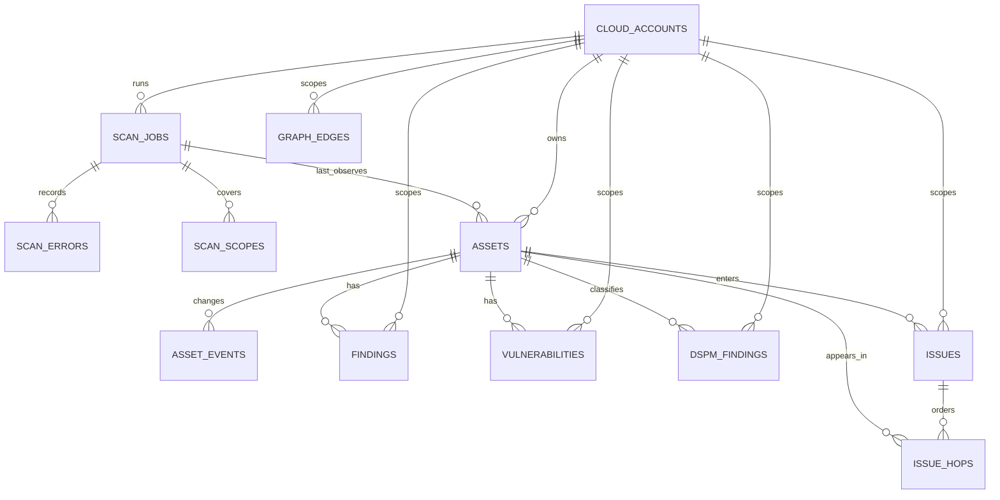
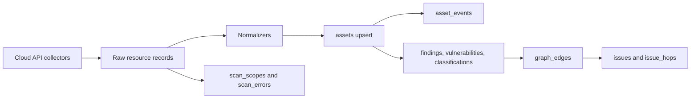

# Odineyes CSPM Data Model and SQLite Schema

## Purpose

Odineyes is a cloud-security evidence platform. Its database must answer more than “what resources were found?” It must prove:

1. which cloud account was scanned;
2. which collection operations completed or failed;
3. when a resource was last observed from the cloud provider;
4. which finding, vulnerability, classification, relationship, or attack path affects that resource; and
5. what changed over time.

The design keeps the useful provider-specific payload in JSON while moving identity, lifecycle, ownership, evidence, and query paths into relational SQLite tables.

## Architecture decision

**Decision:** retain SQLite and SQLAlchemy for the current single-workspace product, with an additive relational evidence model.

SQLite is appropriate for local/demo deployments and a single application writer. The schema avoids SQLite-only application logic, keeps foreign keys enabled, and uses WAL mode. The same models can later run on PostgreSQL through SQLAlchemy.

We intentionally do not add an `organizations` table yet. The current product has one workspace and all public APIs are account-scoped. Adding multi-tenancy prematurely would require changing every query, unique key, authorization check, and migration. The boundary is explicit: `cloud_accounts` is the current root of isolation. Introduce `organizations` before the first shared/SaaS deployment, then make every account-scoped natural key tenant-scoped.

## Entity relationship model



## Core tables

| Table | Role | Identity / lifecycle rule |
|---|---|---|
| `cloud_accounts` | A connected AWS account, Azure subscription, or GCP project. | Unique `(provider, account_identifier)`. This is the current isolation boundary. |
| `scan_jobs` | A tracked inventory, workload, or configuration scan. | One state machine: `queued`, `running`, `completed`, `failed`. |
| `scan_scopes` | Per collector and region outcome. | Unique `(scan_job_id, source_type, region)`. `*` means global/all-regions. Status is `complete`, `partial`, or `failed`. |
| `scan_errors` | Individual collector or normalization failures. | Append-only child of a scan job. Failure is not interpreted as an empty resource set. |
| `assets` | Canonical current state of a cloud resource. | Unique `(account_id, cloud_provider, resource_id)`. Soft lifecycle through `is_active`. |
| `asset_events` | Asset create/change/delete/reactivate history. | Append-only delta record with previous and new normalized state. |
| `findings` | Atomic policy/rule verdicts. | Unique `(account_id, rule_id, resource_id)`; open/resolved lifecycle. `asset_id` is the canonical relational link. |
| `vulnerabilities` | CVE and package/image evidence for an asset. | Unique `(account_id, resource_id, cve_id, package)`; open/resolved lifecycle. |
| `dspm_findings` | Sensitivity and exposure classification for a data store. | Unique `(account_id, store_id)`. Despite the legacy name, this is classification context, not only an alert. |
| `graph_edges` | Current and historical attack-graph relationships. | Unique `(account_id, src_id, dst_id, edge_type)` with active/inactive lifecycle. Logical node ids support pseudo-nodes such as `internet`. |
| `issues` | Correlated attack paths and toxic combinations. | Unique `(account_id, issue_type, path_hash)`; open/resolved lifecycle. |
| `issue_hops` | Ordered, relational attack-path nodes. | Unique `(issue_id, hop_order)`. `asset_id` is null only for pseudo/external nodes. |

## Data-model rules

### 1. Canonical asset first

Every real cloud resource is represented once in `assets`. Other security domains reference it with an optional `asset_id`:

- `findings.asset_id`
- `vulnerabilities.asset_id`
- `dspm_findings.asset_id`
- `issues.entry_asset_id`
- `issue_hops.asset_id`

The legacy/provider resource ID is retained in each domain table for idempotent upsert and for evidence that cannot be matched safely. A missing foreign key means “not proven linked”, never “linked to an arbitrary asset.”

### 2. State, history, and source payload are separate

| Need | Storage |
|---|---|
| Current normalized query state | Typed columns on `assets` such as region, public exposure, encryption, risk, lifecycle. |
| Provider-specific payload | `assets.raw`, `assets.properties`, `assets.normalized` JSON. |
| Change history | `asset_events`. |
| Scan completeness | `scan_scopes` and `scan_errors`. |
| Security evidence history | Open/resolved lifecycle tables and timestamp columns. |

JSON is used for extensible cloud-provider data, policy documents, evidence payloads, compliance mappings, and graph metadata. It is not used as a substitute for relationships that must be filtered, joined, or audited.

### 3. A zero result is not always evidence

`scan_scopes` makes this distinction durable:

| Scope status | Meaning |
|---|---|
| `complete` | The collector completed. Zero assets can be trusted as an observation. |
| `partial` | Some data was collected but an error affected the same scope. Do not retire inventory solely from absence. |
| `failed` | The scope is unknown. The platform retains existing inventory and shows coverage degradation. |

### 4. Attack paths retain both API shape and relational shape

`issues.path` remains the compact JSON payload used by the UI/API. `issue_hops` is the normalized equivalent used for investigation and SQL joins. Each hop has an ordered position, a stable node ID, optional canonical asset FK, kind, label, and evidence object.

This supports questions such as:

```sql
SELECT i.title, h.hop_order, a.name, a.asset_type
FROM issues i
JOIN issue_hops h ON h.issue_id = i.id
LEFT JOIN assets a ON a.id = h.asset_id
WHERE i.status = 'open'
ORDER BY i.risk_score DESC, h.hop_order;
```

## Scan write flow



1. A `scan_job` is created and moved to `running`.
2. Collectors provide raw records, authoritative scopes, and any collection errors.
3. Normalizers transform provider records into `NormalizedAsset` values.
4. Assets are upserted, `last_seen_scan_id` is set, and meaningful deltas create `asset_events`.
5. `scan_scopes` records whether every service/region observation is complete, partial, or failed.
6. Findings, CVEs, data classification, graph edges, and correlated issues link back to known assets whenever the identity is unambiguous.
7. The job is completed or failed without deleting historical evidence.

## SQLite implementation details

- Foreign keys are enabled on every connection: `PRAGMA foreign_keys=ON`.
- WAL mode is enabled for file-backed databases so dashboard reads can continue while a scan writes.
- `busy_timeout=30000` absorbs short concurrent-write bursts.
- Schema changes are additive through `init_db()`:
  - new tables are created with `Base.metadata.create_all()`;
  - new columns are patched with idempotent `ALTER TABLE ADD COLUMN` statements;
  - indexes are created with `checkfirst=True`;
  - old evidence rows are backfilled only when a single safe asset match exists.
- The existing asset natural-key migration remains a deliberate table rebuild because SQLite cannot replace a unique constraint in place.

## Important indexes

| Index | Query supported |
|---|---|
| `ix_assets_account_active_scanned` | Fresh active inventory per account. |
| `ix_findings_asset_status` | Open findings for an asset. |
| `ix_vulns_asset_status` | Open CVEs for a workload. |
| `ix_dspm_asset` | Sensitivity context for an asset. |
| `ix_issues_entry_asset` | Paths beginning at an asset. |
| `ix_issue_hops_asset` | All attack paths containing an asset. |
| `ix_scan_scopes_job_status` | Scan coverage and failed collectors. |
| `ix_graph_edges_account_src` | Graph traversal from a given account/node. |

## Migration and compatibility contract

The implementation is safe for the current local SQLite databases:

- Existing asset, finding, vulnerability, classification, and issue rows are retained.
- New foreign keys are nullable during upgrade.
- Backfill links an old row only on an exact or unique canonical match.
- Existing issue JSON paths are converted to `issue_hops`; pseudo-nodes remain valid with `asset_id = NULL`.
- No table is dropped and no scan history is overwritten.

## Deferred schema work

These are intentionally deferred until the product requires them:

1. **Organizations/workspaces and RBAC** before multi-customer SaaS deployment.
2. **Secrets vault integration** to remove `cloud_accounts.api_secret` from the application database.
3. **Full IAM authorization graph** for SCPs, permission boundaries, explicit deny, conditions, groups, and resource policies.
4. **Network topology tables** for VPC routes, NACLs, load balancers, endpoints, and reachability evidence.
5. **PostgreSQL migration** when concurrent workers, retention volume, full-text search, or graph queries exceed SQLite's single-writer model.

## Implementation locations

- SQLAlchemy models: `src/odineyes/db/models.py`
- Additive SQLite migrations and safe backfill: `src/odineyes/db/base.py`
- Scan, evidence, issue-hop, and classification repositories: `src/odineyes/inventory/repository.py`
- Scan lifecycle integration: `src/odineyes/inventory/service.py`
- Schema contract tests: `src/odineyes/tests/test_cspm_data_model.py`
