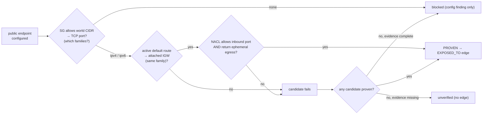

# The Evidence-Based Graph Scanner — and how it kills false positives

What changed, why, and the exact mechanisms that stop the old scanner's false
alarms. This is the detection engine, not the CVE/EBS work.

## One-sentence version

The old scanner flagged **configuration flags**; the new one proves **packet
paths and authorization paths** as edges in a graph, and only calls something an
attack path when every control on the path is *observed to permit it*. A flag
with no proven path is posture, not exposure.

## The three layers

| Layer | File | Job |
|-------|------|-----|
| Reachability engine | `inventory/reachability.py` | Prove/refuse one internet→resource **packet path** across SG + route table + IGW + NACL |
| Graph engine | `inventory/graph.py` | Build the asset graph; create attacker-traversable **edges only when proven**; enumerate paths |
| Issue engine | `inventory/issues.py` | Score each enumerated path: `risk = base × exposure × blast_radius × freshness × sensitivity` |

All three are pure, offline, deterministic, fixture-testable — no cloud calls at
scoring time.

## Old scanner vs new scanner

| Dimension | Old (heuristic / flag-based) | New (evidence / graph-based) |
|-----------|------------------------------|------------------------------|
| "Public DB" | `PubliclyAccessible=true` ⇒ internet attack path | Flag ⇒ *medium config finding*. Attack path only if SG **and** route **and** IGW **and** NACL all prove one complete path |
| Open port | port heuristic ⇒ fixed severity | severity depends on **what the evidence shows** is behind it (stale / attached / proven) |
| Security group | could be `is_public`; port list drove risk | an SG has no address — never `is_public`; it's a *rule*, and its finding severity is graded by proven reachability of what attaches to it |
| IAM privesc | `admin: true/false` heuristic | edge needs explicit IAM Allow **∧** permissions-boundary permit **∧** role-trust; unevaluated layers fail **closed** |
| Result of a flag with no path | false "exposed" | `blocked` (control stops it) or `unverified` (evidence missing) — two opposite facts, never conflated |
| Severity source | hand-set label per rule | follows the computed 0–100 score; the badge can't contradict the number |
| Evidence | a severity label | an audit-line trail: `{source API, observation, security effect}` per hop |
| Confidence | ad-hoc | none fabricated — `status` + contents of `missing` *are* the confidence |

## Why it's "graph theory"

The account becomes a directed graph. Nodes = assets (+ pseudo-nodes `internet`
and `external:<principal>`). Edges are the relations an attacker actually
traverses:

```
EXPOSED_TO   internet → resource   (only after a reachability proof)
CAN_ASSUME   principal → role      (identity policy ∧ boundary ∧ role trust)
CAN_ACCESS   principal → bucket    (explicit Allow within boundary)
CAN_MODIFY_AND_INVOKE / CAN_IMPERSONATE_VIA_SERVICE   second-order CIEM
```

An **attack path** is a simple path `entry → … → valuable target`
(`role | bucket | database`), found by a depth- and count-capped DFS
(`enumerate_paths`, max_depth 7, max_paths 400 so a dense graph can't explode).
The DFS is the whole point: it surfaces *latent* multi-hop paths no single rule
names — internet → EC2 → assumable role → admin → every bucket — and ranks them
by severity then length. Edges the scanner's own onboarding created
(`verified_onboarding`) are excluded so the scanner never flags itself as an
attacker.

## The reachability proof (the core of FP reduction)

For a public endpoint, one path is proven only if a **single address family**
completes **end to end** through, for each candidate `(subnet × family)`:



Four verdicts, and the discipline lives in the distinctions:
`reachable | blocked | unverified | not_applicable`.

## The seven mechanisms that eliminate false positives

1. **Configuration ≠ reachability.** `PubliclyAccessible=true` produces
   `RDS_PUBLIC_ENDPOINT_CONFIGURED` (medium), never an internet edge. This alone
   removed the biggest old FP class: databases marked internet-exposed while
   their SG was shut.

2. **Whole-path proof.** SG + route table + attached IGW + NACL must *all*
   permit. Any one denying ⇒ `blocked` ⇒ no edge ⇒ no attack path. A closed
   control anywhere on the path silences the alarm — correctly.

3. **Missing evidence ≠ blocked.** If a required source wasn't collected the
   verdict is `unverified`, a *coverage gap* — never a false "exposed" and never
   a false "clean". `unverified` outranks `blocked` (an unevaluable path might be
   the open one), so gaps never masquerade as safety.

4. **Address family end-to-end.** An `::/0` SG rule can't borrow an IPv4 default
   route to fake reachability; an egress-only gateway (`eigw-`) never carries
   inbound. Prevents the "IPv6 rule + IPv4 route" phantom path.

5. **Stateless NACL interval algebra.** NACLs are evaluated in rule-number order
   with proper interval subtraction (`_nacl_allows_world`), so a low-numbered
   partial DENY coexists with a broader ALLOW instead of a naive "first rule
   wins" that both over- and under-flags. Return traffic is tested as *overlap*
   with the ephemeral range (1024–65535), not membership of one port — a tighter
   valid egress rule (e.g. 32768–65535) still correctly proves reachable.

6. **Severity from evidence tier, not from the rule.** `0.0.0.0/0 → 22` always
   fails CIS 5.2, but:
   - no resource uses the SG ⇒ **low** (stale rule, nothing exposed)
   - attached but no proven path ⇒ **medium** (control gap — the finding says
     whether the path is broken or just uncollected)
   - complete internet path to an attached instance ⇒ **high**

   This turns the old undifferentiated flood of "critical open ports" into a
   ranked list where high means *provably reachable*.

7. **Identity edges fail closed.** `CAN_ASSUME` / `CAN_ACCESS` require explicit
   IAM Allow **and** permissions-boundary permit **and** (for assume) role trust.
   Layers not yet evaluated — SCP, RCP, session/resource policy, conditional
   context — never produce an optimistic edge; they're declared as limitations in
   the readiness response so the UI never shows false certainty. No phantom
   privilege-escalation paths from an `admin:true` guess.

Bonus, one layer down: `is_public` was removed from security groups. It
double-counted — the rule severity already encodes "open to world" and the
exposure multiplier then multiplied the same fact again, inflating scores.

## Scoring: a number the badge can't contradict

```
risk_score = base × exposure × blast_radius × freshness × sensitivity   (0–100)
exposure:     internet 1.0 · external-trust 0.85 · internal 0.6
blast_radius: admin 1.0 · data 0.85 · single-service 0.6
freshness:    ≤1d 1.0 · ≤7d 0.95 · older 0.85   (confidence decay)
severity   =  ≥80 critical · ≥60 high · ≥40 medium · else low
```

Every issue carries `evidence[]` (audit-line trail), a `scoring` string showing
the factors multiplying up to the number, and a `confidence` (route-completeness,
distinct from risk). An operator sorts *certainty* separately from *severity*.

## What it deliberately does NOT claim (fail-closed boundary)

Proven only: world default-route paths (`0.0.0.0/0`, `::/0`) through an internet
gateway. Still `unverified`, never guessed: AWS Network Firewall, Gateway Load
Balancers, Transit Gateway, VPC peering, PrivateLink, custom appliance routing,
application-layer auth, and the IAM layers in mechanism 7. A missing runtime
sensor means every path is a *possible* exposure, not proof of active
exploitation — stated in `analysis_summary.limitations`.

## How to talk about the FP reduction (for a demo / write-up)

- Old: "PubliclyAccessible=true → 1 critical attack path" on a DB whose SG is
  closed. New: 1 medium config finding, `internet_reachability.status=blocked`,
  with the exact control that stops the packet named in the evidence.
- Old: 50 "critical" open-SSH findings, undifferentiated. New: 3 high (provably
  reachable), 12 medium (attached, path unproven/uncollected), 35 low (stale
  rules on nothing) — the operator fixes the 3 first.
- The number every stakeholder wants (Phase-5 metric, not yet built):
  evidence coverage, rule precision, suppression rate, **false-positive rate**,
  time-to-verified-remediation. Wiring these is the natural next step.

## Source map

- `inventory/reachability.py` — `assess_rds_internet_reachability`,
  `assess_ec2_internet_reachability`, `build_network_topology`, NACL interval math
- `inventory/graph.py` — `AssetGraph.build`, `enumerate_paths`, edge derivation,
  `analysis_summary`
- `inventory/issues.py` — risk model, `_severity_for`, evidence/scoring/confidence
- `docs/detection-rules-evidence-model.md` — the rule contract and four-state table
