# Odineyes Go AWS Scanner - Implementation and Rollout Notes

Date: 2026-07-23  
Status: implemented and locally verified; production activation requires explicit approval

## Why this change exists

The Python scanner is functionally useful, but large multi-region scans spend
substantial time coordinating AWS API calls, enriching resources, and retaining
large raw inventories in one process. The main production risks are:

- slow multi-region scans and API throttling;
- scan overlap and incomplete snapshots;
- temporary STS credentials being created in the orchestration process;
- silent collector/data-model mismatches;
- an unsafe all-at-once migration to a new scanner;
- free-tier deployment hosts compiling a large SDK during release.

The Go scanner does not make AWS APIs intrinsically faster. Its value is bounded
concurrency, lower per-worker overhead, a single static deployment binary, and a
clean authentication boundary. AWS network latency and service throttling remain
the main limits.

## Implemented architecture

```mermaid
flowchart LR
    API["FastAPI scan request"] --> MODE{"Scanner backend"}
    MODE -->|"python"| PY["Existing Python collector"]
    MODE -->|"shadow"| BOTH["Python primary + Go comparison"]
    MODE -->|"go"| GO["Go scanner subprocess"]

    BOTH --> PY
    BOTH --> GO
    PY --> PERSIST["Existing normalizers and SQLite persistence"]

    GO --> CREDS["AWS default credential chain"]
    CREDS --> ID["STS GetCallerIdentity"]
    ID -->|"same account"| READ["Read-only AWS collection"]
    ID -->|"customer account"| ASSUME["STS AssumeRole + ExternalId"]
    ASSUME --> VERIFY["Verify assumed account id"]
    VERIFY --> READ

    READ --> RAW["Versioned JSON raw-resource contract"]
    RAW --> VALIDATE["Python schema and normalizer validation"]
    VALIDATE --> PERSIST
    PERSIST --> FINDINGS["Findings, identity, data, and attack-path engines"]
```



The Go process accepts one JSON request through stdin and returns one JSON
response through stdout. No role ARN, ExternalId, access key, or session token is
placed in command-line arguments. The Go process loads the ambient workload
identity itself and performs `AssumeRole` internally.

## Authentication rules

The scanner enforces the following rules before collection:

1. Load the standard AWS SDK credential chain.
2. Call `sts:GetCallerIdentity`.
3. If the caller account equals the requested account, use the ambient identity.
4. For a different account, require a valid IAM role ARN belonging to the exact
   requested account.
5. Reject a cross-account scan when the ambient ARN is the AWS root principal.
6. Call `sts:AssumeRole`, including the registered ExternalId when present.
7. Call `GetCallerIdentity` again and reject the scan if AWS returns a different
   account.

The ExternalId is a confused-deputy binding value, not a customer access token
and not an AWS credential. Customer access keys are not required.

In production, the ambient identity should be the EC2 instance role, ECS task
role, EKS workload identity, or another short-lived AWS workload identity.

## AWS inventory coverage

The Go collector emits the same canonical source types used by the current
normalizers:

| AWS area | Canonical assets and enrichment |
|---|---|
| EC2 | Instances and security groups across discovered regions |
| S3 | Paginated buckets, region, public-access block, policy status, ACL, encryption, versioning, policy presence, and tags |
| IAM | Roles and users, managed/inline policies, admin evidence, privilege-escalation actions, explicit AssumeRole/S3 access, trust, access keys, MFA, console access, and dormancy |
| RDS | DB instances, clusters, and proxies |
| Lambda | Functions, function URL authentication, and wildcard resource-policy exposure |
| Elastic Load Balancing | ALB/NLB inventory |
| Secrets Manager | Secrets and wildcard resource-policy exposure |
| Redshift | Clusters |
| Neptune | DB clusters |
| DocumentDB | DB clusters |
| ECS | `ListClusters` followed by batched `DescribeClusters`, settings, and tags |
| CloudTrail | Trails and current logging status |
| AWS Config | Recorders and active recording status |
| KMS | Keys, state, manager, specification, and rotation status |
| CloudWatch Logs | Log groups, retention, KMS key, and stored bytes |

ECS collection fixes an existing Python-path gap: `ListClusters` returns ARN
strings, while the generic Python extraction path only accepts dictionaries.
The Go scanner resolves those ARNs through `DescribeClusters` and emits records
that the existing ECS normalizer can persist.

## Completeness and failure semantics

Each service/region operation produces one of two outcomes:

- an authoritative scope, meaning the operation completed and inventory rows
  missing from that scope may be retired; or
- a collection error, meaning existing assets in that scope must not be retired.

A scope is also non-authoritative when it reaches the 5,000-item safety limit.
One denied service does not invalidate successful services. Fatal identity or
AssumeRole errors fail the entire scan before persistence.

The Python adapter validates:

- protocol version;
- returned account id;
- resource/scopes/error JSON types;
- fatal scanner errors;
- maximum response size;
- that every emitted source type has an installed normalizer.

## Performance controls

- Region/service tasks use a bounded worker pool.
- The default worker count is 16 and the accepted maximum is 64.
- AWS SDK adaptive retry mode is enabled with six attempts.
- Region discovery includes regions that are enabled or do not require opt-in.
- Every inventory operation has a 5,000-item default safety limit.
- The complete scan has a 15-minute default timeout and a one-hour hard maximum.
- Requests are limited to 1 MiB and responses to 256 MiB at the Python boundary.
- Resources and scopes are sorted before output for deterministic comparison.

IAM and per-bucket S3 enrichment still require several AWS calls per resource.
For very large accounts, later work should add service-specific rate limits,
streaming output, and incremental/event-driven collection.

## Rollout controls

`ODINEYES_AWS_SCANNER_BACKEND` accepts:

| Value | Behavior |
|---|---|
| `python` | Existing collector only. This is the default and immediate rollback mode. |
| `shadow` | Persist Python results and run Go only for comparison. A Go failure cannot fail persistence. |
| `go` | Persist Go results. |

`ODINEYES_AWS_SCANNER_ACCOUNT_ALLOWLIST` is an optional comma-separated list of
12-digit AWS account ids. When it is set, `shadow` or `go` applies only to those
accounts; every other account stays on Python.

Examples:

```text
ODINEYES_AWS_SCANNER_BACKEND=shadow
ODINEYES_AWS_SCANNER_ACCOUNT_ALLOWLIST=097639379012
```

```text
ODINEYES_AWS_SCANNER_BACKEND=go
ODINEYES_AWS_SCANNER_ACCOUNT_ALLOWLIST=097639379012
```

The single-host CloudFormation template exposes both values as
`ScannerBackend` and `ScannerAccountAllowlist` parameters.

## Recommended production sequence

1. Deploy the release with `ScannerBackend=python`.
2. Confirm the binary exists in the API container:

   ```bash
   docker exec odineyes-api odineyes-scanner </dev/null
   ```

   An empty-input validation error is expected; command-not-found is not.

3. Update the stack to `ScannerBackend=shadow` with one non-production or known
   customer account in `ScannerAccountAllowlist`.
4. Run multiple scans and compare:

   - counts by source type;
   - authoritative scopes;
   - collection errors;
   - normalized asset counts;
   - findings, identity posture, and attack paths;
   - scan duration and AWS throttling.

5. Resolve every unexplained mismatch.
6. Change the canary account to `ScannerBackend=go`.
7. Observe at least two complete scheduled scan cycles.
8. Expand the allowlist gradually.
9. Remove the allowlist only after all supported account shapes pass.

Rollback is one environment/stack parameter change:

```text
ScannerBackend=python
ScannerAccountAllowlist=
```

## Release packaging

The full development Dockerfile builds the scanner in a pinned
`golang:1.26.4-bookworm` build stage.

The free-tier EC2 release path does not compile Go on the t3.micro. Instead,
`scripts/package_ec2_release.ps1` cross-compiles a stripped, static Linux AMD64
binary and includes it at:

```text
scanner-go/bin/odineyes-scanner-linux-amd64
```

The runtime Dockerfile copies that binary to:

```text
/usr/local/bin/odineyes-scanner
```

Validated Linux binary SHA-256:

```text
8F7B34E0026DE0A31DE3219B1A0A679E684E8493BC9E4D6BFCF753A65C38F0D5
```

## Bugs fixed during implementation

- Fixed task-submission cancellation so context cancellation exits the outer
  submission loop instead of only the `select`.
- Fixed ECS inventory by resolving cluster ARN strings through
  `DescribeClusters`.
- Added modern paginated S3 bucket enumeration and bucket-region fallback.
- Restored IAM parity for `sts:AssumeRole` privilege-escalation evidence.
- Added response account and normalizer compatibility guards.
- Prevented any scope with a resource collection/encoding error from being
  marked authoritative and retiring existing assets.
- Added a safe shadow fallback and account-level canary control.
- Updated a stale one-click onboarding test to the current reusable,
  provider-scoped S3 key.
- Removed a redundant CloudFormation `DependsOn` warning.
- Kept Python as the default in Compose and CloudFormation.

## Verification completed

- Go unit tests: passed.
- `go vet ./...`: passed.
- Python full suite on the final release state: 537 passed, 1 skipped.
- Ruff checks on changed Python scanner files: passed.
- Frontend TypeScript and Vite production build: passed.
- CloudFormation `cfn-lint` for `us-east-1`: 0 errors, 0 warnings.
- Windows scanner binary protocol/error contract: passed.
- Linux AMD64 cross-build: passed.
- EC2 release ZIP creation and content inspection: passed.

The local Docker image build could not run because Docker Desktop's engine
service was unavailable on this workstation. No production resource, stack,
image registry, or website was modified.

## Known limitations and follow-up work

- Live Go/Python parity against representative AWS accounts must be measured in
  shadow mode before Go becomes authoritative.
- IAM conditions, permission boundaries, SCPs, session policies, and
  `NotAction`/`NotResource` require a complete effective-permission evaluator.
  Conditional statements are intentionally not converted into unconditional
  graph edges.
- The current subprocess protocol buffers a complete scan response. Large
  enterprise inventories should move to framed streaming or a job queue.
- Service-specific adaptive concurrency should be added using observed
  throttling metrics.
- The API access-verification endpoint still uses the Python/boto3 diagnostic
  path; normal inventory scans can use Go.
- The scanner currently targets AWS inventory. Trivy, Tetragon/eBPF, Azure, and
  GCP remain separate collection pipelines.

## Production gate

The implementation is ready for a controlled deployment, but production has
not been changed. Before any stack update, S3 upload, container replacement, or
backend activation, obtain explicit deployment approval and begin with
`ScannerBackend=python`.
