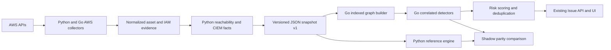

# Odineyes Go graph detection engine

## Outcome

Odineyes now has a deterministic Go engine for correlated cloud-risk detection. Python continues to collect and normalize AWS data and to decide single-asset facts such as verified network reachability. Go receives those facts through a versioned JSON contract, constructs the security graph, derives IAM access edges, traverses attack routes, runs all eight correlated detectors, scores and deduplicates issues, and returns the same `Issue` model consumed by the API and UI.

This boundary is intentional. A faster language cannot repair incomplete AWS evidence. Collection and normalization remain the source of truth; Go accelerates the graph work after the evidence is normalized.



## Implemented detector coverage

The Go engine implements the current correlated detector set:

1. `PUBLIC_COMPUTE_TO_ADMIN`
2. `PUBLIC_COMPUTE_TO_DATA`
3. `PUBLIC_S3_EXPOSURE`
4. `PUBLIC_DATABASE_PATH`
5. `CROSS_ACCOUNT_LATERAL`
6. `IAM_PRIVILEGE_ESCALATION`
7. `SECOND_ORDER_ROLE_ESCALATION`
8. `OVERPRIVILEGED_CICD_ROLE`

The implementation preserves evidence, remediation, severity, confidence, compliance mapping, path order, related resources, and scoring text. The parity suite compares all of these operator-visible fields.

## Data structures and complexity

Let:

- `V` be graph nodes.
- `E` be graph edges.
- `I` be IAM identities.
- `G` be exact IAM resource grants for one identity.
- `P` be wildcard IAM resource patterns for one identity.
- `T` be candidate target resources of the requested kind.
- `C` be matching candidates.
- `D` be the bounded path depth, currently 7.
- `K` be the bounded number of emitted paths, currently 400.

| Operation | Implementation | Time complexity |
|---|---|---:|
| Node lookup | `map[resourceID]*Node` | Average `O(1)` |
| Node insertion | node map plus kind and order indexes | Average `O(1)` |
| Edge insertion and dedup | `(source,target,type)` hash index | Average `O(1)` |
| Nodes by kind | precomputed kind index | `O(1)` lookup, `O(k)` iteration |
| Outgoing edges by type | `(source,type)` adjacency index | `O(1)` lookup, `O(k)` iteration |
| Exact IAM grant resolution | graph lookup for each literal ARN | `O(G + C log C)` |
| Global wildcard grant | emit every target | `O(T)` |
| Pattern IAM grant | compiled Python-compatible glob over targets | `O(P*T)` |
| Detection sort and dedup | stable risk order plus path hash | `O(F log F)` for `F` findings |
| Path enumeration | cycle-safe bounded DFS | Worst-case exponential in `D`, capped by `D` and `K` |

The key improvement is that least-privilege exact ARN policies no longer scan every bucket or role for every identity. Their cost depends on the number of grants, not the inventory size. Wildcards necessarily remain linear because a wildcard intentionally creates an edge to every covered target.

## Measured grant-index performance

Benchmark environment: Windows amd64, Intel Core i7-10610U, Go 1.26.4. Each exact case resolves the same three literal S3 ARNs.

| Candidate targets | Exact grants | Time/op | Bytes/op | Allocations/op |
|---:|---:|---:|---:|---:|
| 1,000 | 3 | 3,477 ns | 296 | 10 |
| 10,000 | 3 | 3,556 ns | 296 | 10 |
| 100,000 | 3 | 3,086 ns | 296 | 10 |

The flat result demonstrates that exact-grant resolution is independent of target population. A wildcard-pattern benchmark is intentionally linear: approximately 3.1 ms for 1,000 emitted matches and 48.4 ms for 10,000 emitted matches on this workstation.

Run the benchmark again with:

```powershell
cd scanner-go
go test ./internal/graph -run '^$' -bench 'BenchmarkGrantIndex' -benchmem -benchtime=200ms
```

## End-to-end Python versus Go stress benchmark

An offline parity-checked stress run was completed on 2026-08-10 with Python
3.14.5, Go 1.26.4, and an Intel Core i7-10610U. Each fixture contains the same
number of IAM roles and S3 buckets; each role receives one exact bucket ARN.
This deliberately exercises the former identity-by-resource cross-product.
Every run compared the complete operator-visible issue output before timing.

| Assets | Repetitions | Python p50 / p95 | Go core p50 / p95 | Go end-to-end p50 / p95 | Core speedup | End-to-end speedup |
|---:|---:|---:|---:|---:|---:|---:|
| 500 | 9 | 88.0 / 99.3 ms | 57.4 / 73.5 ms | 77.6 / 85.0 ms | 1.53x | 1.13x |
| 1,000 | 9 | 369.5 / 503.2 ms | 94.6 / 142.5 ms | 251.4 / 333.5 ms | 3.91x | 1.47x |
| 2,000 | 9 | 1,826.2 / 2,170.2 ms | 136.4 / 194.7 ms | 393.9 / 456.1 ms | 13.39x | 4.64x |
| 4,000 | 3 | 4,994.5 / 5,149.9 ms | 211.8 / 221.9 ms | 467.5 / 514.5 ms | 23.58x | 10.68x |
| 8,000 | 3 | 17,483.5 / 19,471.0 ms | 361.7 / 391.8 ms | 880.2 / 967.1 ms | 48.34x | 19.86x |

"Go core" times only the Go graph builder and detector against an identical
pre-built snapshot. "Go end-to-end" additionally includes the Python evidence
and snapshot preparation plus process transport, so it is the relevant
production number. The fixture's Python traced heap peak grows from 1.18 MiB
at 500 assets to 18.81 MiB at 8,000 assets. Do not compare that figure directly
with Go process RSS; they use different memory accounting.

The repeatable harness is `scripts/benchmark_graph_engines.py`:

```powershell
.\.venv\Scripts\python.exe scripts\benchmark_graph_engines.py `
  --sizes 250 500 1000 2000 4000 --runs 9 `
  --json-out .benchmarks\graph-engine.json
```

## Runtime contract

The command is `odineyes-graph`. It reads one snapshot from standard input and writes one result to standard output. Both sides require contract version 1. Unknown versions fail closed instead of silently dropping evidence.

The command is a pure function of its input:

- It performs no AWS calls.
- It performs no database calls.
- The caller supplies the analysis timestamp.
- Output ordering is deterministic.
- Graph and path serialization can be skipped when only findings are needed.

Python invokes the binary with `--skip-graph --skip-paths` in the scan pipeline. This avoids serializing a potentially large graph projection when the caller only persists issues.

## Rollout and failure behavior

Configure `ODINEYES_GRAPH_ENGINE`:

| Mode | Behavior |
|---|---|
| `python` | Reference engine only |
| `shadow` | Runs both, returns Python, logs any full-field mismatch |
| `go` | Returns Go output; falls back to Python on any execution or contract failure |
| `auto` | Uses Go at or above `ODINEYES_GRAPH_GO_MIN_ASSETS`, Python below |

`auto` is the production default and the threshold is 1,000 assets. Process startup and JSON transport are fixed costs, so Python remains faster for very small inventories. The Go binary is copied into the runtime image and the deployment preflight refuses a release that omits it.

The fallback is a security control. A binary crash, timeout, missing executable, oversized response, malformed JSON, or contract mismatch triggers the Python engine. Odineyes never converts an engine failure into an empty finding set.

## Verification

The parity suite runs the Python and Go engines over the same fixtures and compares every operator-visible field. Current coverage includes public compute to admin, role chaining to data, public S3, public databases, cross-account trust, direct IAM escalation, second-order Lambda escalation, overprivileged CI/CD, environment score weighting, verified Odineyes onboarding suppression, no-evidence EC2 behavior, empty inventory, and subprocess fallback.

```powershell
$env:ODINEYES_GO_GRAPH_PATH=(Resolve-Path 'scanner-go\bin\odineyes-graph.exe').Path
$env:ODINEYES_REQUIRE_GO_GRAPH='1'
.\.venv\Scripts\python.exe -m pytest src\odineyes\tests\test_graph_engine_parity.py -q
```

Production packaging cross-compiles `scanner-go/bin/odineyes-graph-linux-amd64`, includes it in the release archive, validates its presence before container replacement, and health-checks the new API before deleting the previous containers. Failed deployments automatically restore the prior release.

## Next optimization boundary

The remaining high-value improvement is a long-running local Go worker using framed messages or a Unix socket. That removes process startup and repeated JSON parsing, allowing Go to win on smaller inventories. It should be introduced only after production shadow telemetry confirms stable memory use and parity across real customer snapshots. The current subprocess boundary is simpler to isolate, roll back, and audit.
