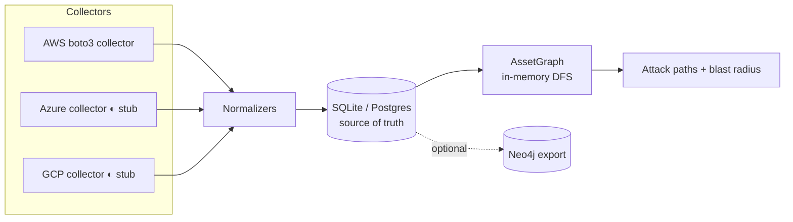
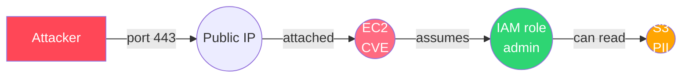
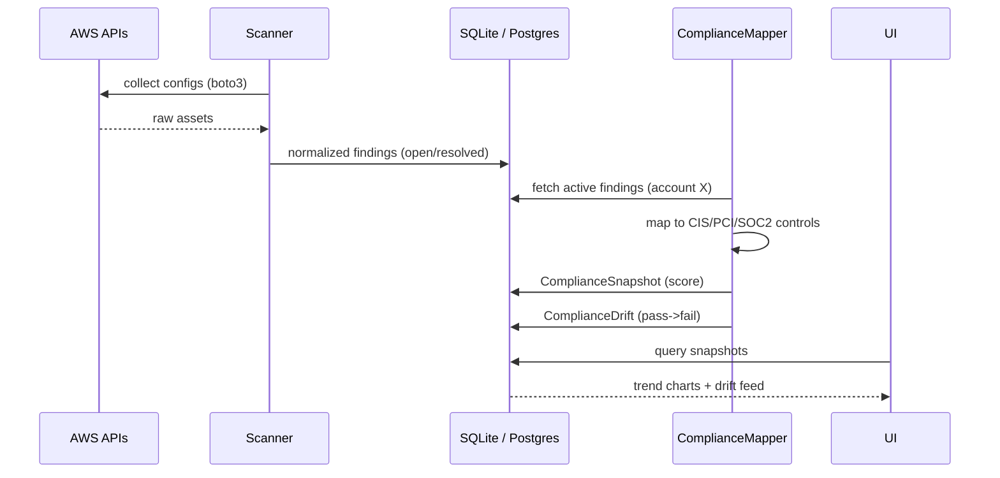
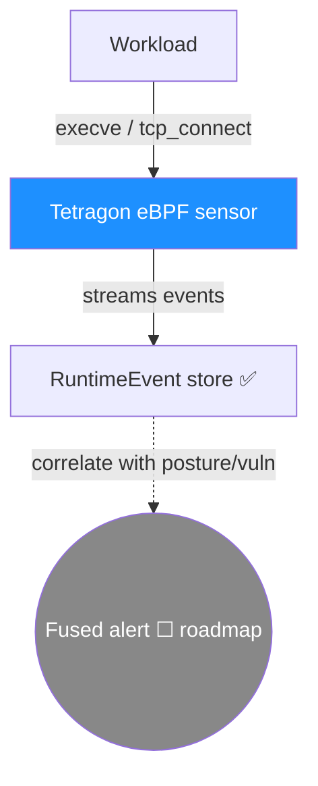
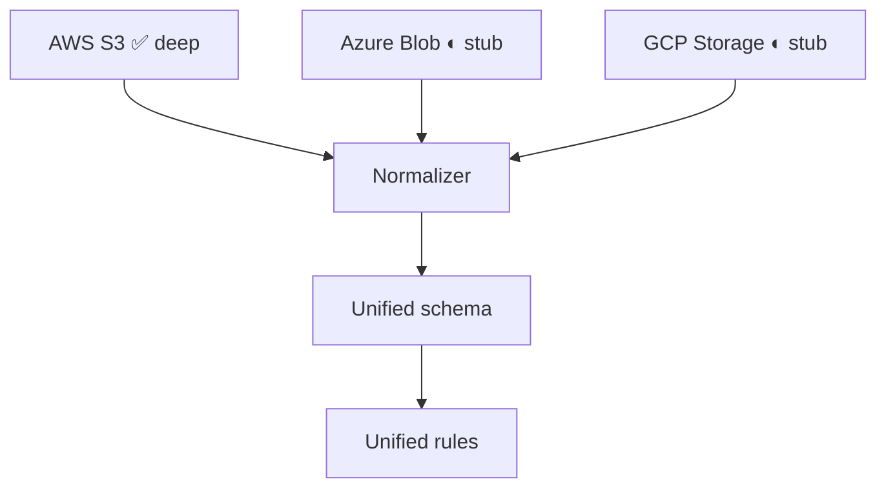

# G3Sec.ai Odineyes — Architecture & Capability Map

This document describes what Odineyes actually does today, grounded in the
codebase (`src/odineyes/`), and separates **shipped** capability from
**roadmap**. It is written to be accurate enough to hand to a customer or an
auditor — every claim below can be traced to code, and anything not yet built
is labelled as such rather than implied.

**Status legend:** ✅ shipped · ◐ partial · ☐ roadmap (not yet built / not wired)

---

## 1. Positioning vs. CNAPP leaders (Wiz, Prisma, Orca)

Honest framing: Odineyes is an AWS-first CNAPP with real graph-based attack-path
analysis, agentless posture, DSPM, CIEM, vuln correlation, and an eBPF runtime
sensor. It is **not** at feature parity with Wiz/Prisma on multi-cloud depth,
effective-permission CIEM, or CI/CD-integrated IaC. Where a differentiator is
aspirational, it's marked roadmap.

| Feature area | Industry leaders | Odineyes today |
| :--- | :--- | :--- |
| Attack-path graph | Graph-based toxic-combination detection | ✅ In-memory `AssetGraph` DFS over a SQL-persisted edge store; multi-hop path enumeration + blast-radius scoring |
| Runtime | Snapshot polling; some add runtime sensors | ◐ Tetragon **eBPF** sensor streams syscall/process/network events to `RuntimeEvent`; runtime↔posture correlation is ☐ roadmap |
| Compliance transparency | Often black-box control mapping | ✅ Steampipe/Powerpipe SQL benchmarks when present, with an in-tree Python check engine fallback; auditable control→check mapping |
| Event-driven speed | Interval polling, quota-bound | ☐ `EventListener` (CloudTrail/EventBridge-via-SQS) is written but **not wired**; scanning is interval-based today |
| Multi-cloud | Broad AWS/Azure/GCP | ◐ AWS is deep; Azure/GCP collectors are shallow stubs |
| Openness | Proprietary stacks | ✅ Trivy (vulns), Steampipe/Powerpipe (compliance), SQL source-of-truth, **optional** Neo4j export — no proprietary lock-in |

---

## 2. Data & graph architecture (the honest version)

- **Source of truth:** SQLite (dev) / Postgres (prod) via SQLAlchemy. All
  assets, findings, issues, vulnerabilities, DSPM findings, runtime events,
  and graph edges persist here.
- **Attack-path graph:** built **in memory** by `inventory/graph.py`
  (`AssetGraph.build` → `enumerate_paths`, DFS, `max_depth=7`) from the
  persisted `GraphEdge` rows. This is a Python graph over SQL — not a graph
  database at runtime.
- **Neo4j:** an **optional** write-through projection
  (`inventory/graph_store.py`, `Neo4jGraphStore.from_env`). Off unless the
  Neo4j env vars are set; SQL remains the source of truth. Use it for ad-hoc
  Cypher querying, not as a dependency.

---

## 3. Capabilities

### A. Graph-based risk prioritization ✅
`AssetGraph` correlates assets + edges into ranked attack paths instead of flat
alerts — e.g. `Public IP → EC2 (CVE) → IAM role (admin) → S3 (PII)`. Path
scoring lives in `graph.py` (`_path_meta`) and the Issues engine
(`inventory/issues.py`).

### B. Continuous compliance & drift ✅
Findings persist as open/resolved. The compliance mapper
(`core/compliance_mapper.py`, 7 catalogs: CIS, SOC2, PCI-DSS, ISO 27001,
NIST 800-53, GDPR, HIPAA) scores snapshots; `queries.compliance_drift`
diffs snapshot-to-snapshot for pass↔fail regressions. Controls that can't be
auto-checked are marked `not_assessed` (honest scoring, not silent pass).

### C. eBPF runtime sensor (CWPP) ◐
`sensor/tetragon_shipper.py` + `sensor/policies/` ship Tetragon eBPF telemetry
(syscall/process/network) into `RuntimeEvent`, surfaced on the Threats/eBPF
pages.

**Shipped:** collection + storage of runtime events.
**Roadmap ☐:** fusing runtime events with static posture/vulns (e.g. "is this
CVE's package actually running", "is this open port receiving traffic"). Today
runtime and posture are stored side by side, not correlated.

### D. Multi-cloud normalization (CSPM) ◐
Normalizers abstract vendor resources into a unified schema + rules engine.
**AWS is deep** (`aws_raw_collector.py`, ~19 resource ops, enrichment hooks,
21 single-asset + combination rules). **Azure/GCP are shallow stubs**
(`azure_collector.py`, `gcp_collector.py` — a single `collect()` each; one
check apiece in `check_registry.py`). Treat non-AWS as preview.

### E. Data Security Posture Management (DSPM) ✅
`dspm/engine.py` + `dspm/stores.py` classify S3, RDS, RDS/EBS snapshots,
DynamoDB, Secrets Manager, SSM parameters. Classification is **regex-based**
(`dspm/classifier.py` — patterns for AWS keys, private keys, JWT, credit card,
IBAN, SSN, email; not NLP/ML). Sensitivity → `DspmFinding` (label PII/PCI/etc.).

**Shipped this cycle:** posture↔DSPM join. `inventory/finding_risk.py` matches
a finding's resource against its DSPM classification (bridging the
`arn:aws:s3:::x` ↔ `s3://x` id formats) and flags the toxic combo
`public + sensitive data` as `ELEVATED`, ranking it above a plain critical.

### F. Cloud Infrastructure Entitlement Management (CIEM) ◐
The collector walks attached + inline **identity policies** per principal
(`AwsCollector._scan_doc`/`_doc_is_admin`) to derive `has_admin`,
`privesc_actions`, and trust posture. The Issues engine turns these into
identity attack paths.

**Shipped ✅:**
- `IAM_PRIVILEGE_ESCALATION` — privesc primitives (iam:PassRole, CreatePolicyVersion, …) → admin
- `CROSS_ACCOUNT_LATERAL` — role assumable from outside the account
- `OVERPRIVILEGED_CICD_ROLE` — OIDC-federated (GitHub/GitLab) role with admin/privesc
- IAM **user** coverage — `IAM_USER_PRIVILEGED_LONGLIVED_KEY` (privileged user, active access key > 90d), `IAM_USER_CONSOLE_NO_MFA`
- `DORMANT_PRIVILEGED_IDENTITY` — privileged role/user unused > 90d or never used since creation

**Roadmap ☐:** true **effective permissions** across SCPs + resource policies +
identity policies (today it's identity-policy heuristics, not full policy
evaluation); usage-based least-privilege right-sizing (needs IAM
last-accessed data); multi-hop role chains (A→B→admin C); Kubernetes→IAM
(IRSA) mapping.

> Correction vs. earlier drafts: Odineyes does **not** yet compute effective
> net-access from SCP + resource + identity policies, and does **not** suggest
> least-privilege replacements from actual usage. Those are roadmap.

### G. Infrastructure-as-Code scanning ◐
`iac/scanner.py` parses Terraform / CloudFormation and checks public S3,
unencrypted storage, open security groups, wildcard IAM, CloudTrail/Config
posture. Exposed as a **stateless** endpoint: `POST /api/inventory/iac/scan`
(content in → findings out).

**Roadmap ☐:** GitHub App / PR-diff scanning, deployment blocking, PR comments,
resource↔code-line mapping. Today it is paste-and-scan or a manual CI call —
**not** an automated PR gate.

### H. Vulnerability management ✅
Trivy scans container images, functions, VM OS packages for CVEs
(`cloud/trivy_scanner.py`, `cloud/cve_scanner.py`). Prioritization uses
exploit maturity + KEV + EPSS (`scanner/maturity.py`, `scanner/kev_client.py`,
`scanner/epss_client.py`). A CVE on an internet-reachable, high-privilege path
is elevated through the attack-path/Issues engine
(`inventory/exploitation.py`), not treated as a flat severity.

### I. Onboarding & data isolation ✅
Cross-account, role-only. `POST /accounts/onboarding-template` generates a
CloudFormation/Terraform template with a server-generated **ExternalId**; the
client deploys it and registers the resulting role ARN. `role_arn` is
mandatory — there is **no** ambient/root-credential scan path (the orchestrator
refuses to scan an account with credentials belonging to a different account).
Per-account data isolation via `account_id` on every table + scope-filtered
API/UI.

---

## 4. What to say to a customer (accurate)

Odineyes delivers agentless AWS CSPM with graph attack-path prioritization,
DSPM (regex classification) joined to posture, CIEM covering privilege
escalation / cross-account trust / dormant + over-keyed identities, Trivy vuln
correlation, auditable Steampipe/Powerpipe compliance with drift, and a
Tetragon eBPF runtime sensor. Frictionless ExternalId role onboarding, SQL
source-of-truth with optional Neo4j export, no proprietary lock-in.

**Be honest about roadmap:** event-driven rescan (module written, not wired),
runtime↔posture correlation, deep Azure/GCP, effective-permission CIEM, and
CI/CD-integrated IaC gating are in progress, not shipped.

---

## 5. Roadmap (from `docs/CSPM_GAP_ANALYSIS.md`)

| Item | Status |
| :--- | :--- |
| Findings risk-weighting + DSPM↔posture join (`ELEVATED`) | ✅ |
| CIEM: user keys/MFA, dormant identity | ✅ |
| Role-only ExternalId onboarding | ✅ |
| Event-driven rescan (wire `EventListener`) | ☐ |
| Runtime↔vuln/posture correlation | ☐ |
| Azure/GCP depth | ☐ |
| Effective-permission CIEM (SCP + resource + usage) | ☐ |
| Multi-hop role chains, K8s→IAM | ☐ |
| IaC CI/PR gate (GitHub App) | ☐ |
| Ticketing integration (Jira/GitHub issues) | ☐ |
