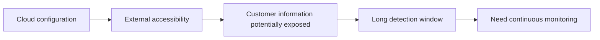
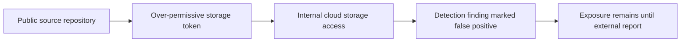
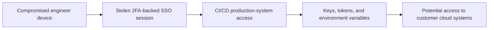
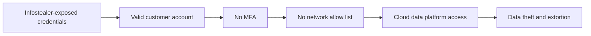
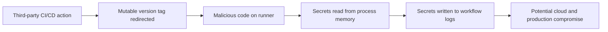

# Recent Real-World CSPM Case Studies for Odineyes (2023-2025)

## Purpose

This document supports the Odineyes CSPM problem statement with recent, publicly documented cloud-security incidents. The cases show that modern cloud risk is no longer only a matter of an open storage bucket or a missing firewall rule. It is the connected risk created by misconfiguration, stale or stolen credentials, excessive permissions, CI/CD secrets, missing MFA, weak network restrictions, and gaps in continuous monitoring.

For the detailed operator, user-persona, and product problem statement derived from these cases, see CSPM_REAL_WORLD_PROBLEM_STATEMENT.md.

> **Evidence rule:** The incident facts below are limited to the cited public sources. The sections titled **Odineyes interpretation** describe how a CSPM could help detect, prioritize, or reduce similar risk. They do not claim that Odineyes alone would have prevented the incident.

## Current industry problem statement

Organizations operate cloud infrastructure, data platforms, source repositories, CI/CD pipelines, SaaS services, and third-party integrations as one connected environment. However, security monitoring is commonly fragmented across separate tools. A misconfigured storage token, a stolen identity, a CI/CD secret, or a mutable dependency can cross those boundaries and grant access to sensitive data or production infrastructure. Teams need a continuous, relationship-aware security model that can show **which exposure is real, which identity enables it, what it can reach, and which action reduces the highest risk first**.

---

## Case study 1: Toyota cloud-configuration exposure (2023)

### Confirmed public facts

In May 2023, Toyota reported that portions of customer information had potentially been externally accessible because of cloud-environment misconfiguration. Toyota reported that some environments had potentially been externally accessible for periods extending from 2015 to 2023. Its response included implementing ongoing monitoring of cloud configuration settings.

### Failure chain

### Industry problem demonstrated

Point-in-time security review does not stop configuration drift. Cloud settings can remain externally permissive for years when discovery, accountability, and continuous evidence are incomplete.

### Odineyes interpretation

- Continuously discover storage, APIs, databases, public endpoints, accounts, and regions.
- Evaluate public access, resource policies, encryption, logging, and ownership together.
- Store first seen, last seen, configuration fingerprint, previous state, and change timeline.
- Prioritize a public data store according to data sensitivity and effective access, not merely a generic severity label.
- Trigger reassessment when a material configuration change occurs.

**Primary source:** [Toyota official incident notice](https://global.toyota/en/newsroom/corporate/39241625.html)

---

## Case study 2: Microsoft overly-permissive Azure Storage SAS token (2023)

### Confirmed public facts

Microsoft reported that an employee shared a blob-storage URL in a public GitHub repository while contributing to open-source AI learning models. The URL contained an overly permissive Shared Access Signature (SAS) token for an internal storage account. Microsoft stated that the token enabled access to internal information, that no customer data was exposed, and that an earlier detection had been incorrectly marked as a false positive.

### Failure chain

### Industry problem demonstrated

Cloud access tokens are permissions, not just strings. An exposed token becomes high risk when it grants broad scope, long duration, or access to valuable storage. Secret scanning without permission and data context creates both false positives and dangerous false negatives.

### Odineyes interpretation

- Ingest secret-scanning findings from source repositories and CI/CD systems.
- Correlate a discovered token or access key with its cloud principal, scope, expiry, permissions, data stores, and network restrictions.
- Escalate alerts only when effective access and data impact justify it.
- Track triage decisions and prevent an unresolved high-impact finding from silently becoming a false positive.
- Recommend short-lived, least-privilege, revocable credentials instead of broad static credentials.

**Primary source:** [Microsoft Security Response Center incident report](https://www.microsoft.com/en-us/msrc/blog/2023/09/microsoft-mitigated-exposure-of-internal-information-in-a-storage-account-due-to-overly-permissive-sas-token)

---

## Case study 3: CircleCI secrets incident (2023)

### Confirmed public facts

CircleCI reported that an attacker used malware on an engineer's laptop to steal a valid 2FA-backed SSO session. CircleCI stated that customer environment variables, keys, and tokens for third-party systems were exfiltrated, and advised customers to assume secrets stored on the platform during the affected period had been accessed and to rotate them.

### Failure chain

### Industry problem demonstrated

MFA is essential but not sufficient when session theft is possible. CI/CD platforms concentrate secrets that can access cloud accounts, production services, repositories, and data stores. Security teams must understand where each secret can lead after it leaves the CI/CD boundary.

### Odineyes interpretation

- Treat CI/CD systems as high-value identity and secret sources, not as out-of-scope developer tooling.
- Correlate pipeline secrets to cloud roles, accounts, services, and reachable data stores.
- Identify long-lived access keys and replace them with workload identity, OIDC federation, or short-lived role sessions where possible.
- Provide a credential-rotation workflow that verifies old keys, tokens, and permissions no longer work.
- Preserve an investigation timeline of secret exposure, credential use, rotation, and post-incident verification.

**Primary source:** [CircleCI January 2023 incident report](https://circleci.com/blog/jan-4-2023-incident-report/)

---

## Case study 4: Snowflake customer-account campaign (2024)

### Confirmed public facts

Mandiant reported a 2024 campaign, tracked as UNC5537, that used stolen customer credentials to access Snowflake customer instances and exfiltrate data. Mandiant reported no evidence that the intrusions resulted from a breach of Snowflake's enterprise environment. It identified three recurring factors in successful compromises: affected accounts lacked MFA, credentials remained valid long after theft, and customer instances lacked network allow lists. Mandiant and Snowflake notified approximately 165 potentially exposed organizations.

### Failure chain

### Industry problem demonstrated

Cloud identity exposure remains dangerous for years when organizations do not continuously rotate credentials, enforce MFA, restrict trusted network locations, and detect abnormal data access. The risk is not a provider failure alone; it is the customer-side identity and access posture around a cloud service.

### Odineyes interpretation

- Discover human and service identities across cloud and SaaS data platforms.
- Detect accounts without MFA, stale credentials, unused credentials, weak authentication policies, and missing trusted-network restrictions.
- Model access from a principal to sensitive data stores and report the likely blast radius.
- Correlate identity posture with high-volume export activity, unusual geography, unusual time, or new access path when telemetry is available.
- Prioritize remediation as a path: enable MFA, rotate exposed credentials, restrict trusted locations, and reduce unnecessary data access.

**Primary source:** [Google Cloud Mandiant report on UNC5537 and Snowflake](https://cloud.google.com/blog/topics/threat-intelligence/unc5537-snowflake-data-theft-extortion)

---

## Case study 5: `tj-actions/changed-files` CI/CD supply-chain compromise (2025)

### Confirmed public facts

GitHub's advisory for CVE-2025-30066 states that the `tj-actions/changed-files` GitHub Action was compromised between March 14 and March 15, 2025. Multiple tags were retroactively changed to point to malicious code. The advisory states that the code extracted CI/CD secrets from runner-process memory and exposed them in workflow logs, potentially affecting more than 23,000 repositories.

### Failure chain

### Industry problem demonstrated

Software-supply-chain trust is cloud-security trust. A build dependency can execute in an environment that holds cloud credentials, deployment keys, and production tokens. Teams cannot protect cloud infrastructure if they do not inventory and govern the CI/CD dependencies that can access it.

### Odineyes interpretation

- Extend the asset model to include repositories, workflows, runners, third-party actions, secrets, and cloud roles.
- Detect mutable CI/CD action references and encourage immutable commit-SHA pinning with dependency review.
- Link a pipeline secret to the cloud permissions and data it can reach.
- In an incident, create an evidence-backed rotation queue for potentially exposed cloud credentials.
- Verify that rotated secrets, revoked tokens, and replaced role sessions cannot be used after remediation.

**Primary source:** [GitHub Advisory Database: CVE-2025-30066](https://github.com/advisories/ghsa-mrrh-fwg8-r2c3)

---

## Cross-case problem statements

| Industry problem | Recent evidence | CSPM requirement for Odineyes |
|---|---|---|
| Cloud misconfiguration can remain undetected for long periods. | Toyota, 2023 | Continuous inventory, drift detection, external-exposure analysis, change timeline. |
| A secret must be prioritized by effective permission and data scope. | Microsoft, 2023 | Secret-to-identity-to-data correlation and evidence-based triage. |
| CI/CD systems are privileged identity planes. | CircleCI, 2023; GitHub Action, 2025 | CI/CD asset inventory, workload identity, secret mapping, rotation verification. |
| MFA alone does not eliminate session or credential abuse. | CircleCI, 2023; Snowflake, 2024 | Session-aware identity security, device and network context, abnormal-use detection. |
| Long-lived credentials create delayed but material breach risk. | Snowflake, 2024 | Key age, inactivity, exposure, rotation, and trusted-network posture. |
| Third-party components can expose cloud secrets and production access. | GitHub Action, 2025 | Software-supply-chain relationship model and CI/CD policy controls. |
| Isolated findings hide the actual attack path. | All five cases | Graph-based attack-path analysis and contextual risk scoring. |

## Required Odineyes capabilities derived from these cases

1. **Continuous normalized inventory** across accounts, regions, repositories, CI/CD systems, identities, data stores, and external endpoints.
2. **Effective-access graph** linking principals, policies, tokens, roles, pipelines, workloads, data stores, and findings.
3. **Sensitive-data context** using classification, tags, ownership, and regulatory labels.
4. **Contextual prioritization** based on exposure, exploitability, identity privilege, data sensitivity, blast radius, and confidence.
5. **Drift and evidence timeline** containing expected state, prior state, current state, change source, scan time, and remediation status.
6. **Credential and secret lifecycle management** that detects risky long-lived access, guides rotation, and verifies revocation.
7. **Safe remediation workflow** that assigns an owner, explains the precise risk path, proposes the smallest breaking change, and validates the result.

## Research-ready conclusion

Recent incidents show that cloud security failures are increasingly cross-domain: a token in a repository, a session in a SaaS platform, a missing MFA control, a permissive storage capability, or a compromised CI/CD dependency can become a route to cloud data or production infrastructure. The industry problem is therefore not simply detecting bad configurations. It is continuously identifying and explaining the connected conditions that make a cloud exposure materially exploitable.

Odineyes should differentiate itself by answering:

> **Which exposed identity, workload, pipeline, or token can reach which sensitive asset, through what relationship, with what evidence, and what is the smallest safe action that breaks the path?**
