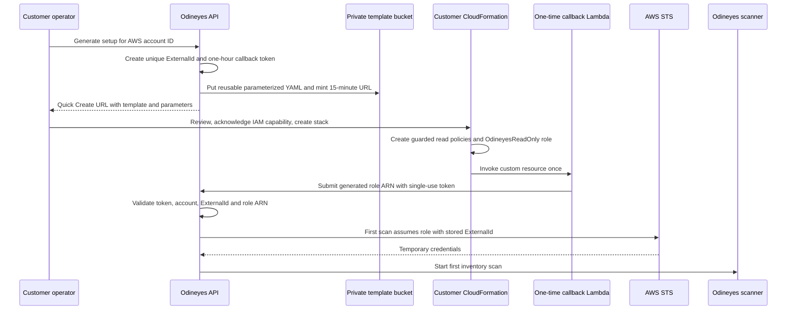

# One-click AWS account onboarding

Odineyes onboards AWS accounts without customer access keys, secret keys, session tokens, or a role-ARN copy/paste step. The customer owns a read-only IAM role. Odineyes receives temporary credentials only through `sts:AssumeRole`. A minimal callback Lambda exists only during one-click onboarding and has CloudWatch Logs permissions only.



## What customer sees

1. Enter 12-digit AWS account ID on **Accounts**.
2. Select **Generate setup files**, then **Launch AWS CloudFormation**.
3. AWS opens Quick Create. Template URL, stack name, unique `ExternalId`, exact scanner principal, callback URL, and single-use token are prefilled.
4. Customer reviews IAM permissions and selects **Create stack**.
5. The stack callback registers the generated role ARN automatically and starts the first scan.
6. Return to Odineyes to inspect scan progress. **Verify setup** remains available for diagnostics.

AWS still requires customer authentication and explicit IAM approval. “One-click” removes template download, parameter entry, ARN copy/paste, and customer credentials. It does not bypass the AWS account security boundary.

## Template and parameter model

One release artifact is reused. It contains the callback implementation but no customer-specific `ExternalId`, callback URL, token, or API secret. Those values are supplied as Quick Create parameters.

```yaml
Parameters:
  ExternalId:
    Type: String
  CSPMPlatformAccountId:
    Type: String
  CSPMPlatformPrincipalArn:
    Type: String
  OnboardingToken:
    Type: String
    NoEcho: true
  CallbackUrl:
    Type: String
```

The template trusts only `CSPMPlatformPrincipalArn` and requires `sts:ExternalId = ExternalId`. The token is stored as SHA-256 in Odineyes, expires after one hour, and is consumed by the first successful callback. An identical callback retry is idempotent.

The managed mode attaches `SecurityAudit`, `ViewOnlyAccess`, three explicit read-policy layers, and a deny guard that blocks secret retrieval, customer data-plane reads, log/source content, role chaining, sessions, and privilege escalation. Optional EBS disk-scanning permissions remain in a separate disabled-by-default role.

`ExternalId` is not an AWS secret, but it is generated by Odineyes, random, unique per connected AWS account, and stored with that connection. Never use one static value across tenants.

## Required production setup

Local development returns manual templates unless S3 hosting is configured. Production one-click setup needs:

```text
ODINEYES_ONBOARDING_TEMPLATE_BUCKET=your-private-onboarding-bucket
ODINEYES_ONBOARDING_TEMPLATE_REGION=us-east-1
ODINEYES_SCANNER_PRINCIPAL_ARN=arn:aws:iam::123456789012:role/OdineyesScanner
ODINEYES_PUBLIC_API_URL=https://your-public-api.example.com
```

`ODINEYES_SCANNER_PRINCIPAL_ARN` must be the specific central scanner workload role or IAM user. Do not use account root.

The API workload needs only object read/write for the onboarding prefix:

```json
{
  "Version": "2012-10-17",
  "Statement": [{
    "Effect": "Allow",
    "Action": ["s3:GetObject", "s3:PutObject"],
    "Resource": "arn:aws:s3:::your-private-onboarding-bucket/cloudformation-onboarding/*"
  }]
}
```

Use the existing [onboarding-template-hosting.yaml](../infrastructure/onboarding-template-hosting.yaml) stack. It creates a private, encrypted, versioned bucket. CloudFormation receives a version-bound presigned `GetObject` URL valid for 15 minutes. No public S3 bucket is required.

## Security boundaries

- Private S3 object, encrypted at rest, version-bound, short-lived launch URL.
- The callback Lambda receives only a one-hour, single-use onboarding token; no persistent API/HMAC secret enters the customer account.
- One unique `ExternalId` per customer account prevents confused deputy reuse.
- Specific provider scanner principal only. Account-root trust is rejected for one-click onboarding.
- Callback binds the generated role ARN to the pre-created account, ExternalId, and token; a role from another account is rejected.
- Account becomes active after the authenticated callback, then the first scan verifies `AssumeRole` and read coverage.
- Manual CloudFormation and Terraform remain available for offline or customer-managed IaC workflows.

## Operational checks

- Customer CloudFormation stack ends at `CREATE_COMPLETE`.
- Odineyes account begins as `awaiting_stack`.
- The callback returns `connected`, consumes the token, and queues the first scan.
- **Verify setup** returns either waiting evidence or `connected` when manual diagnosis is needed.

## Launch links (no account ID)

The flow above needs a 12-digit account ID before it can issue anything. The session flow does not: a link is minted blind and the account is **discovered** from the role ARN CloudFormation produced, which is by construction the account the stack actually ran in.

| Endpoint | Purpose |
|---|---|
| `GET /api/inventory/onboarding/hosting-status` | Preflight. Public API URL, token signing secret, scanner principal, bucket reachability, and whether `cloudformation:ValidateTemplate` accepts the URL. Link generation stays disabled until nothing reports `fail`. |
| `POST /api/inventory/onboarding/publish` | Upload (or reuse) the shared, secret-free template. One content-keyed object serves every customer; `assert_template_is_generic` refuses a body carrying a hard-coded ExternalId or an API secret. |
| `POST /api/inventory/onboarding/link` | Mint a link. `label`, `ttl_seconds` (60–86400), `console_region`, `with_callback`, `policy_mode`. Regenerating for a label retires every earlier pending link with it — those URLs then return 409. |
| `GET /api/inventory/onboarding/sessions` | `pending` / `redeemed` / `superseded` / `expired`. Pending links report expiry on the clock, not on a write. |
| `POST /api/inventory/onboarding/register-manual` | Complete a session from the stack's `RoleArn` output when the stack could not call back. |

The token is a signed capability — `v1.<session>.<expiry>.<nonce>.<hmac>`, signed with `ODINEYES_ONBOARDING_TOKEN_SECRET` (32+ chars, required). It rides in the launch URL's query string, so **treat the link as a secret and deliver it over an authenticated channel**. `POST /api/inventory/accounts/onboarding-callback` routes on the token's shape: dot-delimited goes to the session redeemer, plain url-safe base64 to the per-account path.

The callback asserts nothing that is taken on trust. The ExternalId must equal the one issued for that session (a customer who edited the parameter gets a visible failed connection, not a silent trust mismatch); the role ARN's account must match the reported account ID; and the session must still be pending. An identical re-delivery is idempotent, because CloudFormation retries custom resources and a retry must not fail a stack whose role was already accepted.

`with_callback=false` leaves `OnboardingToken` and `CallbackUrl` empty, which turns the template's `AutoConnect` condition off so no Lambda is created at all. That is the correct shape when there is no publicly reachable endpoint: a stack that cannot reach its callback rolls itself back and takes the created role with it.

## Permission verification

A role that assumes successfully is not a role that can collect. `POST /api/inventory/accounts/{id}/verify` (the per-account **Verify** button) therefore runs one cheap, unpaginated probe per collection domain — identity, compute, network, storage, containers, serverless, database, analytics, messaging, security, logging, edge, governance, devops, aiml — plus negative probes for the actions the template's Deny guard must block. The response carries `permissions.coverage` per domain, `permissions.missing` for denied read actions, and `permissions.guard_failures` for guard actions the account allowed. An out-of-date stack version or a restrictive SCP is reported as a named gap here, instead of showing up later as findings that silently never appear.

Deep verification is not run by the **Verify setup** poller (`verify-onboarding`), which stays a single read call because the browser retries it on window focus.
