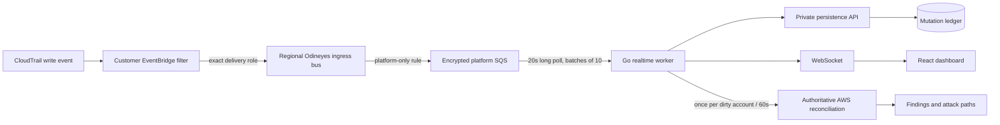

# Odineyes near-real-time AWS ingestion

## Outcome

Odineyes can ingest a filtered stream of security-relevant AWS mutations while
keeping its normal inventory scan as the source of truth. A CloudTrail event is
never promoted directly into a canonical finding. It creates an immutable
mutation record, may create a provisional fast-path alert, and schedules one
reconciliation scan per affected account per 60-second window.

## Delivery and failure semantics

- The customer rule matches only selected mutating API calls.
- The customer delivery role can send only to the configured platform ingress bus.
- Its trust policy accepts only the exact EventBridge rule ARN and source account.
- The ingress-bus policy registers the customer account reported by onboarding.
- The platform queue accepts messages only from its local ingress-bus rule.
- SQS uses managed server-side encryption, 20-second long polling, batch deletes,
  a 180-second visibility timeout, and a dead-letter queue after five receives.
- Events are idempotent by EventBridge event ID. Malformed events and rejected
  tenant events are not deleted, so they eventually reach the DLQ.
- Request fields that resemble credentials, tokens, passwords, or secrets are
  redacted before persistence.

## Latency contract

The UI receives accepted fast-path mutations as soon as CloudTrail, EventBridge,
SQS, and the Go worker deliver them. This is **near real time**, not a guaranteed
sub-second SLA: CloudTrail delivery to EventBridge is best effort. Canonical
findings and attack paths are refreshed after the 60-second micro-batch window
and the subsequent AWS collection finishes.

## Regional boundary

The onboarding stack creates an EventBridge rule in the stack Region. A
customer rule targets the Odineyes ingress bus in that same Region; the local
platform bus then delivers the event to the local worker queue. A stack in
`us-east-1` covers that Region plus global-service events observed there. Full
multi-region coverage requires a regional telemetry stack per customer Region.
No worker needs to poll a different Region's SQS queue.

## CloudTrail prerequisite

CloudTrail API events reach EventBridge only while a trail is logging. Odineyes
does not silently create a new customer trail because that changes customer log
retention and S3 cost. Onboarding must show this prerequisite and verification
should mark realtime coverage degraded when no logging trail is present.

## Pipeline trail versus forensic audit trail

When a customer explicitly enables `EnableRealtimeCloudTrail`, onboarding
creates a tagged, regional, write-only `odineyes-realtime-*` trail. Its purpose
is event delivery to EventBridge, not long-term forensic audit logging.

Odineyes keeps its raw configuration in the evidence ledger but suppresses only
these two hygiene findings for a trail that has both onboarding tags:

- `CLOUDTRAIL_NO_CLOUDWATCH`
- `CLOUDTRAIL_NOT_ENCRYPTED`

The suppression is `suppressed_by=design` and explains the cost-versus-purpose
decision. It never applies to an untagged or lookalike customer trail, to a
non-logging trail, or to disabled log-file validation. Most importantly,
`CLOUDTRAIL_NOT_MULTIREGION` stays open. If the dedicated regional pipeline is
the only trail, the account still lacks a multi-region forensic audit trail.

## Cost measurements

Do not promise a fixed per-account price. Record these measurements per tenant:

- matched EventBridge events;
- SQS messages received, deleted, retried, and dead-lettered;
- empty receives and average batch size;
- event-time to persistence and WebSocket latency;
- dirty-account batches and reconciliation duration;
- AWS API calls made by each reconciliation.

The filtering, long polling, batch deletion, and account coalescing are cost
controls. Actual cost depends on customer mutation volume and scan breadth.
