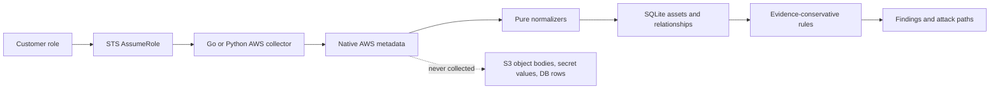

# AWS Collection Contract

## Decision

Odineyes collects AWS control-plane metadata first. It does not read customer
data, download S3 objects, retrieve secret values, open database connections,
or start an AWS Config snapshot. This creates useful CSPM evidence without
turning the scanner into a data-exfiltration path.

The customer onboarding role must grant only actions used by supported
collectors. The generated `least-privilege` policy is the contract. Do not use
`ODINEYES_SCAN_ALL` in production: it is an exploratory diagnostic mode and
cannot be represented by a small, reviewable IAM policy.



## Implemented P0 collection

| Area | Resources and evidence | Why it exists |
| --- | --- | --- |
| Compute and containers | EC2 instances; ECS clusters and active task definitions; EKS clusters; Lambda functions; load balancers; ECR repositories | Workload identity, Kubernetes control-plane, container configuration and registry posture |
| Network proof | Security groups, subnets, route tables, network ACLs, internet gateways | Proves or rejects a path to a workload. A `PubliclyAccessible` flag alone is not an attack path. |
| Identity | IAM users and roles, trust policies, inline and attached policy metadata, access-key age, MFA and login-profile state | Effective-access and cross-account analysis without reading credentials |
| Data stores | S3 bucket posture, RDS instances/clusters/proxies, Redshift, Neptune, DocumentDB, Secrets Manager metadata | Encryption, public-policy and data-store exposure context |
| Security controls | CloudTrail status, AWS Config recorder status, KMS key metadata and rotation, CloudWatch log groups, GuardDuty detectors | Auditability, threat-detection and control coverage |
| Block and file storage | EBS volumes; EBS snapshots owned by the account, with their `createVolumePermission` sharing state; EFS file systems and resource policies | Encryption at rest and the snapshot-sharing exfiltration path |
| Messaging and app data | SNS topics, SQS queues, DynamoDB tables with point-in-time recovery, API Gateway REST APIs and their stages | Resource-policy exposure, encryption and backup posture for the services applications actually store data in |
| Network completeness | VPCs and their active flow logs | Anchors the network graph and proves whether traffic is recorded at all |
| Account-wide identity | Root credential state and the IAM password policy (`GetAccountSummary`, `GetAccountPasswordPolicy`) | CIS section 1 controls belong to the account, not to any resource |
| Region completeness | Enabled-region discovery before regional collection | Avoids hiding resources in non-default regions |

`describe_snapshots` is always called with `OwnerIds=["self"]`. Without that
filter the API enumerates every public snapshot on AWS rather than the
account's, which would flood the inventory and misattribute other people's
resources.

Account-wide IAM settings normalize to a single pseudo-asset identified by the
account root ARN. Rules need a `resource_id` to attach a finding to, and the
root ARN is the honest identifier for controls that belong to the account
itself.

Both collectors now follow this contract for network evidence. Go collector now
collects subnets, route tables, network ACLs and internet gateways. Python
collector now follows hierarchical detail calls for ECS clusters, active ECS
task definitions and EKS clusters. Their list APIs return identifiers, so
normalizing the list response directly would otherwise create an empty or
incomplete inventory.

## Important data semantics

Raw AWS responses are preserved with a source type, then normalized. The
normalizer never calls AWS. This split makes each fact auditable and each
normalizer testable.

```text
aws.ec2.describe_instances
  -> ("aws.ec2.instance", native response)
  -> normalize_ec2_instance
  -> Asset + USES_SECURITY_GROUP + USES_INSTANCE_PROFILE

aws.ecs.list_clusters
  -> cluster ARN list
  -> aws.ecs.describe_clusters with SETTINGS and TAGS
  -> ("aws.ecs.cluster", cluster document)
  -> normalize_ecs_cluster
  -> Asset + BELONGS_TO

aws.ecs.list_task_definitions (ACTIVE only)
  -> task-definition ARN list
  -> aws.ecs.describe_task_definition with TAGS
  -> ("aws.ecs.task_definition", task-definition document)
  -> normalize_ecs_task_definition
  -> Asset + EXECUTES_AS task/execution roles

aws.eks.list_clusters
  -> cluster name list
  -> aws.eks.describe_cluster
  -> ("aws.eks.cluster", cluster document)
  -> normalize_eks_cluster
  -> Asset + control-plane endpoint/encryption/logging evidence

aws.ecr.describe_repositories
  -> repository metadata
  -> aws.ecr.get_repository_policy + get_lifecycle_policy
  -> ("aws.ecr.repository", repository document)
  -> normalize_ecr_repository
  -> Asset + repository-policy/lifecycle evidence

aws.rds.describe_db_instances
  -> DB instance + subnet group + attached security groups
  -> normalize_rds_instance
  -> Asset + USES_SECURITY_GROUP
  -> reachability assessment using SG + route + IGW + NACL evidence
```

Collection scopes are marked authoritative only after the listing and required
detail calls finish without an error or safety-limit truncation. A permission
failure therefore cannot be mistaken for an empty AWS account and delete
previous inventory during reconciliation.

## Generated IAM policy

`src/odineyes/core/iam_policy_generator.py` is policy source of truth.
It groups permissions by normalized source type and includes:

- base list and describe calls;
- required detail calls such as `ecs:DescribeClusters`;
- hierarchical container calls such as `ecs:ListTaskDefinitions`,
  `ecs:DescribeTaskDefinition`, `eks:ListClusters`, `eks:DescribeCluster`;
- ECR repository configuration plus `ecr:GetRepositoryPolicy` and
  `ecr:GetLifecyclePolicy` evidence;
- enrichment calls such as bucket public-access-block and logging, IAM policy
  versions, IAM group inheritance, permissions-boundary policy documents, and
  KMS rotation status;
- `ec2:DescribeRegions` and `sts:GetCallerIdentity`.

One corrected AWS mapping matters: AWS S3 `ListBuckets` API access is granted
by `s3:ListAllMyBuckets`, not `s3:ListBuckets`. AWS documents the operation as
`ListBuckets`; its IAM action name differs. [S3 API reference](https://docs.aws.amazon.com/AmazonS3/latest/API/API_ListBuckets.html)

Generate reviewable policy JSON locally:

```powershell
$env:PYTHONPATH = 'src'
.\.venv\Scripts\python.exe -c "import json; from odineyes.core.iam_policy_generator import least_privilege_policy; print(json.dumps(least_privilege_policy(), indent=2))"
```

Use that policy through existing CloudFormation or Terraform onboarding with
`policy_mode = "least-privilege"`. Do not paste customer access keys into
Odineyes. The scanner assumes the customer role using the configured workload
identity, a specific trusted scanner principal and the onboarding ExternalId.
ExternalId stays per-account onboarding data, not a constant in source code or
templates.

## Explicitly excluded from P0

| Excluded action or data | Reason |
| --- | --- |
| `secretsmanager:GetSecretValue`, S3 `GetObject`, database queries | Reads customer payload, not posture metadata |
| `config:DeliverConfigSnapshot` | AWS classifies this action as Read, but the operation schedules a new delivery. Scanner must not initiate it. [AWS Config authorization reference](https://docs.aws.amazon.com/service-authorization/latest/reference/list_config.html) |
| Any `Put*`, `Create*`, `Update*`, `Delete*`, `Start*`, `Stop*`, `Attach*` or `Detach*` action | Odineyes P0 is observation only |
| `iam:Get*` or `iam:List*` wildcards | Hides permission growth from customer review |
| Full AWS Config history and snapshot content | High volume, additional retention and privacy design needed |
| Guest OS package inventory from EC2 | Requires an agent, SSM, or an image/SBOM source. It cannot be inferred from EC2 metadata. |

## Next collection increments

These are intentionally not granted or detected yet. Each must land as one
vertical slice: AWS calls, raw schema, normalizer, SQLite relationships,
evidence consumer, least-privilege actions and tests.

1. EKS: cluster endpoint, VPC security groups, encryption config, control-plane
   logs and role are collected. Next add node groups, access entries and Pod
   Identity before claiming Kubernetes workload reachability. AWS documents
   [`ListClusters`](https://docs.aws.amazon.com/eks/latest/APIReference/API_ListClusters.html)
   and [`DescribeCluster`](https://docs.aws.amazon.com/eks/latest/APIReference/API_DescribeCluster.html)
   as separate read operations.
2. ECS and ECR: active task definitions, task/execution roles, privileged mode,
   host networking, ECR scanning configuration and repository policy are
   collected. Next link running ECS services/tasks and EKS workloads to the
   exact ECR image digest and Trivy SBOM/CVE result.
3. DynamoDB: `dynamodb:ListTables`, `DescribeTable`, then tags and a separate
   resilience slice for point-in-time recovery. Do not scan table items.
   [DynamoDB authorization reference](https://docs.aws.amazon.com/service-authorization/latest/reference/list_dynamodb.html)
4. VPC topology: VPCs, peering, transit gateways, endpoints, Network Firewall
   and route propagation. Add them before asserting multi-VPC reachability.
5. Findings ingestion: Security Hub findings belong in a finding-evidence model,
   not the asset registry. Use `securityhub:GetFindings`. Amazon Inspector v2
   uses `inspector2:ListFindings`. [Security Hub reference](https://docs.aws.amazon.com/service-authorization/latest/reference/list_securityhub.html) [Inspector v2 reference](https://docs.aws.amazon.com/service-authorization/latest/reference/list_inspector2.html)
6. Workload vulnerability context: connect deployed ECR, ECS and EKS workloads
   to Trivy SBOM/CVE results. Only elevate a CVE when deployment, exposure,
   privilege and reachable sensitive data evidence connect.

## Acceptance checks before enabling new detections

1. Scan an account with an intentionally denied action. UI must show collection
   incompleteness, never zero resources.
2. Scan an account containing an ECS cluster. Inventory must contain one
   `aws.ecs.cluster` asset with settings and tags.
3. Scan a public RDS endpoint with a closed security group. It must remain
   `unverified` or `blocked`, not public by configuration alone.
4. Scan an open RDS test path with all SG, route, IGW and NACL evidence. The
   result must show every API observation used to prove reachability.
5. Regenerate least-privilege policy and review its diff whenever a collector
   source changes.

## Delivery status

Completed now:

- Fixed ECS hierarchical discovery in Python.
- Added EKS cluster, ECR repository and active ECS task-definition discovery.
- Added seven evidence-conservative container and Kubernetes posture policies.
- Added network control-plane collection to Go scanner.
- Corrected generated S3 IAM action.
- Added collection contract and regression tests.

Not deployed by this change. Deploy only after Go build/test succeeds in the
release environment and the customer onboarding role policy is updated through
IaC.
