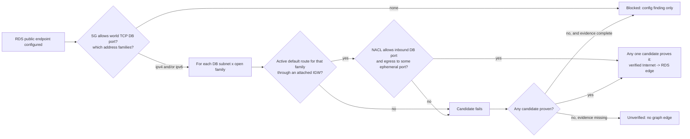

# Evidence-Based Detection Rules

## Problem

`DBInstance.PubliclyAccessible=true` configures an RDS public endpoint. It does
not, by itself, prove that a packet from the public internet can reach the
database. A security group, route table, internet gateway, and stateless network
ACL can still block that path.

Treating the flag as an attack path created false positives. It marked databases
as Internet exposed when their security group was closed, and it inflated the
attack-path graph with an edge that did not have packet-path evidence.

## Rule Contract

Odineyes now separates configuration posture from verified reachability.

| State | Required evidence | Product result |
| --- | --- | --- |
| RDS public endpoint configured | `rds:DescribeDBInstances` reports `PubliclyAccessible=true` | Medium configuration finding. No attack path. |
| Verified Internet reachable | Public endpoint, and **at least one** DB subnet completes a full path in a single address family: the attached security group permits the TCP database port from that family's world CIDR, the subnet resolves to an active default route through an attached IGW, and the network ACL allows both inbound to the database port and return traffic to some ephemeral port | Internet-to-database graph edge and `PUBLIC_DATABASE_PATH` attack-path issue. |
| Blocked | Collected security group, route, IGW, or NACL evidence denies a required part of the path | No Internet graph edge. |
| Unverified | One or more required data sources are absent or cannot be joined | No Internet graph edge. The result is a collection-coverage gap, not a high-risk claim. |

## Implemented Collection

The AWS collector now reads only these additional inventory APIs:

- `ec2:DescribeSubnets`
- `ec2:DescribeRouteTables`
- `ec2:DescribeNetworkAcls`
- `ec2:DescribeInternetGateways`

The normalizers retain the minimal evidence needed for proof:

- RDS DB-subnet IDs, VPC ID, endpoint port, attached SG IDs, and endpoint flag.
- Structured world-open SG ingress with protocol and full port range.
- Route-table associations and active default routes.
- NACL ordering, direction, protocol, CIDR, and port ranges.
- IGW to VPC attachments.

No customer data, database credentials, or network packets are read. This is
control-plane configuration analysis only.

## Graph Behavior

A database's subnet group normally spans availability zones, so subnets are
evaluated independently and the verdict is the best proven path. One public
subnet makes the database reachable; a private sibling does not undo that. The
failed candidates are still reported in `blockers`, so the operator sees which
subnets are safe and which one is the exposure.

Missing evidence outranks a blocker. A candidate that could not be evaluated may
be the open one, so an unevaluable path never reports as `blocked`.

Address families are proven end to end. An `::/0` security group rule cannot be
combined with an IPv4 default route to claim reachability, and an egress-only
gateway (`eigw-`) never carries inbound traffic.

The graph stores the evidence used for a verified edge. An attack-path finding
can therefore show the API source, observed configuration, and security effect
instead of relying on a severity label alone.

## Operator Surface

`GET /api/inventory/assets/{id}` returns `internet_reachability` for any
resource that configures a public endpoint, and `null` for everything else. The
asset detail page renders all four states distinctly, because a `blocked`
verdict and an `unverified` one are opposite facts that would otherwise both
render as an empty panel:

| State | What the operator is told | What they should do |
| --- | --- | --- |
| `reachable` | The proven path, hop by hop | Close the control named in the evidence |
| `blocked` | Which control stops the path | Nothing — and keep that control |
| `unverified` | Which evidence was not collected | Grant the scanner the missing read permissions, re-scan |

The verdict is computed on read rather than stored on the asset row. It derives
from the whole account's network evidence, so persisting it would make an
unchanged database look like it drifted every time an unrelated route table
changed. The network-asset query is scoped to the four evidence types and only
runs for resources with a public endpoint.

Assessing many databases shares one `build_network_topology` index. Rebuilding
it per database made the evaluator O(assets x databases) — 14.4s on a
26k-asset account with 500 public databases, against 0.05s indexed.

There is deliberately no `confidence` score. `status` plus the contents of
`missing` already carry that information, and a separately-maintained label
could only ever contradict them.

## Rule IDs

| Rule ID | Meaning |
| --- | --- |
| `RDS_PUBLIC_ENDPOINT_CONFIGURED` | A public endpoint is configured. This is posture, not proof of exposure. |
| `RDS_PUBLIC_ENDPOINT_UNENCRYPTED` | A public endpoint is configured and storage encryption is off. |
| `PUBLIC_DATABASE_PATH` | A world-reachable packet path was verified by all required controls. |
| `WORLD_OPEN_SENSITIVE_PORT` | A security group allows `0.0.0.0/0` (or `::/0`) to a sensitive port. Severity depends on what is behind it. |

## Security Groups Are Rules, Not Locations

The same evidence discipline applies one layer up. `0.0.0.0/0 -> 22` is a real
CIS 5.2 failure and always produces a finding, but it is not the same risk in
every account, and the security group cannot tell you which case you have:

| What the evidence shows | Severity | Why |
| --- | --- | --- |
| No collected resource uses the group | `low` | A stale rule. Nothing is exposed by it today. |
| Attached, but no proven Internet path | `medium` | A control gap. Either the path is genuinely broken, or the evidence to prove it was not collected — the finding says which. |
| A complete Internet path is proven to an attached instance | `high` | `ec2:DescribeInstances` public IP, world-open ingress on that port, an active default route through an attached IGW, and a network ACL permitting request and response. |

A security group is also never itself `is_public`. It has no address and nothing
routes to it; what is exposed is whatever attaches to it. Marking the group
public additionally double-counted in risk scoring — the rule severity already
encodes "open to the world", and the exposure multiplier then multiplied the
same fact again. The `world_open` property carries the configuration instead.

`assess_ec2_internet_reachability` proves the instance path with the same
topology index and the same `reachable` / `blocked` / `unverified` contract used
for databases.

## Current Boundary

This evaluator proves world default-route paths (`0.0.0.0/0` and `::/0`) through
an internet gateway. It does not yet prove or refute paths that depend on AWS
Network Firewall, Gateway Load Balancers, Transit Gateway, VPC peering, private
connectivity, custom appliance routing, or application authentication.

Return traffic is modelled as "any port in 1024-65535", the range AWS documents
for network ACL egress. A stateless ACL only has to permit some of that range
for a response to get back, so a tighter but still valid egress rule such as
32768-65535 correctly proves reachable.

The next phases should add:

1. Controlled external CIDR source-range modelling (ingress from a named
   corporate range is not the same exposure as `0.0.0.0/0`).
2. AWS Reachability Analyzer as optional validation for high-value findings.
3. Security Hub, AWS Config, and flow-log evidence as secondary signals.
4. Extending the shared engine past RDS and EC2 to Redshift, OpenSearch, EKS,
   and load balancers.
5. Detection lifecycle metrics: evidence coverage, rule precision, suppressions,
   false-positive rate, and time to verified remediation.
