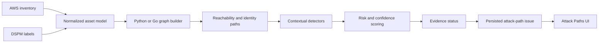

# Contextual Detection Engine Upgrade

## Purpose

This change moves Odineyes away from severity decisions based on resource names and toward evidence-backed, graph-contextual detection. The goal is not to reproduce proprietary Wiz implementation details. The goal is to apply the same useful product principle: combine exposure, identity, data sensitivity, asset context, and evidence quality before promoting an attack path.

## Problem fixed

The previous engine had two conflicting sources of truth:

1. The reachability layer correctly treated only DSPM classification as proof that a data store contains sensitive data.
2. The Python and Go issue detectors could still promote a bucket or database to critical because its name contained terms such as `customer`, `backup`, `prod`, or `secret`.

This created false critical findings. A name is a clue, not proof of data sensitivity.

There was also a pipeline defect. `InventoryService` loaded DSPM labels for graph construction but did not pass those labels into attack-path analysis. The detector therefore could not use the strongest evidence already stored by the platform.

## New detection flow



## What changed

### 1. DSPM labels now reach both detection engines

`InventoryService.evaluate_issues()` and `InventoryService.build_graph()` load account data labels and pass them to the shared graph-engine adapter. Each data-store node and each Go snapshot asset now carries `data_sensitivity_label`.

The Go wire contract was incremented from snapshot version 1 to version 2. This prevents an old Go binary from silently interpreting the new payload incorrectly.

### 2. Classification controls critical promotion

The following policy is now applied consistently in Python and Go:

| Classification | Data-risk factor | Can promote a data path to critical? |
|---|---:|---|
| CRITICAL | 1.00 | Yes |
| HIGH | 0.95 | Yes |
| MEDIUM | 0.85 | Yes |
| LOW | 0.70 | No |
| NONE | 0.60 | No |
| UNCLASSIFIED | 0.65 | No |

A sensitive-looking resource name can raise the unclassified factor only to 0.75. It cannot independently create a critical result.

Examples:

- Public bucket named `customer-data-prod` with no DSPM result: high, not critical.
- Public bucket with a generic name and DSPM label `CRITICAL`: critical.
- Internet-reachable compute path to a `HIGH` classified store: eligible for critical promotion.

### 3. Findings carry classification evidence

Data-related attack paths now include an evidence record with:

- evidence type: `data_classification`
- source: `dspm`
- subject: the affected data-store resource ID
- observed label: `CRITICAL`, `HIGH`, `MEDIUM`, `LOW`, `NONE`, or `UNCLASSIFIED`

This makes the severity decision explainable to an analyst.

### 4. Evidence status is explicit

Each attack-path issue now has an `evidence_status`:

- `confirmed`: the path is backed by current asset and relationship evidence.
- `partial`: a routed path references a missing non-pseudo asset.
- `stale`: one or more asset observations failed the freshness calculation.

Pseudo entry nodes such as Internet and external-account principals are intentionally excluded from missing-asset checks.

The status is serialized by Python and Go, persisted in SQLite, returned by API queries, and displayed in the Attack Paths list and detail drawer.

### 5. Existing databases upgrade safely

The SQLite startup migration adds:

```sql
ALTER TABLE issues
ADD COLUMN evidence_status VARCHAR(16) NOT NULL DEFAULT 'confirmed';
```

Existing issue rows remain valid and default to `confirmed`. New evaluations replace that default with calculated status.

### 6. Python and Go remain behaviorally aligned

The shadow/parity representation now includes evidence status. Tests verify that both engines produce the same rule, severity, risk, confidence, evidence status, path, and evidence for classified and unclassified data assets.

## Files changed

| Area | Files | Responsibility |
|---|---|---|
| Graph context | `src/odineyes/inventory/graph.py` | Attach DSPM classification to graph nodes |
| Python detection | `src/odineyes/inventory/issues.py` | Classification-first scoring and evidence status |
| Engine adapter | `src/odineyes/inventory/graph_engine.py` | Snapshot v2 and Python/Go parity |
| Service flow | `src/odineyes/inventory/service.py` | Supply labels to graph analysis |
| Go engine | `scanner-go/internal/graph/*.go` | Match Python semantics efficiently |
| Persistence | `src/odineyes/db/*`, repository, queries | Store and return evidence status |
| UI | `frontend/src/pages/AttackPaths.tsx`, `frontend/src/types.ts` | Show evidence quality |
| Verification | issue, parity, migration tests | Protect behavior and compatibility |

## Verification performed

The focused backend suite passed:

```text
56 passed, 1 skipped
```

The Go graph package passed:

```text
go test ./internal/graph/...
```

The production frontend build passed. Vite reported only the existing large-bundle warning.

## Deployment requirements

Python and Go must be deployed together because snapshot protocol version 2 is now required. Rebuild the Go binary or Docker image before enabling the updated API. An old version 1 binary will fail closed with an unsupported-version error instead of returning misleading results.

Recommended rollout:

1. Deploy in graph-engine shadow mode.
2. Run representative account scans and inspect parity metrics.
3. Confirm classified assets receive expected severity and unclassified names no longer become critical.
4. Backfill attack-path issues by running evaluation for existing accounts.
5. Promote Go to the primary engine after parity is clean.

## Remaining work for Wiz-like detection quality

This upgrade fixes one high-impact source of false positives, but enterprise-grade contextual detection requires more work:

1. Implement a normalized IAM policy intermediate representation covering identity policies, resource policies, permission boundaries, session policies, SCPs, RCPs, conditions, and explicit denies.
2. Expand relationship coverage beyond current resource types and S3-oriented data access.
3. Correlate Trivy vulnerabilities, runtime evidence, exploitability, and workload identity with graph paths.
4. Apply event-driven graph deltas rather than rebuilding the full account graph for every mutation.
5. Measure rule precision using analyst dispositions: true positive, false positive, accepted risk, compensating control, and duplicate.

The next highest-value phase is the IAM policy intermediate representation. It will remove false lateral-movement paths that are blocked by organization guardrails and expose privilege paths hidden inside policy conditions.
