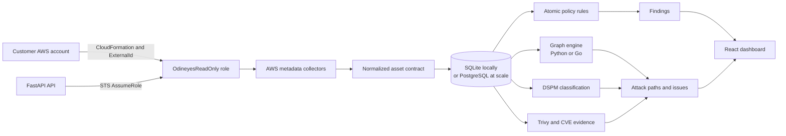
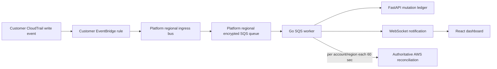

# Odineyes CSPM - Knowledge Transfer

**Repository:** `Cloudsentinel-CSPM`  
**Product name in code:** Odineyes / CloudSentinel  
**Scope:** AWS-first Cloud-Native Application Protection Platform (CNAPP)  
**Prepared:** 2026-09-15  
**Verification baseline:** 799 Python tests passed, 2 skipped; all Go tests passed; React production build passed; Docker Compose syntax parsed successfully.

## 1. What this product is for

Odineyes helps a cloud-security team answer a more useful question than
"which controls are misconfigured?":

> Which reachable combination of exposure, workload, identity, and sensitive
> data creates the most urgent risk, and which change breaks that path?

It is an AWS-first CSPM/CNAPP. The primary workflow is:

1. A customer deploys a customer-owned CloudFormation onboarding stack.
2. The stack creates a least-privilege cross-account role, protected by a
   customer-specific ExternalId.
3. Odineyes assumes that role, collects AWS control-plane metadata, and
   normalizes it into an inventory.
4. Atomic rules, CIEM analysis, DSPM classification, vulnerability evidence,
   and graph relationships are persisted.
5. The graph engine produces evidence-backed attack paths and prioritized
   issues for the React dashboard.

The scanner should stay **omniscient** about collected cloud evidence. The
dashboard should stay **quiet** by suppressing explicitly designed low-signal
hygiene findings without deleting the underlying evidence.

## 2. Repository map

| Area | Primary location | Responsibility |
|---|---|---|
| FastAPI application | `src/odineyes/api/server.py` | API lifecycle, CORS, health, background monitors and router registration. |
| Inventory API | `src/odineyes/api/inventory_routes.py` | Account registration, scans, inventory, findings, graph, CVEs, DSPM, runtime and compliance APIs. |
| AWS collection | `src/odineyes/inventory/aws_raw_collector.py` | AWS control-plane collection and collection-scope evidence. |
| Scan orchestration | `src/odineyes/inventory/service.py`, `orchestrator.py` | Collect, normalize, persist, evaluate, and scan registered accounts concurrently. |
| Normalization | `src/odineyes/inventory/normalizers.py` | Converts provider-specific AWS responses to the common asset contract. |
| Rules and tuning | `src/odineyes/inventory/rules.py`, `tuning.py` | Atomic findings and explainable suppression/tuning. |
| Graph and attack paths | `src/odineyes/inventory/graph.py`, `issues.py`, `reachability.py` | Builds relationships, calculates path evidence, and stores correlated issues. |
| Python/Go bridge | `src/odineyes/inventory/graph_engine.py`, `go_aws_collector.py` | Chooses the safe Python or optimized Go scanner/graph backend. |
| Go scanner | `scanner-go/` | Concurrent AWS collection, graph detection, SQS worker, and WebSocket server. |
| Persistence | `src/odineyes/db/` | SQLAlchemy schema and safe additive migrations. |
| Vulnerability scanning | `src/odineyes/cloud/trivy_scanner.py`, `cloud/cve_scanner.py` | Trivy execution, CVE normalization and correlation. |
| DSPM | `src/odineyes/dspm/` | Data-store discovery and regex-based data-sensitivity classification. |
| Runtime / eBPF | `src/odineyes/sensor/` | Tetragon event shipping and runtime-event detection. |
| Frontend | `frontend/src/` | React/Vite dashboard and investigation views. |
| Cloud infrastructure | `infrastructure/` | AWS bootstrap, single-host, regional real-time, and onboarding templates. |
| Deployment tooling | `deploy/`, `scripts/` | EC2 packaging, service units, local startup, image installation and checks. |

## 3. Runtime architecture



### Security boundaries

- The platform uses **STS AssumeRole**, not customer access keys.
- Every AWS account has a unique ExternalId. The customer role trust policy
  should name the exact scanner user or workload role, not an account root
  principal.
- `role_arn` is mandatory for a cross-account AWS scan. A scanner may use its
  ambient identity only for its own account when that identity matches the
  target account.
- The scanner principal must also have an identity policy permitting
  `sts:AssumeRole` on the customer role. Both the caller policy and target
  trust policy are required.
- Operator-mutating APIs can be protected with `ODINEYES_ADMIN_TOKEN`.

## 4. Core scan workflow

### 4.1 Account onboarding

1. The operator generates an onboarding link or template through the
   inventory/onboarding API.
2. Odineyes creates an ExternalId and embeds it as a parameter in the
   customer CloudFormation template.
3. The customer deploys the template in its own account. It creates the
   read-only role and optional capabilities such as disk scanning or regional
   telemetry.
4. The role ARN is registered or verified through STS.
5. A scan job is created and returns `202 Accepted`; the UI polls the scan-job
   status instead of holding a long HTTP request open.

For automatic CloudFormation callback onboarding, the API must be publicly
reachable through HTTPS and `ODINEYES_PUBLIC_API_URL` must be configured.
Localhost cannot receive a callback from a customer Lambda, so local
onboarding uses the manual completion flow.

### 4.2 Collection and persistence

The AWS collector returns raw control-plane responses for resource inventory,
configuration, identity, exposure, encryption, network associations, and
related evidence. It does not read customer workload data by default.

The pipeline is:

```text
AWS APIs -> raw collector -> normalizer -> assets table
         -> scan scopes/errors -> findings -> graph edges -> issues/issue hops
```

Each collector reports a scope state:

| State | Meaning | Safe behavior |
|---|---|---|
| `complete` | The service/region completed. | Absence can be used to retire stale inventory. |
| `partial` | Some data was gathered, but evidence is incomplete. | Keep prior assets and flag degraded coverage. |
| `failed` | The scope is unknown. | Preserve existing state; do not infer that assets disappeared. |

### 4.3 Detection and prioritization

Odineyes has three complementary detection layers:

1. **Atomic posture rules:** resource-local checks, for example encryption,
   public access, logging, and risky security-group ingress.
2. **Relationship/CIEM analysis:** IAM privilege-escalation primitives,
   role trust, external principals, CI/CD federation, key age, console MFA,
   and dormant privileged identities.
3. **Attack-path graph:** joins internet reachability, compute, identity,
   security controls, data stores, CVEs, and classifications to identify a
   material path rather than a flat list of alerts.

The rule layer does not treat every technically imperfect configuration as an
active threat. Suppressions carry a reason and remain queryable so a security
team can distinguish an intentional design decision from an ignored finding.

Examples of deliberately lower-signal hygiene conditions:

- Empty default VPCs with no active workloads should not dominate Flow Log
  findings.
- A subnet auto-assign-public-IP setting is retained as evidence but should be
  hidden or capped as infrastructure hygiene unless it contributes to a proven
  public workload path.
- A tagged `odineyes-realtime-*` pipeline CloudTrail may suppress CloudWatch
  and customer-KMS hygiene findings by design. It must not suppress the true
  absence of a multi-region forensic audit trail.

## 5. Data model

SQLAlchemy is the persistence abstraction. SQLite is the current local and
single-host baseline; PostgreSQL is the appropriate move when concurrent
workers, retention, tenant isolation, or high-volume queries exceed SQLite's
single-writer model.

| Entity | Why it exists |
|---|---|
| `cloud_accounts` | Registered cloud account and onboarding state. Current account isolation boundary. |
| `scan_jobs`, `scan_scopes`, `scan_errors` | Durable scan lifecycle and coverage truth. |
| `assets`, `asset_events` | Current normalized inventory plus append-only lifecycle/drift history. |
| `findings` | Atomic rule verdicts with open/resolved and suppression lifecycle. |
| `graph_edges` | Current/historical security relationships. |
| `issues`, `issue_hops` | Correlated toxic combinations and their ordered, queryable path evidence. |
| `vulnerabilities` | CVE/package/image evidence linked to an asset when identity is proven. |
| `dspm_findings` | Data sensitivity and exposure context. |
| `runtime_events` | Runtime/eBPF telemetry. |

Important invariants:

- A real resource is canonicalized once in `assets`.
- JSON payloads retain provider-specific evidence, while relational fields
  support filtering, joins, lifecycle, and audit.
- Historical evidence is preserved. Suppression changes display/risk behavior,
  not collection truth.
- The schema is currently single-workspace. Add `organizations` and tenant
  scoping before serving multiple unrelated customers in a shared SaaS database.

## 6. Graph engine and Go components

The project uses Go for the hot paths where concurrency and graph traversal
matter, while Python remains the API, persistence, normalization, and
rollback-safe implementation.

### Graph backend selection

- `ODINEYES_GRAPH_ENGINE=auto` selects the optimized Go engine only when it is
  available and the asset count meets the configured threshold.
- `ODINEYES_GRAPH_GO_MIN_ASSETS` controls that threshold; the deployment
  default is 1000.
- Python remains the safe fallback, so an unavailable binary does not make the
  entire product unavailable.
- Parity tests protect the contract between Python and Go graph results.

### Go real-time worker

`scanner-go/cmd/odineyes-realtime` provides:

- an HTTP/WebSocket endpoint (`/ws`) for the React client;
- SQS long polling at 20 seconds;
- batches of up to 10 messages;
- event-idempotent persistence through the private FastAPI real-time endpoint;
- 60-second account/region micro-batching before authoritative reconciliation.

This avoids recomputing the full graph for every individual CloudTrail event.
It is **near real time**, not a sub-second contractual SLA, because CloudTrail
delivery is best effort.

## 7. Real-time ingestion architecture



Operational rule: deploy a customer telemetry/onboarding stack for **each AWS
Region** that needs telemetry, and run a worker in the same Region as its SQS
queue. Do not have a Mumbai worker long-poll a US queue. Only selected
mutating CloudTrail events are forwarded; `Describe*`, `Get*`, and `List*`
events are excluded at the customer edge.

The required four permission hops are:

1. Customer EventBridge delivery role -> `events:PutEvents` to the exact
   platform ingress bus.
2. Platform ingress-bus resource policy -> accepts the customer account/role.
3. Platform ingress rule -> routes matching events to the local queue.
4. Queue policy -> permits only the ingress rule to send messages.

The files to review are `infrastructure/aws-regional-realtime.yaml`,
`src/odineyes/core/templates/cspm_g3_regional_telemetry.yaml`, and
`scanner-go/internal/realtime/worker.go`.

## 8. Vulnerability, DSPM, IaC, and runtime coverage

### Trivy

Odineyes delegates vulnerability matching to Aqua Security Trivy. It supplies
orchestrated invocation, temporary STS credentials, result normalization,
asset correlation, and evidence storage.

- Container/image, package, secret, misconfiguration and SBOM flows are
  supported through Trivy adapters.
- EBS snapshot scanning uses Trivy's experimental `vm ebs:<snapshot-id>` path
  and EBS Direct APIs. Existing snapshot scans are read-only.
- Optional EC2 lifecycle scans create a bounded temporary snapshot, scan it,
  persist results against the original instance, then delete the temporary
  snapshot in cleanup. Use explicit customer consent, volume-size limits,
  cooldowns, and cost monitoring.
- The production image pins the Trivy release and verifies a recorded SHA-256
  at runtime.

### DSPM

Current data-store coverage includes S3, RDS/RDS snapshots, EBS snapshots,
DynamoDB, Secrets Manager, and SSM parameters. Classification is rule/regex
based for signals such as credentials, private keys, payment data, national
identifiers, email, and JWTs. It is not ML/NLP content classification.

### IaC

The IaC endpoint accepts Terraform and CloudFormation content and returns
normalized rule findings. It is an API/manual scan today; GitHub App,
pull-request comments, and merge blocking are not yet a shipped workflow.

### Runtime / eBPF

The runtime path is Tetragon-oriented. Event shipping, storage, and dashboard
views are implemented. Runtime-to-vulnerability/posture correlation still
requires a defined deployment and evidence-fusion rollout. Runtime sensors are
Linux host features, not supported by Docker Desktop/Windows host mode.

## 9. Frontend and key API surfaces

The React/Vite frontend uses Motion, dagre, Recharts, Lucide, and AWS service
icons. Major views include Dashboard, Accounts, Inventory, Asset Detail,
Identity/Identity Detail, Findings, Vulnerabilities, Attack Paths, Data,
Threats, eBPF, IaC, Compliance, Architecture, and Settings.

The main API router is mounted under `/api/inventory`. Important paths include:

| Purpose | Endpoint family |
|---|---|
| Register, verify, delete and scan accounts | `/api/inventory/accounts/*` |
| Scan all accounts and check status | `/api/inventory/scan-all`, `/api/inventory/scan-all/status` |
| Assets and investigation details | `/api/inventory/resources`, `/api/inventory/assets/{asset_id}` |
| Findings and correlated issues | `/api/inventory/findings*`, `/api/inventory/issues*`, `/api/inventory/graph` |
| Identity and data-security models | `/api/inventory/identity/*`, `/api/inventory/data-security/*`, `/api/inventory/dspm*` |
| Trivy/CVE operations | `/api/inventory/vulnerabilities/*`, `/api/inventory/cve-catalog*` |
| Runtime evidence | `/api/inventory/runtime-events*`, `/api/inventory/runtime/*` |
| Compliance and drift | `/api/inventory/compliance/*` |
| IaC scan | `/api/inventory/iac/scan` |
| One-click onboarding | `/api/onboarding/*` and `/api/accounts/onboarding-callback` |

## 10. Local development runbook

### Prerequisites

- Python 3.11 preferred (project requires Python 3.9+).
- Go version specified by `scanner-go/go.mod`.
- Node/npm for the frontend.
- Docker Desktop only when using the local Compose stack.
- An AWS CLI profile using a **non-root** IAM principal, with permission to
  assume each customer `OdineyesReadOnly` role.

### Windows

```powershell
.\scripts\start-windows-backend.ps1
npm.cmd --prefix frontend run dev
```

The script uses an explicitly supplied profile, then `AWS_PROFILE`, then
`default`. Verify the selected principal before a scan:

```powershell
aws sts get-caller-identity --profile <profile>
```

### Linux/macOS

```bash
./scripts/start-linux-backend.sh
npm --prefix frontend run dev
```

### Local Docker

`docker-compose.yml` starts Neo4j, the FastAPI API, and an optional privileged
runtime-sensor profile. It persists local SQLite state under `data/api` and
Neo4j data under `data/neo4j`.

```powershell
docker compose up --build
docker compose --profile runtime up --build  # Linux runtime sensor only
```

Before using Docker for live AWS scans, set the AWS profile and override all
environment-specific values through a local ignored environment file. Never
put access keys, tokens, customer IDs, or public callback secrets in Compose or
source control.

## 11. AWS production deployment

Primary IaC artifacts:

| File | Purpose |
|---|---|
| `infrastructure/aws-bootstrap.yaml` | Initial platform resources and onboarding-template hosting. |
| `infrastructure/aws-single-host.yaml` | Single-host AWS deployment baseline. |
| `infrastructure/aws-mumbai-production-network.yaml` | Mumbai production network definition. |
| `infrastructure/aws-regional-realtime.yaml` | Regional EventBridge/SQS ingress resources. |
| `infrastructure/onboarding-template-hosting.yaml` | Private, encrypted, versioned onboarding-template bucket. |
| `src/odineyes/core/templates/cspm_g3_onboarding.yaml` | Customer cross-account onboarding template. |
| `deploy/aws/deploy-release.sh` | Release packaging/deployment helper. |

Production requirements:

- Use an EC2 instance role, ECS task role, or EKS workload role. Do not mount
  `~/.aws` or use long-lived access keys.
- Configure a concrete `ODINEYES_SCANNER_PRINCIPAL_ARN`; it must be an IAM user
  or role ARN, never account root.
- Provide a public HTTPS `ODINEYES_PUBLIC_API_URL` for automatic onboarding
  callbacks.
- Use a private, encrypted S3 template bucket. The API principal needs the
  documented narrow publisher/read policy.
- Use explicit CORS origins and protect operator APIs with an admin token.
- Treat SQLite as a single-host baseline. Move to PostgreSQL before adding
  horizontally scaled API/workers or shared multi-customer tenancy.

## 12. Verification runbook

These commands were run for this KT on 2026-09-15.

```powershell
# Python backend, database, API, scanner and IaC tests
.\venv\Scripts\python.exe -m pytest src\odineyes\tests -q --basetemp .codex-pytest-20260915

# Go graph/scanner/realtime tests
Push-Location scanner-go
go test ./...
Pop-Location

# Frontend typecheck and production bundle
npm.cmd --prefix frontend run build

# Compose YAML expansion and validation
docker compose config --no-interpolate --quiet

# Whitespace errors in tracked changes
git diff --check
```

Observed result:

| Check | Result | Notes |
|---|---|---|
| Python test suite | Pass | `799 passed, 2 skipped`; warnings are dependency/cache warnings, not test failures. |
| Go test suite | Pass | Graph, protocol, realtime and scanner packages passed. |
| Frontend build | Pass | Bundle emitted successfully. Main JS is about 1.06 MB pre-gzip; split routes/chunks before public scale-up. |
| Compose validation | Pass | Current file uses the obsolete `version` field and Docker config access warning appeared in the sandbox. Remove `version` during Compose consolidation. |
| `git diff --check` | Pass | No whitespace error reported. |

The first full Python run was invalid because Windows denied pytest access to
its default system temporary directory. The rerun used a workspace-local
`--basetemp` and passed. This is a test-host permission issue, not a product
test failure.

## 13. Current gaps and priority work

### Must address before broader production use

1. **Database and tenancy:** add organization/workspace scoping, RBAC, and
   PostgreSQL before multi-customer shared SaaS operation.
2. **Identity accuracy:** evolve CIEM from policy heuristics toward effective
   permissions incorporating SCPs, permission boundaries, session policies,
   resource policies, explicit deny, conditions, and usage evidence.
3. **Regional operations:** provision and monitor a telemetry stack plus a
   worker for every customer AWS Region that needs real-time coverage.
4. **Secrets management:** keep credentials and tokens out of local files,
   Docker Compose, image layers, and database fields; use workload identity and
   runtime secret resolution.
5. **Onboarding resilience:** retain Custom Resource response retries and a
   sufficient CloudFormation service timeout; failure logs should surface a
   request ID and remediation guidance.

### Important quality improvements

- Split the React bundle by route/investigation surface.
- Consolidate the three Compose files into one canonical portable definition;
  remove the obsolete Compose `version` field.
- Treat `docker-compose.yml` defaults as local-only. Do not rely on its
  hard-coded local SQS URL or scanner principal in production.
- Reconcile duplicated historic documents under `docs/CNAPP/` with the root
  `docs/` source of truth to avoid conflicting claims.
- Verify Steampipe/Powerpipe execution as the non-root `cs` user in the Docker
  image before making compliance benchmarks a production dependency. The
  in-tree Python engine remains the fallback.
- Keep Trivy EBS Direct scanning opt-in, capped, region-local, and cost
  monitored because the Trivy VM target is experimental and EBS Direct reads
  are billable.

## 14. Handover checklist

### Daily operator checks

- Confirm `/health` responds.
- Review failed/partial scan scopes and scan-job errors before trusting a clean
  dashboard.
- Verify the scanner caller identity is a non-root IAM user/workload role.
- Check that every customer role trust policy names that exact principal and
  has the correct ExternalId.
- Review active attack paths first, then hygiene and suppressed findings.
- Check regional queue DLQs, worker health, and EventBridge delivery metrics
  where real-time ingestion is enabled.

### Before a release

- Run the verification commands in section 12.
- Build the Docker image and test `/health` from the container.
- Run CloudFormation lint/validation for changed infrastructure templates.
- Confirm the new image has a pinned Trivy binary and no secrets baked into it.
- Test onboarding creation, an STS verification, a scan, and a deletion in a
  disposable customer/test account.

### Before a customer demo

- Use only real, authorized AWS accounts and data.
- State that AWS is the supported deep provider; Azure and GCP remain shallow
  collector coverage.
- Explain confidence/coverage states (`complete`, `partial`, `failed`) and do
  not present missing evidence as a pass.
- Present attack paths as evidence-backed prioritization, not a guarantee of
  exploitability.

## 15. Recommended source-of-truth documents

- [Workflow](WORKFLOW.md)
- [Architecture and shipped-vs-roadmap status](ODINEYES_ARCHITECTURE.md)
- [Data model and SQLite schema](DATA_MODEL_AND_SQLITE_SCHEMA.md)
- [AWS collection contract](aws-collection-contract.md)
- [One-click CloudFormation onboarding](ONE_CLICK_CLOUDFORMATION_ONBOARDING.md)
- [Regional real-time infrastructure](REGIONAL_REALTIME_INFRASTRUCTURE.md)
- [Real-time ingestion](REALTIME_INGESTION.md)
- [Go graph detection engine](GO_GRAPH_DETECTION_ENGINE.md)
- [Go AWS scanner migration](GO_AWS_SCANNER_MIGRATION.md)
- [Trivy EBS Direct scanning](TRIVY_EBS_DIRECT_SCANNING.md)
- [Tetragon eBPF implementation](TETRAGON_EBPF_IMPLEMENTATION.md)

This KT is the starting point for a new engineer or operator. It intentionally
separates implemented code from configuration/deployment work still required,
so product claims stay evidence-based.
